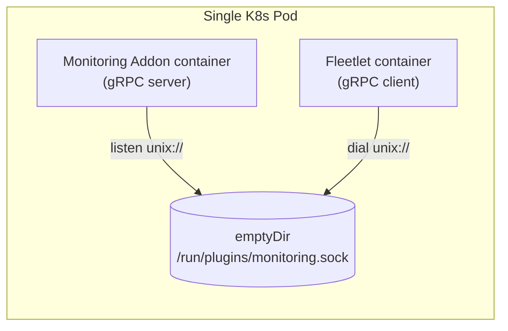
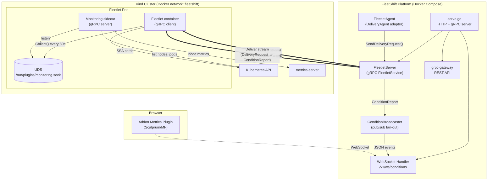
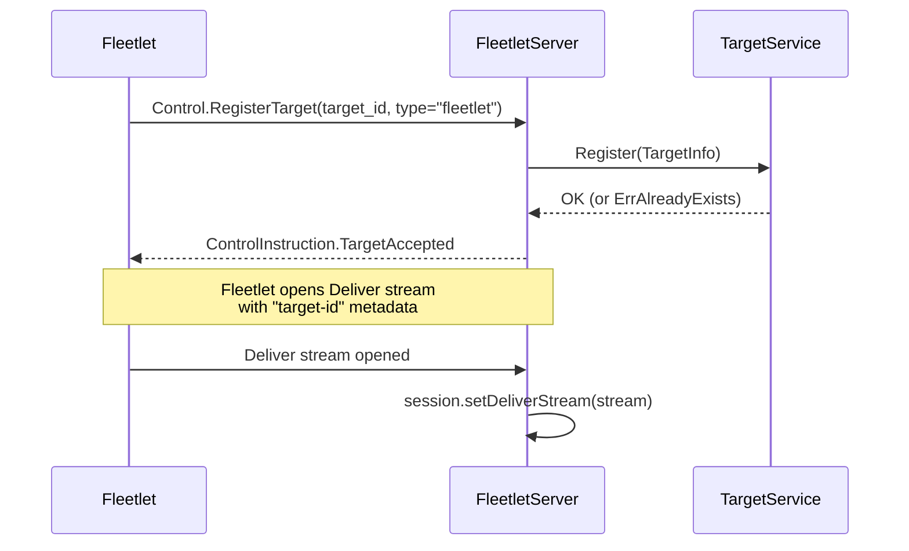
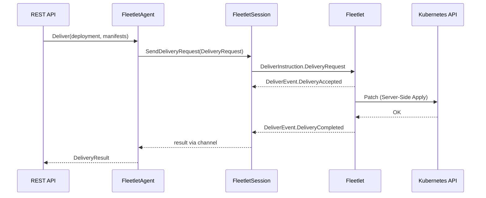
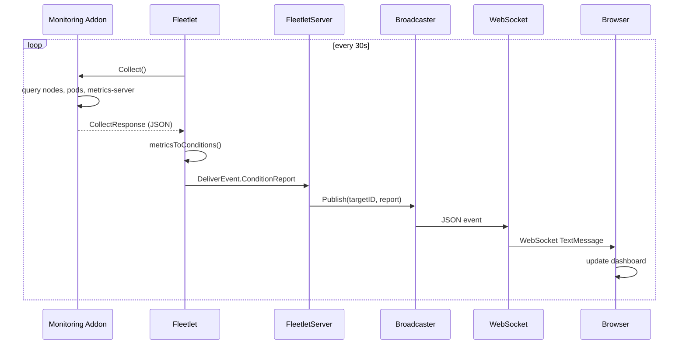

# Addon Spike: Fleetlet + Monitoring Addon

This spike validates the FleetShift addon model end-to-end: a **fleetlet** agent runs
inside a managed Kind cluster, connects to the FleetShift platform over gRPC, applies
manifests via Server-Side Apply, and relays live Kubernetes metrics back to the platform
where they stream to the browser over WebSocket.

## go-plugin: Why Plain gRPC, and When go-plugin Could Work

The original plan used [HashiCorp go-plugin](https://github.com/hashicorp/go-plugin)
for fleetlet ↔ addon communication. During implementation we discovered a hard
limitation that forced a different approach for this spike.

### Where go-plugin works fine: platform side

On the **platform**, go-plugin works as designed. The FleetShift server launches
addon binaries (e.g. `monitoring-platform`) as **subprocesses** via
`plugin.NewClient()`. Both processes share the same host filesystem, so Unix
sockets work transparently. This is the standard go-plugin model — Terraform,
Vault, and Nomad all use it this way.

### The problem on managed clusters: Unix sockets are hardcoded on Linux

go-plugin's `plugin.Serve()` selects the network listener based on `runtime.GOOS`
([server.go:528–534](https://github.com/hashicorp/go-plugin/blob/main/server.go)):

```go
func serverListener(unixSocketCfg UnixSocketConfig) (net.Listener, error) {
    if runtime.GOOS == "windows" {
        return serverListener_tcp()
    }
    return serverListener_unix(unixSocketCfg)  // always on Linux
}
```

- **`PLUGIN_MIN_PORT` / `PLUGIN_MAX_PORT`** env vars only apply inside
  `serverListener_tcp()`, which is never called on Linux.
- **`ServeConfig` has no `Listener` field** — there is no way to inject a custom
  TCP listener.
- **`ServeConfig.Test`** changes magic-cookie and stdio behaviour, not the
  transport.

Because the fleetlet and monitoring addon run as **separate Pods** in Kubernetes,
they don't share a filesystem — Unix sockets can't cross pod boundaries. This is
why we switched to plain gRPC (`grpc.NewServer()` / `grpc.NewClient()`) for
cluster-side addon communication.

### Solution: sidecar pattern with Unix domain sockets

We use a **sidecar** deployment where the fleetlet and addons run as containers in
the same Pod, communicating via Unix domain sockets on a shared `emptyDir` volume.
This gives us UDS performance with full crash isolation — one container crashing
doesn't take down the other (K8s restarts only the failed container).



The monitoring addon listens on a well-known socket path (`/run/plugins/monitoring.sock`),
and the fleetlet connects to it via gRPC's native `unix:` scheme. No go-plugin
protocol is needed on the cluster side — plain gRPC over UDS provides the same low
IPC overhead while keeping the deployment model simple.

**Why not go-plugin for the sidecar?** We could use `ReattachConfig{Test: true}` +
`PLUGIN_UNIX_SOCKET_DIR`, but go-plugin creates socket files with random suffixes
(`/plugin-socket/plugin<RANDOM>`), requiring glob-based discovery. Plain gRPC with
a well-known socket path is simpler and equally performant.

**Crash isolation:** Containers in the same Pod have separate cgroups and
namespaces. If the monitoring addon OOM-kills or segfaults, only that container
restarts — the fleetlet stays up. The shared `emptyDir` has a `sizeLimit: 1Mi`
to prevent disk pressure.

## Architecture



## Data Flow

### Registration (startup)



### Manifest Delivery (platform → cluster)



### Metrics Relay (cluster → browser)



## Directory Structure

```
addons/
├── go.mod
├── Dockerfile.fleetlet
├── Dockerfile.monitoring
├── proto/addon/monitoring/v1/
│   └── monitoring.proto            # MonitoringAddon service definition
├── gen/addon/monitoring/v1/        # generated Go code
├── shared/monitoring/
│   ├── interface.go                # MonitoringAddon interface + go-plugin handshake
│   └── grpc.go                     # gRPC client/server wrappers
├── fleetlet/cmd/
│   └── main.go                     # fleetlet binary (gRPC client + SSA + metrics relay)
├── monitoring/
│   ├── cmd/agent/main.go           # cluster-side: gRPC server, K8s metrics collector
│   ├── cmd/platform/main.go        # platform-side: go-plugin subprocess (manifest gen)
│   └── internal/
│       ├── collector/collector.go  # K8s API queries (nodes, pods, metrics-server)
│       └── manifests/generator.go  # MonitoringConfig CRD manifest generation
└── deploy/
    ├── setup.sh                    # deploy fleetlet + addon to Kind cluster
    ├── demo.sh                     # scale workloads to demo live metrics
    └── kind/
        ├── fleetlet.yaml           # Deployment with monitoring sidecar + RBAC
        └── monitoring-crd.yaml     # MonitoringConfig CRD
```

Platform-side changes in `fleetshift-server/`:

```
internal/
├── addon/fleetlet/
│   └── agent.go                    # DeliveryAgent adapter for remote fleetlets
├── transport/
│   ├── grpc/
│   │   ├── fleetlet_server.go      # FleetletServiceServer (Control + Deliver)
│   │   └── condition_broadcaster.go # pub/sub for condition events → WebSocket
│   └── http/
│       └── conditions_ws.go        # WebSocket endpoint /v1/ws/conditions
└── cli/
    └── serve.go                    # wiring: FleetletServer + httpMux + WS handler
```

UI changes in `fleetshift-user-interface/`:

```
packages/
├── mock-ui-plugins/src/plugins/addon-metrics-plugin/
│   ├── MetricsDashboard.tsx        # live dashboard (WebSocket + PatternFly)
│   └── api.ts                      # plugin API hooks
├── mock-ui-plugins/webpack.config.ts  # DynamicRemotePlugin registration
├── mock-servers/src/routes/users.ts   # always-on plugin visibility
└── gui/webpack.config.ts              # WebSocket proxy + /api/v1/management proxy
```

## Key Technical Decisions

| Decision | Choice | Rationale |
|---|---|---|
| Addon communication | gRPC over Unix socket (sidecar) | Low IPC overhead, crash-isolated containers, no network exposure |
| Manifest application | Server-Side Apply (SSA) | Declarative, conflict-free, field-manager ownership |
| Metrics transport | ConditionReport with JSON message | Zero proto changes to FleetletService; structured data in string field |
| Browser streaming | WebSocket via ConditionBroadcaster | Low-latency fan-out from gRPC server to N browser clients |
| Plugin visibility | Always-on (like management plugin) | Addon metrics isn't tied to mock-server clusters |
| Kind networking | Docker network `fleetshift` | Kind cluster containers join the compose network, fleetlet reaches platform at `fleetshift:50051` |
| Re-registration | Idempotent (ErrAlreadyExists → success) | Fleetlet reconnects gracefully after platform restart |

## Condition Report Format

The fleetlet encodes metrics as JSON in the `Condition.message` field:

**ClusterMetrics:**
```json
{"nodes": 1, "pods": 15, "cluster": "addon-spike"}
```

**NodeMetrics:**
```json
{
  "name": "addon-poc-2341214-control-plane",
  "cpuCapacity": 12000,
  "cpuUsage": 87,
  "memCapacity": 7837,
  "memUsage": 715,
  "pods": 15
}
```

## Setup & Demo

### Prerequisites

- Docker Compose stack running (`docker compose up --build -d`)
- A Kind cluster provisioned via FleetShift (Orchestration → Create Deployment)
- `kind`, `kubectl`, `docker` on PATH

### Deploy Addons to a Cluster

```bash
cd addons
./deploy/setup.sh <cluster-name>
# e.g. ./deploy/setup.sh addon-poc-2341214
```

This will:
1. Export kubeconfig for the Kind cluster
2. Build `fleetlet:dev` and `monitoring-agent:dev` images
3. Load images into Kind
4. Deploy MonitoringConfig CRD and fleetlet pod (with monitoring sidecar)
5. Fleetlet registers with the platform and starts relaying metrics via UDS

### Verify

```bash
# Check fleetlet logs
export KUBECONFIG=/tmp/kind-<cluster-name>.kubeconfig
kubectl logs -f deploy/fleetlet -c fleetlet

# Check monitoring sidecar logs
kubectl logs -f deploy/fleetlet -c monitoring

# Platform should show target registration
docker compose logs fleetshift --tail=20
```

Open `http://localhost:3000/addon-metrics` in the browser to see the live dashboard.

### Demo: Watch Metrics Change

```bash
./deploy/demo.sh <cluster-name>
```

This scales an nginx deployment (3 → 8 → 1 → delete) with pauses between steps
so you can watch the pod count and CPU/memory usage update live in the dashboard.

### Install metrics-server (for real CPU/memory usage)

Without metrics-server the dashboard shows capacity only (usage = 0). To enable:

```bash
kubectl apply -f https://github.com/kubernetes-sigs/metrics-server/releases/latest/download/components.yaml
kubectl -n kube-system patch deployment metrics-server --type=json \
  -p='[{"op":"add","path":"/spec/template/spec/containers/0/args/-","value":"--kubelet-insecure-tls"}]'
```

## What This Proves

1. **gRPC bidirectional streaming** works for platform ↔ cluster communication
2. **Fleetlet as a relay agent** can register targets, apply manifests, and relay addon data
3. **Addons as sidecar containers** communicate via Unix sockets with crash isolation
4. **Real-time data flow** from Kind cluster → fleetlet → platform → WebSocket → browser works end-to-end
5. **SSA manifest delivery** enables the platform to push configuration (MonitoringConfig CRD) to clusters
6. **Scalprum plugin architecture** supports live data dashboards loaded dynamically into the shell

## What's Next

- Platform-side addon subprocess (go-plugin): platform generates MonitoringConfig manifest, delivers via fleetlet
- CRD-driven state change: update MonitoringConfig → addon adjusts collection behavior
- Authentication on the fleetlet gRPC connection (currently unauthenticated)
- Multiple clusters: dashboard showing metrics from N clusters simultaneously
