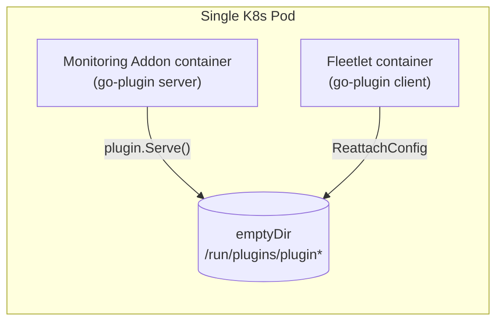
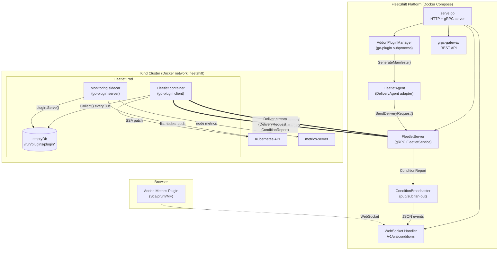
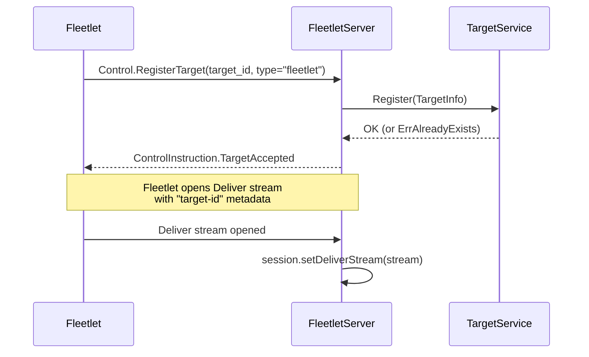
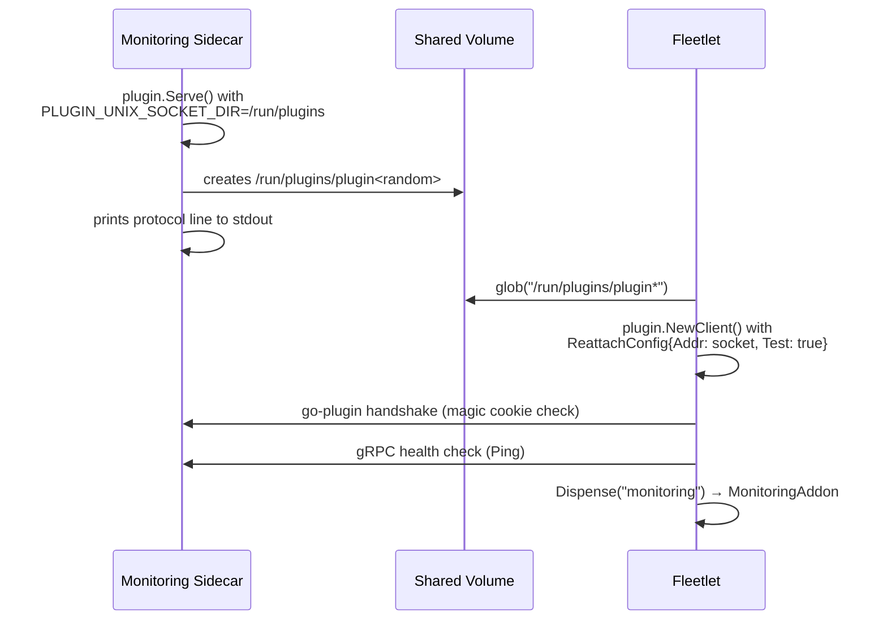
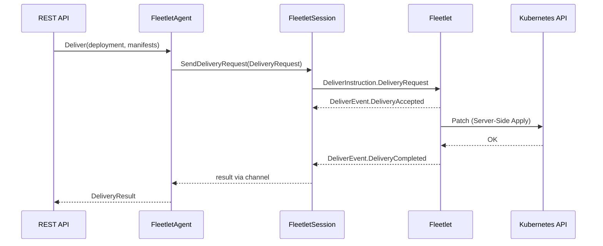
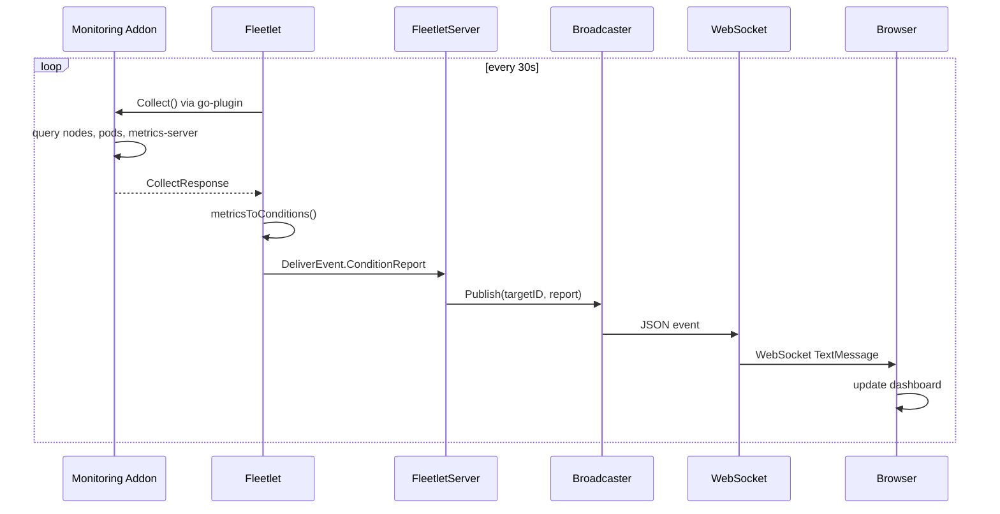

# Addon Spike: Fleetlet + Monitoring Addon

This spike validates the FleetShift addon model end-to-end: a **fleetlet** agent runs
inside a managed Kind cluster, connects to the FleetShift platform over gRPC, applies
manifests via Server-Side Apply, and relays live Kubernetes metrics back to the platform
where they stream to the browser over WebSocket.

## go-plugin: Used on Both Sides

[HashiCorp go-plugin](https://github.com/hashicorp/go-plugin) is used for addon
communication on **both** the platform and the cluster:

### Platform side: subprocess model

The FleetShift server launches addon binaries (e.g. `monitoring-platform`) as
**subprocesses** via `plugin.NewClient()`. Both processes share the same host
filesystem, so Unix sockets work transparently. This is the standard go-plugin
model — Terraform, Vault, and Nomad all use it this way.

When a deployment uses `manifest_strategy.type = TYPE_ADDON`, the server's
`AddonManifestStrategy` calls the addon subprocess to generate manifests via the
`GenerateManifests()` RPC.

### Cluster side: sidecar model

On managed clusters, go-plugin's `plugin.Serve()` creates Unix sockets automatically
via `PLUGIN_UNIX_SOCKET_DIR`. The fleetlet and addons run as **sidecar containers**
in the same Pod, sharing an `emptyDir` volume for the socket.



The fleetlet discovers the socket by globbing `/run/plugins/plugin*` (go-plugin
creates sockets with random suffixes), then connects via `plugin.NewClient()` with
`ReattachConfig{Test: true}`. `Test: true` tells the client not to manage the
addon process lifecycle — K8s manages both containers independently.

### Why sidecar instead of separate pods

go-plugin selects the network listener based on `runtime.GOOS`
([server.go:528–534](https://github.com/hashicorp/go-plugin/blob/main/server.go)):

```go
func serverListener(unixSocketCfg UnixSocketConfig) (net.Listener, error) {
    if runtime.GOOS == "windows" {
        return serverListener_tcp()
    }
    return serverListener_unix(unixSocketCfg)  // always on Linux
}
```

On Linux, `plugin.Serve()` always uses Unix sockets — there is no way to force TCP.
Since Unix sockets can't cross pod boundaries, addons **must** share a filesystem
with the fleetlet. The sidecar pattern with a shared `emptyDir` volume provides this.

**Crash isolation:** Containers in the same Pod have separate cgroups and namespaces.
If the monitoring addon OOM-kills or segfaults, only that container restarts — the
fleetlet stays up. The shared `emptyDir` has a `sizeLimit: 1Mi` to prevent disk
pressure.

### Shared interface

Both sides use the same go-plugin handshake and plugin map defined in
`addons/shared/monitoring/`:

- `Handshake`: magic cookie `FLEETSHIFT_MONITORING=v1`
- `PluginMap`: `{"monitoring": &MonitoringGRPCPlugin{}}`
- `MonitoringAddon` interface: `Collect()` + `GenerateManifests()`

## Architecture



## Data Flow

### Registration (startup)



### go-plugin Connection (sidecar startup)



### Manifest Delivery (platform → cluster)



### Metrics Relay (cluster → browser)



## Directory Structure

```
addons/
├── go.mod
├── Dockerfile.fleetlet
├── Dockerfile.monitoring
├── proto/addon/monitoring/v1/
│   └── monitoring.proto            # MonitoringAddon gRPC service (Collect + GenerateManifests)
├── gen/addon/monitoring/v1/        # generated Go code
├── shared/monitoring/
│   ├── interface.go                # MonitoringAddon interface + go-plugin handshake + plugin map
│   └── grpc.go                     # gRPC client/server wrappers for go-plugin
├── fleetlet/cmd/
│   └── main.go                     # fleetlet binary (go-plugin client + SSA + metrics relay)
├── monitoring/
│   ├── cmd/agent/main.go           # cluster-side: go-plugin server via plugin.Serve()
│   ├── cmd/platform/main.go        # platform-side: go-plugin subprocess (manifest gen)
│   └── internal/
│       ├── collector/collector.go  # K8s API queries (nodes, pods, metrics-server)
│       └── manifests/generator.go  # MonitoringConfig CRD manifest generation
└── deploy/
    ├── setup.sh                    # deploy fleetlet + addon sidecar to Kind cluster
    ├── demo.sh                     # scale workloads to demo live metrics
    └── kind/
        ├── fleetlet.yaml           # Pod with fleetlet + monitoring sidecar + shared emptyDir
        └── monitoring-crd.yaml     # MonitoringConfig CRD
```

Platform-side changes in `fleetshift-server/`:

```
internal/
├── addon/
│   ├── fleetlet/
│   │   └── agent.go                # DeliveryAgent adapter for remote fleetlets
│   └── plugin/
│       ├── manager.go              # go-plugin subprocess manager (launches addon binaries)
│       └── strategy.go             # AddonManifestStrategy (calls GenerateManifests via go-plugin)
├── transport/
│   ├── grpc/
│   │   ├── fleetlet_server.go      # FleetletServiceServer (Control + Deliver streams)
│   │   └── condition_broadcaster.go # pub/sub for condition events → WebSocket
│   └── http/
│       └── conditions_ws.go        # WebSocket endpoint /v1/ws/conditions
├── domain/
│   ├── strategy_spec.go            # ManifestStrategyAddon type + AddonName field
│   └── strategy_factory.go         # AddonManifestStrategyFactory interface
└── cli/
    └── serve.go                    # wiring: AddonPluginManager + FleetletServer + WS handler
```

UI changes in `fleetshift-user-interface/`:

```
packages/
├── mock-ui-plugins/src/plugins/addon-metrics-plugin/
│   ├── MetricsDashboard.tsx        # live dashboard (WebSocket + PatternFly)
│   └── api.ts                      # plugin API hooks
├── mock-ui-plugins/webpack.config.ts  # DynamicRemotePlugin registration
├── mock-servers/src/routes/users.ts   # always-on plugin visibility
└── gui/webpack.config.ts              # WebSocket proxy + /api/v1/management proxy
```

## Key Technical Decisions

| Decision | Choice | Rationale |
|---|---|---|
| Addon protocol | go-plugin on both sides | Handshake, health checks, versioning for free; same interface everywhere |
| Platform addons | Subprocess (`plugin.NewClient`) | Standard go-plugin model; same as Terraform/Vault |
| Cluster addons | Sidecar + `ReattachConfig{Test: true}` | Unix sockets require shared filesystem; sidecar guarantees co-location |
| Socket discovery | `filepath.Glob("/run/plugins/plugin*")` | go-plugin creates random socket names; glob with retry is simple and reliable |
| Crash isolation | Separate containers in same Pod | Containers have independent cgroups; one crash doesn't affect the other |
| Manifest application | Server-Side Apply (SSA) | Declarative, conflict-free, field-manager ownership |
| Metrics transport | ConditionReport with JSON message | Zero proto changes to FleetletService; structured data in string field |
| Browser streaming | WebSocket via ConditionBroadcaster | Low-latency fan-out from gRPC server to N browser clients |
| Plugin visibility | Always-on (like management plugin) | Addon metrics isn't tied to mock-server clusters |
| Kind networking | Docker network `fleetshift` | Kind cluster containers join the compose network, fleetlet reaches platform at `fleetshift:50051` |

## Condition Report Format

The fleetlet encodes metrics as JSON in the `Condition.message` field:

**ClusterMetrics:**
```json
{"nodes": 1, "pods": 15, "cluster": "addon-spike"}
```

**NodeMetrics:**
```json
{
  "name": "addon-pod-2341443-control-plane",
  "cpuCapacity": 12000,
  "cpuUsage": 87,
  "memCapacity": 7837,
  "memUsage": 715,
  "pods": 15
}
```

## Setup & Demo

### Prerequisites

- Docker Compose stack running (`docker compose up --build -d`)
- A Kind cluster provisioned via FleetShift (Orchestration → Create Deployment)
- `kind`, `kubectl`, `docker` on PATH

### Deploy Addons to a Cluster

```bash
cd addons
./deploy/setup.sh <cluster-name>
# e.g. ./deploy/setup.sh addon-pod-2341443
```

This will:
1. Export kubeconfig for the Kind cluster
2. Build `fleetlet:dev` and `monitoring-agent:dev` images
3. Load images into Kind
4. Install metrics-server (for real CPU/memory usage)
5. Deploy MonitoringConfig CRD
6. Deploy fleetlet pod with monitoring sidecar (shared `emptyDir` + go-plugin)
7. Fleetlet discovers addon socket, connects via go-plugin, starts relaying metrics

### Verify

```bash
# Check fleetlet logs (should show "monitoring plugin connected via go-plugin")
export KUBECONFIG=/tmp/kind-<cluster-name>.kubeconfig
kubectl logs -f deploy/fleetlet -c fleetlet

# Check monitoring sidecar logs (should show go-plugin protocol line)
kubectl logs -f deploy/fleetlet -c monitoring

# Platform should show target registration
docker compose logs fleetshift --tail=20
```

Open `http://localhost:3000/addon-metrics` in the browser to see the live dashboard.

### Demo: Watch Metrics Change

```bash
./deploy/demo.sh <cluster-name>
```

This scales an nginx deployment (3 → 8 → 1 → delete) with pauses between steps
so you can watch the pod count and CPU/memory usage update live in the dashboard.

## What This Proves

1. **go-plugin works on both sides** — subprocess on the platform, sidecar in the cluster, same interface
2. **Sidecar pattern** provides crash-isolated addon containers with UDS performance
3. **Fleetlet as a relay agent** can register targets, apply manifests, and relay addon data
4. **Real-time data flow** from Kind cluster → fleetlet → platform → WebSocket → browser works end-to-end
5. **SSA manifest delivery** enables the platform to push configuration (MonitoringConfig CRD) to clusters
6. **Scalprum plugin architecture** supports live data dashboards loaded dynamically into the shell

## What's Next

- CRD-driven state change: update MonitoringConfig → addon adjusts collection behavior
- Authentication on the fleetlet gRPC connection (currently unauthenticated)
- Multiple clusters: dashboard showing metrics from N clusters simultaneously
- Multi-addon discovery: fleetlet connects to N addon sockets in the shared volume
