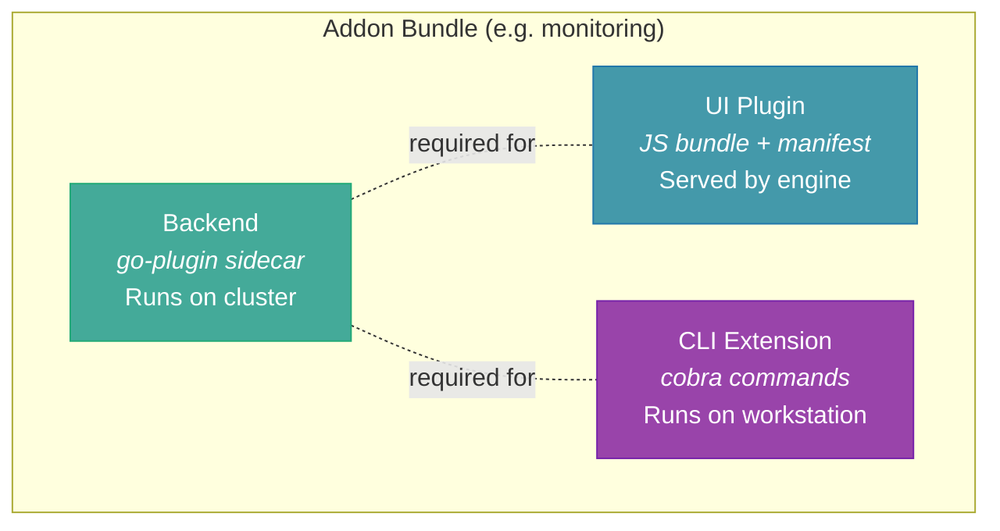
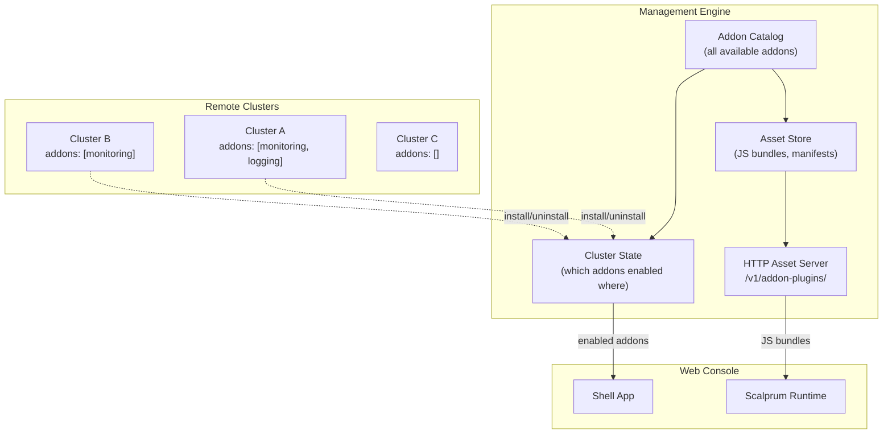
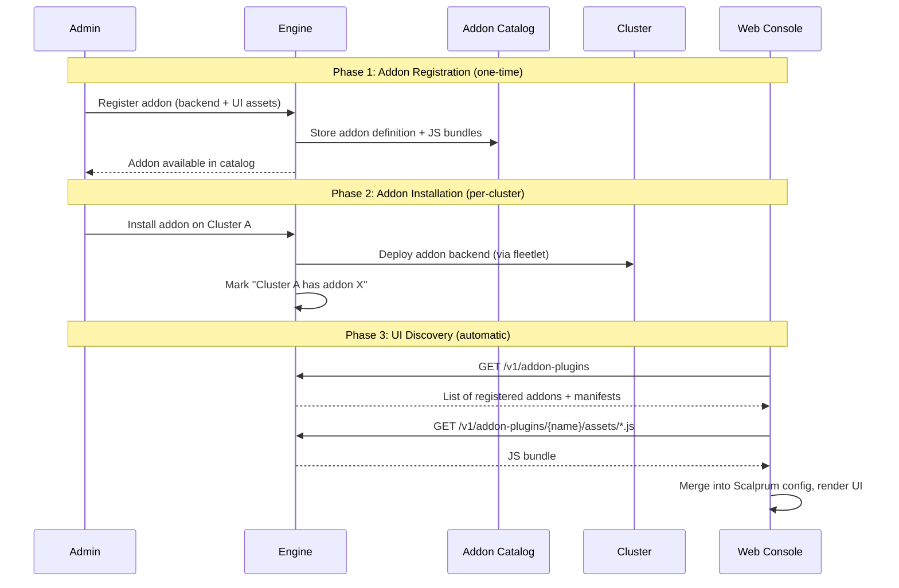
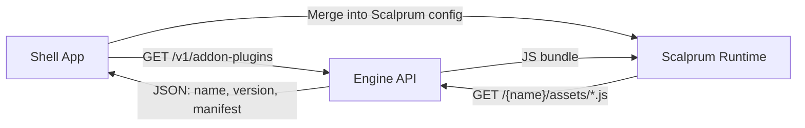
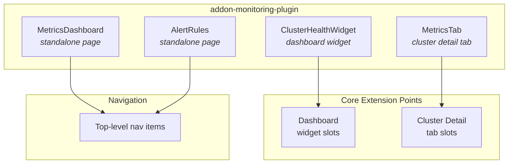
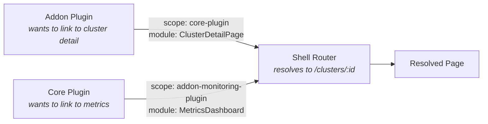
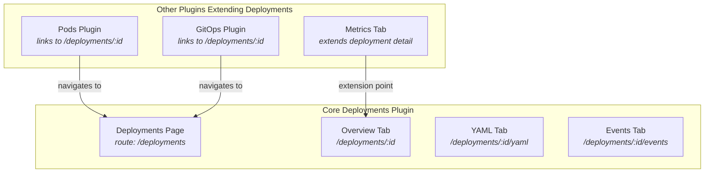
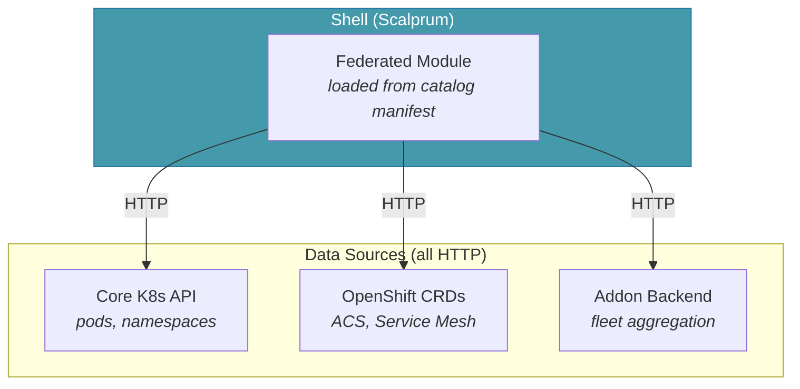
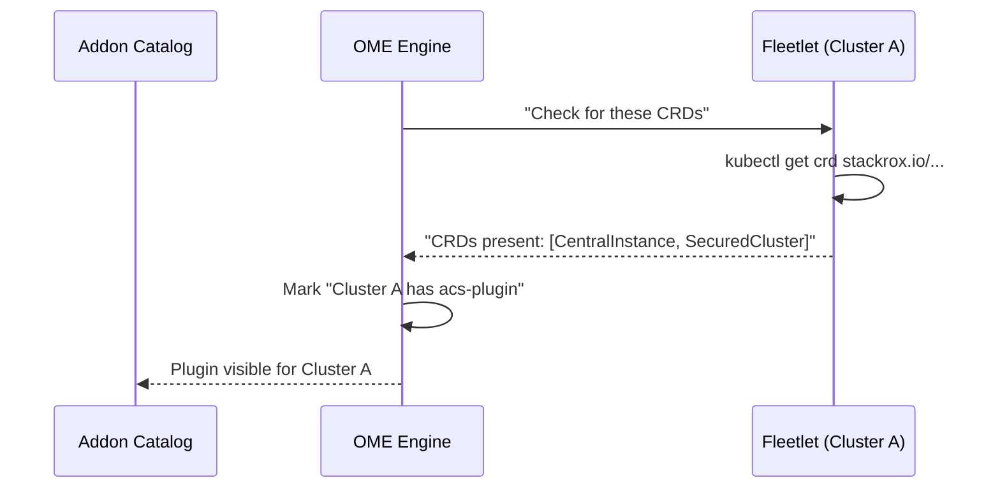
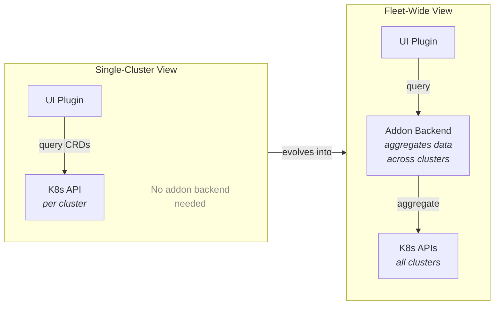

# Addon Architecture: Bundle Model & Engine-Centric Assets

## Summary

An addon is a **bundle** that can contain any combination of backend, UI, and
CLI components -- but must include at least one. Addon bundles are registered
with the management engine, which is the single authority on what addons exist.
Remote clusters install addons (running their backend component), but they
never introduce new ones.

A UI or CLI component only activates when the addon's backend is installed on
at least one managed cluster. If a UI surface does not need a backend addon for
its data, it belongs in a core plugin, not an addon.

## Addon Bundle Model

An addon bundle is the unit of packaging, registration, and installation. It
declares which components it ships:



At least one component is required. UI and CLI are optional but depend on
the backend being installed on at least one cluster.

| Component | What it is | Where it runs | When it activates |
|-----------|-----------|---------------|-------------------|
| **Backend** | go-plugin sidecar or operator | Managed cluster (via fleetlet) | When installed on a cluster |
| **UI** | Scalprum plugin (JS bundle + manifest) | Browser (served by engine) | When backend is installed on >= 1 cluster |
| **CLI** | CLI extension commands | Developer workstation | When backend is installed on >= 1 cluster |

**Key constraint**: An addon must declare its backend dependencies. It does
not have to ship its own backend, but it must specify which backends it
depends on — whether core APIs, other addons, or both. This is declared in
the addon manifest as a dependency list:

```yaml
name: my-custom-dashboard
dependencies:
  - core                    # depends on core platform APIs
  - addon-monitoring        # depends on the monitoring addon's backend
```

The platform validates these dependencies at install time:

- If all dependencies are available → addon installs normally
- If a dependency is missing → installation is blocked with a clear error
  (e.g. "Requires addon-monitoring which is not installed")

This enables UI-only addons (a custom dashboard that consumes existing APIs)
while ensuring every addon has a functioning data source. An addon with zero
dependencies is valid only for fully static content.

## Addon Catalog

The addon catalog is a **runtime data structure** — not something compiled
into the binary. It is the engine's authoritative registry of what addons
are available, what each addon ships, and how to install it. The engine reads
the catalog at runtime; adding a new addon means registering it in the catalog
via API, not rebuilding the server.

### What the catalog contains

Each entry in the catalog describes one addon bundle:

| Field | Description |
|-------|-------------|
| `name` | Unique addon identifier (e.g. `monitoring`) |
| `version` | Semver — used for upgrades and cache-busting |
| `components` | Which surfaces this addon ships (backend, UI, CLI — at least one) |
| `install_spec` | How to install the addon (OCI artifact reference, container image, JS bundle URL — depends on distribution mechanism) |
| `manifest` | Scalprum-compatible JSON for the UI component (if present) |
| `assets` | JS bundle files for the UI component (if present) |
| `extends_core` | Which core plugin surface this addon extends (if any) |

The `install_spec` is the key piece — it tells the engine *how* to pull and
run the addon's backend, not just *that* it exists. If addons are distributed
as OCI artifacts, the spec points to a registry and tag. If they are container
images, it points to an image reference. The distribution mechanism is
pluggable; the catalog just stores the pointer.

### Per-instance catalogs

Each OME deployment has its own addon catalog. A self-hosted OME might have
a private catalog populated with internal addons. A hosted/SaaS OME could
optionally point to a public catalog as well. This is analogous to Helm's
configurable chart repositories or VS Code's extension marketplace — the
catalog source is a deployment decision, not a build decision.

### Catalog vs. installed

The catalog and installation are separate concerns:

- **Catalog** = "these addons are available" (like a Helm repo — you can
  browse charts but haven't installed them yet)
- **Installed** = "this addon is active on this OME instance" (its backend
  is running on one or more clusters, its UI is loaded in the shell, its CLI
  extensions are available)

The catalog tells the engine *how* to install; the install action actually
pulls the artifact, starts the backend, registers the UI plugin, etc.
Uninstalling removes the runtime state but does not remove the addon from
the catalog — it remains available for reinstallation.

### Runtime registration — not baked into the binary

The engine does **not** need to know about addons at build time. Bundling
the universe of addons into the binary would require bespoke builds for
different product configurations and would prevent users from shipping their
own addons without a custom build.

Instead, addons are registered at runtime via API (or CLI, which calls the
API). The catalog is just data in the engine's database. This means:

1. **Adding an addon** = an API call that creates a catalog entry
2. **Different deployments** can have completely different catalogs
3. **Third-party addons** work without any changes to the engine binary

## The Core Insight

The engine already knows the full universe of available addons before any
cluster installs anything. A cluster cannot install an addon the engine does
not offer. This means:

1. **The engine has every addon's bundle at registration time.** When an
   addon is registered via the API, all its components -- backend definition,
   UI assets, CLI extensions -- are stored in the engine's addon catalog.
2. **Clusters only toggle state.** Installing an addon on a cluster is a
   state change ("cluster X has addon Y enabled"), not a data transfer.
3. **No asset upload from fleetlets is necessary.** The push-to-platform
   model (fleetlets uploading JS bundles over gRPC) adds complexity without
   value. The engine already has the assets.

## Architecture



## Lifecycle



## What the Engine Stores

Each addon in the catalog has:

| Field | Description |
|-------|-------------|
| `name` | Unique addon identifier (e.g. `addon-monitoring-plugin`) |
| `version` | Semver for cache-busting and upgrades |
| `manifest` | Scalprum-compatible JSON (extensions, loadScripts) |
| `assets` | JS bundle files (one or more) |
| `extends_core` | Which core plugin surface this addon extends |

The asset store is append-only with version deduplication: same name + same
version = no-op; same name + newer version = replace.

## What the Cluster Controls

A cluster's relationship to addons is purely declarative state:

```
Cluster A:
  installed_addons:
    - monitoring (v1.2.0)
    - logging (v1.0.0)
```

The cluster does not hold or transmit UI assets. It runs the addon backend
(go-plugin sidecar or standalone operator) and reports health/metrics via the
fleetlet. The UI surfaces are entirely server-side in the engine.

## Why Not Push-from-Fleetlet?

An alternative model has each fleetlet discover addon UI assets from a shared
volume and upload them to the engine over gRPC. This was considered and
rejected:

| Concern | Push Model | Engine-Centric Model |
|---------|-----------|---------------------|
| Asset availability | Only after a cluster connects | Always available |
| Duplicate uploads | N clusters with same addon = N uploads | Zero uploads |
| Offline clusters | No UI until cluster reconnects | UI always works |
| Version consistency | Race between fleetlets uploading different versions | Single source of truth |
| Bandwidth | Large JS bundles over gRPC on every reconnect | Zero network cost |
| Complexity | Fleetlet needs asset discovery + upload logic | Engine already has the assets |

The push model solves a problem that does not exist: addons cannot appear on
clusters that the engine does not know about.

## Shell Integration

The shell (web console) discovers addon plugins the same way it discovers
built-in plugins:



The Scalprum config for an addon plugin looks identical to a built-in plugin:

```json
{
  "addon-monitoring-plugin": {
    "name": "addon-monitoring-plugin",
    "manifestLocation": "http://engine:8080/v1/addon-plugins/addon-monitoring-plugin/manifest.json",
    "assetsHost": "http://engine:8080/v1/addon-plugins/addon-monitoring-plugin/assets"
  }
}
```

The shell does not know or care whether a plugin is built-in or an addon. It
loads them all the same way through Scalprum.

## Addon Visibility Rules

An addon's UI plugin appears in the console when:

1. The addon bundle is registered in the engine's addon catalog
2. The addon's **declared dependencies** are satisfied (all required backends
   — core APIs or other addons — are available)
3. The user has the addon's nav items enabled in their preferences

Rule 2 is the critical gate. If an addon ships its own backend, that backend
must be installed on at least one managed cluster. If an addon depends on
other addons' backends, those addons must be installed. If an addon only
depends on core APIs, it activates as soon as it is registered (core is
always available).

The same rule applies to CLI extensions: an addon's CLI commands are only
relevant when its dependencies are satisfied.

Rule 3 gives users per-persona control via the existing marketplace toggle
mechanism.

## Extension Model

A single addon UI plugin can expose **multiple components** -- both standalone
pages and extensions to core extension points. This means one addon bundle
can contribute several surfaces to the console at once.



Extension types:

- **`fleetshift.module`** -- standalone page with its own nav item
- **`fleetshift.dashboard-widget`** -- widget rendered on the dashboard
- **Core extension points** -- tabs, panels, or other slots defined by core
  plugins (e.g. a tab on the cluster detail page)

Addon plugins **cannot** reference other addon plugins' scopes in their
`$codeRef`. They can only extend core plugin surfaces. This constraint is
enforced at load time: if a `$codeRef` references a non-core scope, it is
rejected.

## Cross-Plugin Navigation

Plugins -- including addons -- need to link to each other without hardcoding
paths. A monitoring addon might link to a cluster detail page owned by the
core plugin, or a core widget might link to an addon's metrics page. Hardcoded
paths create tight coupling and break when routes change or plugins are not
installed.

The solution is **reference-based navigation**: plugins navigate by target
scope and module name, not by path. The shell resolves these references to
actual routes at runtime based on the page registry. If the target plugin is
not installed, the link gracefully degrades.



The engine holds the routing structure -- it knows which plugins are
registered, what modules they expose, and which routes they occupy. This
means the backend can provide the page registry that the shell uses for
resolution, keeping routing knowledge centralized rather than scattered across
plugins.

See [007-cross-plugin-navigation](https://github.com/fleetshift/fleetshift-user-interface/blob/main/spikes/007-cross-plugin-navigation.md)
for the implementation spike.

## Explored Alternative: Allowing Core Plugin Overrides

A question was raised about whether addons should be able to replace core
plugin surfaces entirely — for example, shipping a "better Deployments page"
that replaces the core one. This is technically possible but introduces
cascading UX consistency problems. This section explores why.

### The problem: core plugins are extension targets

Core plugins are not standalone pages — they are **extension targets** that
other plugins depend on. Consider the core Deployments plugin in an OCP-like
model:



The Deployments page has:

1. **Nested routes** — tabs like Overview, YAML, Events, each with their own
   route segment
2. **Extension points** — slots where other plugins inject tabs (e.g. a
   monitoring addon adds a Metrics tab)
3. **Inbound links** — other plugins (Pods detail, GitOps) navigate to
   specific deployment routes

### What breaks when you override

If an addon replaces the core Deployments plugin:

| Dependency | What breaks |
|-----------|-------------|
| **Nested routes** | Unless the addon re-implements every nested route identically, deep links from other plugins return 404. A link to `/deployments/:id/yaml` fails if the replacement plugin doesn't have that route. |
| **Extension points** | The monitoring addon injects a Metrics tab into the Deployments detail page. If the replacement plugin doesn't implement the same extension point slots, the tab disappears silently. |
| **Cross-plugin navigation** | Pods detail links to "View Deployment" via scope reference to the core Deployments plugin. Core plugins are always present, and scopes must be unique — the addon *must* use a different scope. This means every cross-plugin link that references the core scope still resolves to the core plugin. The addon can never intercept those links without re-registering every other plugin's references. |
| **Route uniqueness** | Routes must be unique. The replacement plugin either takes the same route (breaking the original) or uses a different route (breaking all inbound links). There is no safe middle ground. |

### The alternative: addons on separate routes

An addon *can* create a custom Deployments-like page on its own route (e.g.
`/my-deployments`). Users can enable/disable nav items via the marketplace.
But this does not replace the core plugin — it coexists alongside it:

- Other plugins still link to the core Deployments page
- Extension points still target the core plugin's slots
- The addon's page is isolated — it doesn't receive extensions from other
  plugins unless it explicitly implements the same extension point contract

To make cross-plugin links point to the addon's page instead of the core
one, every other plugin that references the Deployments scope would need to
be updated. This is a platform-wide change, not a local addon decision.

### Conclusion

Overriding core plugins is technically possible but **we cannot guarantee
consistent UX** when it happens. The web of dependencies between plugins —
routes, extension points, cross-plugin navigation — assumes the core plugin
is the canonical owner of its routes and extension slots. Replacing it breaks
that assumption for every other plugin that depends on it.

What addons *can* do:

- **Extend** core plugin surfaces (add tabs, widgets, panels via extension
  points)
- **Create new pages** on their own routes with their own nav items
- **Consume core APIs** without shipping their own backend

What addons *cannot* safely do:

- **Replace** a core plugin's routes (breaks inbound links)
- **Override** a core plugin's extension points (breaks other addons'
  extensions)
- **Shadow** a core plugin (two plugins on the same route is undefined
  behavior)

## Pre-Installed Plugins

Not every UI surface requires an addon backend. Products that ship with
OpenShift or are installed independently (ACS/StackRox, Service Mesh,
Serverless, etc.) install CRDs and expose data through the standard
Kubernetes API. Their UI plugins can communicate with the cluster
directly — the same way the classic OpenShift console plugin model works.

These **pre-installed plugins** sit between core plugins and full addons:

| Type | Backend dependency | Data path | Example |
|------|-------------------|-----------|---------|
| **Core plugin** | None (core K8s APIs) | fleetlet → K8s API | Pods, Namespaces, Nodes |
| **Pre-installed plugin** | None (pre-existing CRDs) | fleetlet → K8s API (custom resources) | ACS, Service Mesh, Serverless |
| **Addon plugin** | Addon backend (deployed by OME) | fleetlet → addon sidecar → OME | Custom monitoring, custom dashboards |

### From the UI, all plugins are the same

The distinction between these three types exists only on the **backend
lifecycle** side — who deploys and manages the data source. From the UI
and CLI perspective, installation is identical for all plugin types:

1. The plugin manifest (entry point, exposed modules, extensions) is
   registered in the catalog
2. The federated module is enabled
3. Scalprum loads and renders it

The federated module itself knows how to obtain its data. It makes HTTP
calls to whatever API it needs — core K8s, OpenShift CRDs, or an addon
aggregation endpoint. The shell does not know or care where the data comes
from. This means there is no separate "install" vs "import" flow for the UI
layer. Whether the backend was deployed by OME, pre-installed by an
operator, or is a built-in K8s API, the UI plugin activation is the same
operation: register metadata, enable the module.



The module may need configuration (e.g. which cluster to query, which
aggregation endpoint to use), but this is runtime context passed via the
shell's API object — not a difference in the plugin loading mechanism.

### Discovery and activation

A core plugin is always available (every cluster has pods and namespaces).
A pre-installed plugin only makes sense when the relevant CRDs are present
on the cluster. Unlike addon plugins — where OME deploys the backend and
knows exactly what exists — pre-installed plugins are set up by operators
or product installers. OME needs to **discover** them.

The catalog drives this. Each pre-installed plugin entry declares what to
look for:

```yaml
name: acs-plugin
type: pre-installed
discovery:
  crds:
    - stackrox.io/v1alpha1/CentralInstance
    - platform.stackrox.io/v1alpha1/SecuredCluster
```

The `type: pre-installed` flag tells the system this is not an addon to deploy
but a pre-existing capability to discover. The fleetlet checks whether
the declared CRDs exist on each managed cluster and reports back to OME:



This is the same end state as addon installation — OME knows which
clusters have which plugins — but the path is discovery rather than
deployment. The UI plugin activates when at least one cluster reports the
relevant CRDs, and is hidden when none do.

### The fleet aggregation boundary

The single-cluster view works without any addon backend — the UI can query
one cluster's K8s API for its ACS violations, Service Mesh configs, etc.,
just like the classic OCP console does.

However, once OME manages multiple clusters with the same pre-installed plugin,
a new need emerges: **fleet-wide aggregation**. Viewing all ACS violations
across 50 clusters, comparing Service Mesh configurations across
environments, or rolling out a policy change fleet-wide — these operations
cannot be served by querying one cluster at a time.

This is the point where a pre-installed plugin may evolve into a full addon:



The transition is incremental: the per-cluster UI remains useful on its own,
and the addon backend adds the fleet-wide layer on top. This means a product
like ACS can integrate with OME in two phases:

1. **Day 1**: Register as a pre-installed plugin — per-cluster views work
   immediately for any cluster that has ACS installed, no addon deployment
   required
2. **Day 2**: Ship an addon backend that aggregates ACS data across the
   fleet — fleet-wide dashboards, cross-cluster policy views, etc.

This avoids an all-or-nothing integration model: products get useful
single-cluster UI integration immediately, and invest in fleet-wide
aggregation when the use case demands it.

## Future: Addon SDK

The long-term vision is an addon SDK that bundles backend + frontend + cli:

```
fleetshift addon create monitoring
fleetshift addon build          # produces backend binary + UI bundle
fleetshift addon publish        # registers in engine catalog
```

The `publish` step pushes the UI assets to the engine's addon catalog via the
CLI/API. The engine stores them and serves them to browsers. No fleetlet
involvement in asset delivery.

## Consistency with Prior Design Decisions

The engine-centric asset model is not a new direction -- it follows directly
from decisions already made across the platform's architecture. This section
traces how existing designs lead to this conclusion.

### Addon registration is platform-side (architecture.md, Section 8)

The capability and addon contract establishes that addons register their
capabilities (ManifestGenerator, PlacementStrategy, etc.) with the platform.
The platform is the registry; addons declare what they can do, the platform
routes to them. UI plugin registration is the same pattern applied to
frontend assets.

### The platform owns the plugin registry (architecture.md, Section 12c)

The UI extensibility model explicitly follows the Grafana/OpenShift dynamic
console plugin pattern:

> The platform provides the shell and plugin registry; addons provide
> domain-specific content.

The plugin registry lives on the platform. Addons contribute content to it.
Storing UI assets in this registry is the natural implementation of this
design.

### Managed resources register schemas with the platform (managed_resources.md)

When an addon connects, it registers its managed resource types -- including
schemas, delivery targets, and status projections -- as part of capability
registration. The platform stores this registration and exposes consumer-facing
APIs based on it. UI plugin metadata is analogous: the addon declares its
extensions and the platform exposes them to the shell.

### Addon discovery flows from the platform (OME-12)

The foundational addon story (OME-12: Addon registration and discovery)
specifies:

> Addons can be registered with the platform and declare their capabilities.
> The platform can discover available addons and route to them based on type.

Registration is with the platform. Discovery flows from the platform. This
applies equally to backend capabilities and frontend plugins.

### UI plugin discovery is based on backend registration (OME-13)

OME-13 (Web UI addon integration) specifies:

> UI plugins are discoverable based on backend addon registration. The addon
> model provides the metadata the frontend needs to load the correct plugin.

The frontend asks the platform what plugins exist. The platform answers based
on what addons have registered. The assets need to be where the platform can
serve them -- which means the platform's own store.

### The kernel owns the UI shell (OME-30 layered model)

The cluster provisioning design (OME-30) defines a four-layer architecture.
The UI shell and plugin system sit at Layer 1 (kernel) -- platform
infrastructure that addons at higher layers contribute to. The kernel
manages the plugin catalog; addons populate it.

### All addon stories follow the same pattern (OME-18 through OME-21)

MCOA, ACS, manifest strategies, and API extensions all register with the
management plane. The management plane stores their definitions and routes
to them. No addon story has the cluster as the source of truth for addon
capabilities or assets.

## Relationship to Existing Implementation

The current codebase has proto definitions (`UIPluginSpec`, `RegisterPlugin`)
and platform-side storage (`addon_plugins` table, HTTP serving) that align
with this model. The fleetlet-side asset discovery code exists but is
unnecessary under the engine-centric model and should not be used in
production.

The HTTP serving endpoints (`/v1/addon-plugins/*`) and the Scalprum config
merge logic in the shell are correct and reusable regardless of how assets
arrive in the engine.
