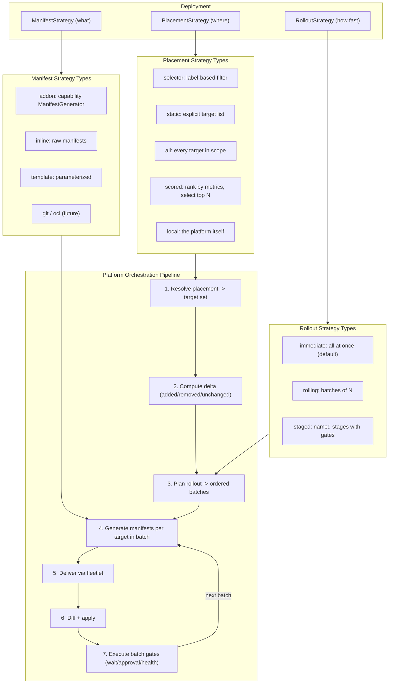
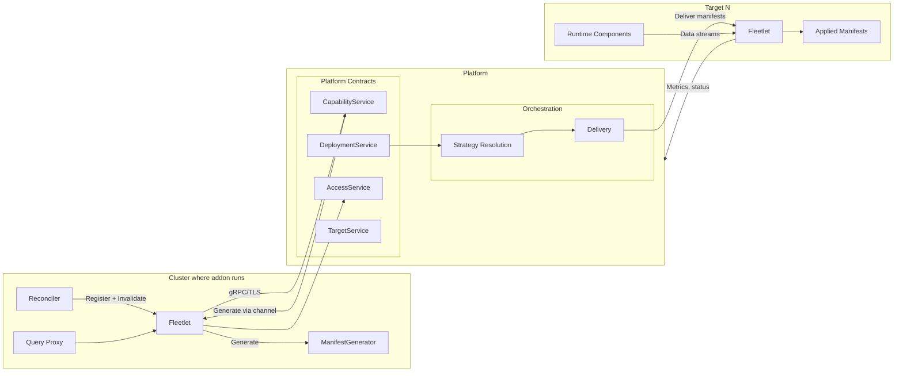
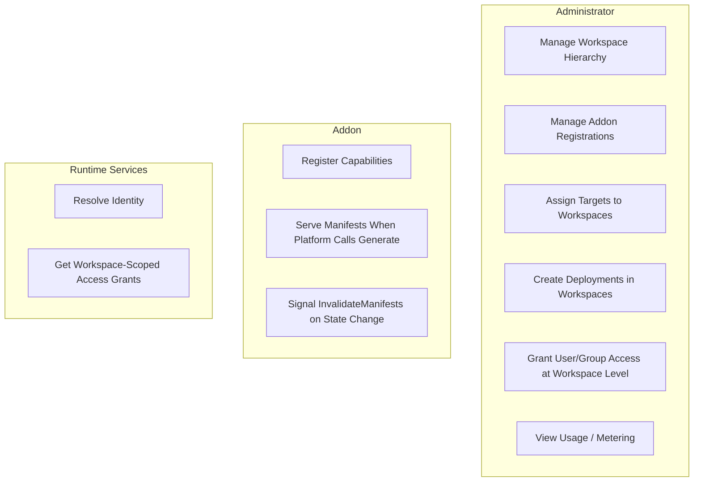
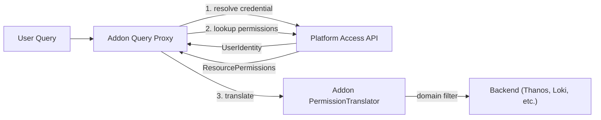

# Management Plane Architecture

The management plane is a URL-addressable service -- not a cluster -- that provides the orchestration pipeline and the fleetlet (a transport-agnostic, channel-based message broker). Strategies define what flows over channels and when to signal recompute. Addons connect to their local fleetlet; the fleetlet connects to the platform. Zero infrastructure coupling: no addon or fleetlet has any dependency on Kubernetes or any specific infrastructure to integrate with the platform. Kubernetes is the primary target type, but the platform's abstractions are target-agnostic -- any endpoint that maintains the delivery contract (section 1.1) is a valid target.

---

## 1. Core model

The management plane decomposes every deployment into three orthogonal, pluggable strategies:

```
Deployment = ManifestStrategy × PlacementStrategy × RolloutStrategy
```

- **ManifestStrategy** -- "what to deploy." Could be an addon-provided `ManifestGenerator` callback, raw inline manifests, a template with per-target substitution, a git ref, or an OCI artifact. "Manifest" is used generically throughout this document -- it means any declarative payload: Kubernetes YAML, platform API objects, addon configuration documents, or provisioning specifications. Extensible.
- **PlacementStrategy** -- "where it goes." Could be a label selector, a static target list, "all targets in scope," a scored strategy that ranks and selects targets by dynamic metrics, or `local` (the platform itself). Extensible. Placement strategies are not just filters -- they can rank, sort, and select a top-N subset. Complex strategies can be stateful, maintaining their own scoring pipelines and signaling the platform to re-resolve when their output would change.
- **RolloutStrategy** -- "how fast and in what order." Could be immediate (all at once), rolling (batches of N), or staged (named stages with gates, approvals, health checks, and deployment health dependencies). Extensible.

What you deploy can be a function of where it goes -- the manifest strategy receives `TargetInfo` for per-target customization. How fast you roll it out is independent of both -- the rollout strategy governs pacing and safety without knowing what is being deployed or how targets were selected.







### Manifest strategy types


| Type       | Source                                               | What triggers re-generation       |
| ---------- | ---------------------------------------------------- | --------------------------------- |
| `addon`    | Registered capability's `ManifestGenerator` callback | Addon calls `InvalidateManifests` |
| `inline`   | Manifests provided directly in deployment spec       | User PATCHes the deployment       |
| `template` | Template + values, rendered per target (future)      | User updates values or template   |


### Placement strategy types


| Type       | Resolution                                                | What triggers re-evaluation                    |
| ---------- | --------------------------------------------------------- | ---------------------------------------------- |
| `selector` | Label selector against workspace target pool              | Target fleet changes (labels, joins, leaves)   |
| `static`   | Explicit target list (validated against workspace scope)  | User PATCHes the deployment                    |
| `all`      | Every target in workspace scope (including children)      | Target fleet changes                           |
| `local`    | Resolves to the platform itself (single implicit target)  | N/A -- always resolves to `[self]`             |


### Rollout strategy types


| Type        | Behavior                                                                                            | What triggers progression                                                    |
| ----------- | --------------------------------------------------------------------------------------------------- | ---------------------------------------------------------------------------- |
| `immediate` | All targets receive changes simultaneously (default)                                                | N/A -- single batch, no gates                                                |
| `rolling`   | Targets are updated in batches of N (absolute or percentage), proceeding when each batch succeeds   | Batch completion (all targets in batch report Applied/Available)             |
| `staged`    | Named stages with label selectors, concurrency limits, and explicit gates (wait, approval, health)  | Gate clearance: timed wait expires, approval granted, or health check passes |

A staged rollout supports several gate types within its stages:

| Stage Gate Type      | Behavior                                                                                          |
| -------------------- | ------------------------------------------------------------------------------------------------- |
| `wait`               | Pauses for a fixed duration before proceeding                                                     |
| `approval`           | Waits for an external approval signal                                                             |
| `health`             | Waits until all targets in the stage report healthy                                               |
| `deploymentHealth`   | Waits until a named sibling or child deployment reports healthy for a configurable stable duration |

The `deploymentHealth` gate enables choreography between related deployments without a centralized DAG engine. A database deployment can use a staged rollout where the first stage rolls out the database and the second stage gates on the API deployment's health — or vice versa. This composes with `DeploymentGroup` (section 3) for multi-component application orchestration.

### Declarative placement and safety

Placement strategies are **declarative**: they express the desired target set at any point in time via `Resolve(pool) -> targets`. Removal is implicit -- the platform computes the set difference between the previous resolved set and the current one. The placement strategy never explicitly says "remove from target B"; it just stops including B. This keeps the strategy interface stateless and the contract simple.

**Safety:** If `Resolve` returns an error or an empty set due to a transient failure (e.g., plugin crash, informer not synced), the platform must NOT shrink the target set. Shrinking only happens on a successful, confident resolution. Similarly, if the rollout strategy's `Plan` returns an error, the platform must NOT begin delivery -- it reports the error on the deployment status and waits for resolution.

### Design invariant: single-pod viability

The platform must function correctly as a single pod with an embedded database. This is a design invariant, not a degraded mode. Every feature, every dependency, and every subsystem must satisfy the question: *does this still work for a single-pod instance with an embedded SQLite database?*

The platform is designed to be recursively instantiable (see section 12). A parent platform deploys child platform instances as standard workloads. For this to be economically viable at per-tenant or per-region granularity, the minimum deployment footprint must be one pod: one container, one process, one persistent volume. No external database server, no mandatory sidecar, no multi-replica correctness dependency.

Concretely:

- **Storage is pluggable.** Embedded SQLite for small instances, external Postgres for large instances, both behind the same storage interface. SQLite in WAL mode handles the write rates of a 200-target regional platform (~330 index writes/sec) at well under its capacity ceiling.
- **Peer mesh is optional.** A single-replica instance skips peer discovery entirely. No mesh, no peer connections. When a single-replica instance serves its own fleetlet connections, every request is local -- no forwarding needed.
- **All subsystems function with a single writer.** The orchestration pipeline, resource index, delivery tracking, and access cache all work correctly with one concurrent writer. Multi-writer support (for multi-replica Postgres deployments) is an optimization, not a correctness requirement.
- **No external service dependencies for core function.** The platform starts, serves traffic, and runs the full orchestration pipeline with nothing more than a filesystem path for its database. External services (managed Postgres, object storage, external IdP) are integrations, not requirements.

Multi-replica deployment with external Postgres remains the production model for large or high-availability instances. The invariant is that single-pod mode is always correct, always functional, and always the baseline against which new features are evaluated. If a proposed feature requires an external service, a sidecar, or multiple replicas to function, that requirement must be justified explicitly and must not be on the critical path for a minimal instance.

### The delivery contract

A **target** is any endpoint that maintains the delivery contract. The platform does not care what a target is internally -- only that it satisfies three requirements:

1. **Accept a declarative payload.** The target's delivery agent receives manifests from the platform and acknowledges receipt.
2. **Apply it.** The delivery agent makes reality match the declared intent -- creating, updating, and pruning resources as needed.
3. **Continuously report health.** The delivery agent watches the applied resources and streams status back to the platform. Health is not a one-time check; it is a continuous signal that the platform uses for rollout progression, placement decisions, and user-visible status.

How a target implements these three requirements is its own business. A Kubernetes target uses Server-Side Apply and watches resource conditions. A platform target creates child deployments through the FleetShift API. An addon-registered target implements whatever domain-specific logic its backend requires. The delivery contract is the only constraint that the platform imposes on its targets.

---

## 1a. Target types and delivery agents

A target type determines how the platform interacts with a target: what delivery agent handles manifest application, what health signals are expected, and what UI plugins render target-specific views (see section 12b). The platform ships three built-in target types and supports addon-registered types.

### Built-in target types

**`kubernetes`** — A Kubernetes API server. The delivery agent uses Server-Side Apply to apply manifests, watches resource conditions (Available, Progressing, Degraded) for health, and prunes resources removed from the manifest set. This is the primary target type and the default for targets registered by a connecting fleetlet. The delivery agent runs as part of the fleetlet's local process and communicates with the cluster's API server directly (co-located) or via kubeconfig (proxy delivery — see section 5a).

**`platform`** — A FleetShift platform instance. The delivery agent is a FleetShift API client that creates, updates, and deletes deployments on the child platform. Health is determined by the child platform's deployment statuses — the delivery agent watches them and reports aggregate health to the parent. This enables recursive deployment: a parent platform places deployments on child platforms the same way it places manifests on Kubernetes clusters. The manifests delivered to a platform target are FleetShift API objects (deployments, deployment groups), not Kubernetes YAML.

**`local`** — The platform itself, resolved by the `local` placement strategy. This is a degenerate case of the `platform` type: instead of making API calls over the network, the delivery agent invokes the platform's internal API handler in-process. The target always exists and is always healthy (the platform is running). Used for deployment groups, infrastructure provisioning orchestrated from the local platform, and any deployment that targets the platform's own control plane.

### Addon-registered target types

An addon can register a delivery capability, making its backend a target. When the addon's fleetlet process connects to the platform, it advertises the target types it can serve. The addon implements the delivery contract on its own delivery channel: it accepts manifests (in whatever format the addon defines), applies them, and reports health.

For example, a Thanos addon could register a `thanos` target type. Deploying Thanos recording rules becomes a standard deployment: the manifest strategy produces Thanos rule documents, placement selects Thanos targets (the Thanos backends connected via fleetlets), and the rollout strategy governs pacing. The platform treats the Thanos target identically to a Kubernetes target — it just delivers different payloads through a different delivery channel.

Addon-registered targets participate in the standard pipeline: placement resolves them, rollout batches them, manifest strategies generate payloads for them, and the platform tracks their delivery status. The only difference from built-in types is that the delivery agent logic lives in the addon process, not in the fleetlet.

---

## 2. Orchestration pipeline

The platform's orchestration pipeline is always the same regardless of which strategies are plugged in:

1. Resolve the placement strategy against the workspace's target pool → target set
2. Compute the delta against the previous target set → added, removed, unchanged
3. Plan the rollout: pass the delta to the rollout strategy → ordered batches with gates
4. For each batch, for each target, call the manifest strategy's `Generate(gctx)` → manifests
5. Deliver manifests to the target through its delivery agent
6. Diff against previous state; add, update, or remove as needed
7. Execute the batch's after-tasks (timed wait, health check, deployment health, approval gate) before proceeding

### Workspace target pool

The **workspace's target pool** is the set of targets that are valid candidates for a deployment. For a deployment in workspace W, the pool is all targets that belong to W or to any descendant workspace (see resource hierarchy, section 7). The platform loads the pool once per orchestration run; the placement strategy receives it as input and returns a subset (the resolved target set). Placement never fetches targets itself.

**Placement view vs full target state.** The platform separates the state it *shares with placement* from the full target state it stores and passes to delivery. Placement receives only a **placement view** of each target (e.g. ID, name, labels). Other target metadata (e.g. properties, capacity, last-seen) are not passed to placement. As a result, placement cannot depend on them, and the platform need not consider changes to that metadata when deciding whether to re-resolve placement. Only changes to the placement view (e.g. labels, target join/leave) trigger placement invalidation.

**Why pool as input:**

- **Persistent authority.** A deployment has ongoing behavior (re-resolution on invalidation, fleet changes). At re-run time there is no "current user" to check—so the deployment's authority must be attached to the deployment. Creating the deployment in a workspace fixes that: the deployment can only ever see targets in that workspace's tree. The pool is that scope. (An alternative would be a deployment-scoped service principal with configured policy; the workspace model is equivalent to an implicit principal granted access to the workspace's targets.)
- **Composition.** Placement has a uniform shape: `Resolve(ctx, pool) → targets`. The output of one placement can be the input to another (e.g. scope → selector → scored). That composition only works if placement consistently expects a pool.
- **Re-evaluation.** When the fleet or labels change, the platform reloads the pool and re-calls Resolve. Placement stays a pure, scope-agnostic function; static placement validates "ID in pool," selector and "all" filter or take the pool.

**Consolidated orchestration pseudo-code:**

```
for each deployment in workspace:
    targets = deployment.PlacementStrategy.Resolve(workspace_target_pool)
    delta = diff(targets, previous_targets)

    plan = deployment.RolloutStrategy.Plan(delta)   // full delta: added, removed, unchanged
    for step in plan.steps:
        if step.remove:
            for target in step.remove.targets:
                deployment.ManifestStrategy.OnRemoved(target)  // when addon-driven
                remove(target)
            await_tasks(step.remove.afterTasks)   // optional gates
        if step.deliver:
            await_tasks(step.deliver.beforeTasks)   // approval, health check
            for target in step.deliver.targets (up to step.deliver.maxConcurrency):
                gctx = GenerateContext{Target: target, Namespace: ..., Config: ...}
                manifests = deployment.ManifestStrategy.Generate(gctx)
                if manifests != stored_previous(target):
                    deliver(target, manifests)  // request/response: blocks until delivery agent ACK
            await_tasks(step.deliver.afterTasks)    // timed wait, health check, deployment health, approval
```

The rollout strategy returns a single ordered sequence of steps; each step is either remove (from no-longer-placed targets) or deliver (generate and apply to targets). The orchestrator runs steps in order: "Is this a remove? Remove. Is this a deliver? Deliver." Removals are thus part of the plan and can be paced or gated (e.g. staged teardown, approval before removing from production). A strategy that wants "immediate removal" emits one remove step with all departed targets first, then deliver steps (e.g. `ImmediateRollout`: one remove step, one deliver step).

**Two-phase manifest diffing:** Manifest diffing is two-phase: (1) the platform compares the new generated output against the stored previous output per deployment per target -- if identical, it skips delivery entirely (no network call); (2) when a change is detected, the platform sends the full new manifest payload to the target's delivery agent. For Kubernetes targets, the delivery agent applies using Server-Side Apply, which handles merging platform-owned fields with target-side mutations (HPAs, admission controllers) without overwriting unmanaged fields. Other target types implement their own apply semantics.

**Delivery is request/response, not fire-and-forget.** Each delivery step (sending manifests to a target via its delivery agent) is a correlated request/response interaction. The delivery agent acknowledges receipt and application (or returns an error). The orchestration step blocks until the ACK arrives. If the connection drops mid-delivery, the RPC fails and the durable engine retries the step. Idempotent apply (Server-Side Apply for K8s targets, equivalent for others) gives at-least-once delivery guarantees without a separate acknowledgment protocol -- the guarantee falls out of RPC semantics + durable execution + idempotent apply.

**Durable execution.** The orchestration pipeline uses durable execution semantics (e.g., DBOS, Temporal, or equivalent). Each step -- Resolve, Plan, Generate, deliver, gate evaluation -- is persisted before execution. If the platform crashes mid-rollout, execution resumes from the last completed step. All strategy interfaces must be **safe for at-least-once invocation**. The durable engine may replay any step. The constraint is narrower: **any side effects must be idempotent.** If `Generate` mutates external state (registers in a SaaS database, issues a certificate), repeating that mutation must be safe. `OnRemoved` must be traditionally idempotent -- calling it twice for the same target must not double-delete or error.

---

## 3. Re-evaluation and invalidation

Placement and manifest strategies produce results that can become stale. When a strategy's output would differ from its last result, re-evaluation is needed. Two mechanisms trigger it:

1. **User input changes** -- the user PATCHes the deployment spec. The platform detects the spec change and re-runs the affected strategy.
2. **Strategy state changes** -- the strategy's internal state changes in a way that would produce a different result. The strategy signals "recompute" to the platform, scoped to the affected deployments.

Each axis triggers a different downstream response:

- **Placement changes** (target set differs): The user patches the placement spec, or the strategy itself signals recompute (e.g., target scores shifted, target labels changed). The platform re-calls `Resolve`, computes the delta against the previous target set, calls the manifest strategy for new targets, removes manifests from departed targets, and feeds additions through the rollout strategy.
- **Manifest changes** (generated output differs): The user patches the manifest spec, or the strategy itself signals recompute (e.g., addon called `InvalidateManifests` after a config rotation). The platform re-calls `Generate` for all currently-placed targets. The rollout strategy governs pacing -- a staged rollout means canary targets get the new manifests first.

A strategy-initiated signal re-runs only that strategy and its downstream effects. A manifest invalidation does not re-resolve placement. A score change does not re-generate manifests for unchanged targets. The signal carries enough context (capability name, deployment ID, target set) for the platform to scope the recompute and avoid unnecessary work.

**Trigger protocol:** The platform re-evaluates a deployment when any strategy signals a change:

- **Placement-driven**: the placement strategy's resolved target set changes. The rollout strategy's plan includes both remove steps (for departed targets) and deliver steps (for new and unchanged targets). The platform runs the plan in order; the manifest strategy is not involved in removal — the platform handles cleanup. The rollout strategy governs pacing and gates for both removals and deliveries.
- **Manifest-driven**: the manifest source changes. The platform re-calls the manifest strategy's Generate for all currently-placed targets, diffs against previous manifests, and delivers only the changes. The rollout strategy governs the pacing -- a staged rollout means canary targets get updated first.
- **Rollout-driven**: a gate clears (approval granted, timed wait expires, health check passes, deployment health satisfied). The platform advances to the next batch in the rollout plan and continues delivery. If a gate fails (health check reports degraded targets), the platform pauses and optionally triggers rollback.

**Rollout is categorically different.** The rollout strategy is a temporal process, not a function that produces a result to recompute. A gate clearing (approval granted, timer expires, health check passes) is the rollout *progressing* -- it's normal operation, not invalidation. There is no stale rollout result to recompute. If the user changes the rollout strategy spec, it governs the *next* rollout (the next placement or manifest change that triggers delivery), not the current in-flight rollout retroactively.

---

## 4. Rollout strategies

The rollout strategy's `Plan(delta)` returns an ordered sequence of **steps**; each step is either **remove** (from departed targets) or **deliver** (generate and apply to targets). The platform runs steps in order. This unified model lets a strategy control both removal pacing (e.g. staged teardown, approval before removing from production) and delivery pacing. Default "immediate" behaviour is one remove step (all departed targets) then one deliver step (all added and unchanged).

For `immediate`, the platform delivers to all resolved targets in parallel with no ordering or gating. This is the default when no rollout strategy is specified. For `rolling`, the platform partitions the resolved targets into batches of the configured size and proceeds to the next batch only when the current batch reports healthy. For `staged`, the user defines an ordered list of named stages, each selecting a subset of the resolved targets by label. Stages execute sequentially. Within a stage, targets are updated up to `maxConcurrency` at a time. Between stages, configurable gates control progression.

**Stage gates** are the mechanism for progressive delivery safety:

- **TimedWait**: pause for a fixed duration after a stage completes before advancing. Useful for bake time -- "wait 10 minutes after canary before proceeding to production."
- **Approval**: pause until an explicit approval signal is received. The platform creates an approval request; a human (or automation) approves it via the API. Useful for change-control workflows.
- **HealthCheck**: pause until all targets in the completed stage report healthy for a sustained period. The platform queries `DeliveryStatusService` and waits for `Available=True` to hold for the configured `stableDuration`. This is the key advantage over blind timers -- the platform uses real delivery health signals, not wall-clock guesses.

Gates can appear as `beforeStageTasks` (executed before a stage starts, e.g., an approval gate before touching production) or `afterStageTasks` (executed after a stage completes, e.g., a health check bake period).

**Disruption budget**: the rollout strategy spec includes optional `minAvailable` and `maxUnavailable` constraints. These are fleet-level PDB equivalents -- they limit how many targets can be simultaneously receiving updates (not yet reporting Available) at any point during the rollout. The platform enforces these constraints across all stages. If honoring the constraint would prevent progress (e.g., `minAvailable: 90%` but the next stage contains 20% of the fleet), the platform reports a conflict on the deployment status.

**Pause and resume**: any active rollout can be paused by PATCHing the deployment with `rolloutState: paused`. The platform stops advancing to new batches but does not interrupt in-progress deliveries. Resuming is `rolloutState: running`. This provides the manual override that operators need during incidents without requiring separate CRD objects.

These capabilities are differentiators over KubeFleet and OCM: health-check gates use real delivery status instead of blind timers; approval is a single API call instead of a CRD patch; disruption budgets are inline instead of a separate CRD; the rollout strategy is orthogonal to what is deployed and where.

---

## 4a. Deployment of Deployments

Complex applications often consist of multiple components with ordering dependencies: a database must be healthy before the API server starts, a service mesh must be installed before application workloads deploy, infrastructure management must be in place before provisioning manifests are applied. The `DeploymentGroup` is a platform-native manifest kind that orchestrates these multi-component applications within the standard `Manifest × Placement × Rollout` model.

### DeploymentGroup as a manifest

A `DeploymentGroup` is a declarative document containing a list of child deployment specifications and a sequence defining their ordering. It is delivered to the platform itself via the `local` placement strategy (or to a child platform via the `platform` target type). The platform's DeploymentGroup controller — analogous to how a Kubernetes Deployment controller manages ReplicaSets — creates child deployments and manages their lifecycle.

```
Parent Deployment
  manifestStrategy: { type: "deploymentGroup", spec: { ... } }
  placementStrategy: { type: "local" }
  rolloutStrategy: { type: "immediate" }
```

The parent deployment targets the platform. Its manifest is a DeploymentGroup document. The platform's local delivery agent receives the document, and the DeploymentGroup controller interprets it: creating child deployments, enforcing sequencing, and reporting aggregate health back to the parent.

### Sequencing and health rollup

The DeploymentGroup spec defines a sequence of steps. Each step references one or more child deployments. Steps execute in order; a step does not begin until all deployments in the previous step report healthy. This is the internal choreography — it composes with the `deploymentHealth` stage gate for cross-deployment dependencies that span different deployment groups.

```
deploymentGroup:
  deployments:
    - name: database
      manifestStrategy: { type: "addon", capability: "postgres-operator" }
      placementStrategy: { type: "selector", targetSelector: { tier: "data" } }
      rolloutStrategy: { type: "rolling", batchSize: 1 }
    - name: api-server
      manifestStrategy: { type: "addon", capability: "api-server" }
      placementStrategy: { type: "selector", targetSelector: { tier: "app" } }
      rolloutStrategy: { type: "staged", ... }
  sequence:
    - step: [database]
    - step: [api-server]
```

The parent deployment's health is the aggregate of its children: it is "in progress" while any child is deploying, "healthy" when all children are healthy, and "degraded" if any child is degraded. This follows the same pattern as Kubernetes Deployment → ReplicaSet → Pod health rollup: the controller watches its children and reports upward.

### Cascading delete

When the parent deployment is deleted, the DeploymentGroup controller deletes all child deployments. This is owner-reference semantics: the children exist because the parent exists. Deleting a child independently is not supported — the DeploymentGroup controller would recreate it on the next reconciliation, just as a Deployment controller recreates a deleted ReplicaSet.

### Example: multi-tier application

A team deploys a three-tier application (database, API, frontend) to production clusters. Without DeploymentGroup, they create three separate deployments and manually coordinate ordering. With DeploymentGroup:

```
POST /deployments
{
  "name": "my-app",
  "manifestStrategy": {
    "type": "deploymentGroup",
    "spec": {
      "deployments": [
        { "name": "postgres", ... },
        { "name": "api", ... },
        { "name": "frontend", ... }
      ],
      "sequence": [
        { "step": ["postgres"] },
        { "step": ["api"] },
        { "step": ["frontend"] }
      ]
    }
  },
  "placementStrategy": { "type": "local" },
  "rolloutStrategy": { "type": "immediate" }
}
```

One deployment, one status, one delete. The platform manages the internal choreography.

---

## 5. Fleetlet

**All addon-platform communication goes through the fleetlet.** Anywhere an addon runs -- a Kubernetes cluster, a VM, a container -- it connects to a local fleetlet. The fleetlet connects to the platform's URL. That's the entire integration model. Zero infrastructure coupling: the addon has no dependency on Kubernetes, no dependency on the platform's infrastructure, and no knowledge of how the platform is hosted.

The fleetlet is not an application agent; it runs no business logic. It is purely a transport multiplexer that serves one or more targets. In the common case, one fleetlet per Kubernetes cluster serves a single `kubernetes` target. But a fleetlet can serve multiple targets simultaneously: the cluster target, addon-registered targets (Thanos, StackRox), or even remote targets via proxy delivery (section 5a). Each target has independent delivery channels multiplexed over the same fleetlet connection. The fleetlet maintains an outbound connection to the platform, solving the network connectivity problem (inbound connections to fleet members are typically blocked by firewalls/NAT). It handles authentication, connection lifecycle, reconnection, and backpressure on behalf of all local processes.

Locally, processes connect to the fleetlet via one of two interfaces:

- **Unix domain socket (UDS)** -- for processes co-located with the fleetlet in the same pod (sidecar pattern, shared `emptyDir` volume). Zero network overhead, secured by filesystem permissions. Ideal for tightly-coupled platform agents like the indexer or health probes.
- **TCP via a Kubernetes Service** (e.g., `fleetlet.fleet-system.svc.cluster.local:9090`) -- for addon pods running elsewhere in the cluster. When an addon runs as a multi-replica Deployment (e.g., 3 replicas of a query proxy), those replicas are scheduled across different nodes and cannot share a UDS file with the fleetlet pod. They connect over the cluster network instead, secured by Kubernetes `TokenReview` (the addon presents its ServiceAccount token on connect; the fleetlet validates it against the local API server).

The fleetlet is a single binary with configuration for both listeners (`--listen-uds=/path` and `--listen-tcp=:9090`). On Kubernetes, both are enabled. On bare-metal or VM deployments where all processes run on one host, UDS alone suffices. In Go, serving a single gRPC server on multiple listeners is trivial -- the same server, interceptors, and channel logic serve both.

No local process ever exposes a network endpoint or manages platform credentials. The result: one outbound connection, one credential set, one firewall rule, one reconnection implementation -- shared by every process that needs to talk to the platform.

Today the control-plane is fragmented: each addon's agent (OCM's work-agent, StackRox sensor, etc.) independently maintains its own connection to its management server, each implementing TLS, reconnection, heartbeats, and backpressure. The fleetlet collapses all addon-platform control-plane connections into one per fleet member. Addons whose deployed components need their own data-plane connections to addon-specific backends (e.g., metrics-collector → Thanos) can still establish those directly -- the fleetlet handles the control plane, not necessarily the data plane (see "Control plane vs data plane" below).

### Channel abstraction

The fleetlet multiplexes **channels** -- named, bidirectional message streams. Any local process can open a channel by connecting to the fleetlet (via UDS or TCP) and sending a registration message with a channel ID. The fleetlet maps each local channel onto the appropriate platform-side stream.

```
Local process ←—gRPC/UDS or TCP—→ Fleetlet ←—Transport—→ Platform
```

The local protocol (gRPC over UDS or TCP) and the platform-facing transport are independent choices. The local side uses gRPC as the wire protocol on both listeners -- it provides streaming, flow control, and protobuf message contracts. UDS adds zero-copy IPC for co-located processes; TCP adds network reachability for remote pods. The platform-facing side is pluggable via the `Transport` interface: gRPC/TLS is the default, but NATS, Kafka, HTTP, WebSocket, or Kube API all work. A process connecting to the fleetlet sees the same local interface regardless of which listener it uses or which transport the fleetlet uses to reach the platform.

Channels are the unit of multiplexing, routing, and access control. The platform and its strategies address channels by name -- "deliver manifests on the `delivery` channel," "read scores from the `scoring` channel," "stream metrics on the `telemetry` channel."

### Built-in channels

The fleetlet has five built-in channels that are always available, fleetlet-owned, and not pluggable:

1. **Control channel** -- heartbeat, target registration, and target metadata. Always open. The fleetlet uses this to register its targets (one or more) with the platform and maintain their presence. Each target registers with its type (`kubernetes`, addon-defined, etc.) and capabilities.
2. **Access channel** -- identity resolution and permission lookup (`ResolveIdentity`, `LookupPermissions`). This is the fleetlet's implementation of the `AccessService` interface. It gets dedicated treatment because access requests are on the critical path of every addon proxy query -- they are the most latency-sensitive and reliability-sensitive calls in the platform. The access channel is always on the control connection class (never bulk), and the fleetlet can optimize it in ways that addon-defined channels cannot:
  - **Local caching** -- the fleetlet caches resolved identities and permission results locally, reducing platform round-trips for repeated credentials. Cache entries have a short TTL aligned with the platform's session semantics.
  - **Resilience during disconnection** -- during brief platform disconnections, the fleetlet serves cached access results rather than failing every proxy request immediately. This trades freshness for availability -- a valid trade-off for the seconds-to-minutes duration of a reconnection cycle.
  - **Priority** -- if the transport is congested, access messages are prioritized over addon-defined channels. A large manifest delivery or bulk telemetry stream never starves access lookups.
3. **Delivery channel** -- manifest delivery from platform to target (request/response). The platform sends a delivery request containing generated manifests; the delivery agent applies them and responds with an acknowledgment (success or error). For a `kubernetes` target, this means Server-Side Apply against the local API server. For addon-registered targets, the addon's delivery agent handles application. The delivery channel is per-target: a fleetlet serving multiple targets multiplexes delivery requests to the correct delivery agent based on the target ID in the delivery envelope.
4. **Status channel** -- delivery status and health from target to platform (streaming). Applied/Available/Degraded conditions flow back continuously. The platform aggregates this into `DeliveryStatusService`. Like the delivery channel, status is per-target.
5. **Index channel** -- resource index deltas from target to platform (streaming). An indexer agent watches the target's state and streams resource deltas (add, update, delete) to the platform for fleet-wide search indexing (see section 11).

All other channels are opened dynamically as local processes connect.

The `Transport` implementation determines how channels are isolated from each other. For example, the gRPC transport maps each channel to a separate HTTP/2 bidirectional stream on a single TCP/TLS connection. This gives per-stream flow control (a slow channel doesn't back-pressure a fast one), frame interleaving (large messages on one stream don't block small messages on another), and independent stream lifecycle (a stream error on one channel doesn't kill others). A NATS transport would get similar isolation naturally -- each channel maps to a subject pair, and NATS handles multiplexing internally. The `Transport` interface doesn't prescribe how isolation works; it only requires that each `Channel` is an independent `Send`/`Recv`/`Close` stream.

**Connection classes.** Some channels carry bulk data (metrics, logs, traces) whose volume could interfere with latency-sensitive control traffic. The fleetlet can route these to a separate underlying connection (or subject namespace, topic partition, etc., depending on the transport). The fleetlet's configuration categorizes channels into connection classes:

- **Control class** -- heartbeat, registration, work distribution, status reporting. Always on the primary connection/path.
- **Bulk class** -- metrics, logs, traces, large data transfers. Optionally on a separate connection/path for isolation.

Local processes don't know which connection class they're on -- the fleetlet makes the routing decision. For transports with connection-level routing (like gRPC/TCP), different connections can land on different platform servers behind a load balancer, enabling platform-side distribution by class.

### Reconnection isolation

A critical design property: **local processes never implement reconnection logic.** If the platform-side connection drops, the fleetlet reconnects transparently. Local connections (UDS or TCP) stay up. Local processes never handle backoff, never manage connection state, never implement retry loops against the platform. The fleetlet absorbs all of that complexity.

During extended disconnections, local processes may experience **backpressure** -- `Send` calls may block when the fleetlet's outbound buffer fills. This is standard flow control, not a disconnection event. The fleetlet may also drop messages on loss-tolerant channels (telemetry) when buffers are exhausted.

**Resync signal.** When the fleetlet restores its platform connection after a drop, it sends a `ChannelResumed` event to each local channel. Different channel types respond differently:

- **Stateful-source channels** (like the resource indexer, which watches a local K8s API server) must resync independently on `ChannelResumed` because only the local process knows what it missed. For example, the indexer agent triggers a full K8s LIST to re-establish its baseline before resuming its WATCH.
- **Telemetry channels** (metrics, logs) accept loss -- the gap during disconnection is tolerable. They can ignore `ChannelResumed`.
- **Delivery channels** (manifest application) are passive -- the delivery agent applies what arrives and reports status. If a delivery was lost mid-flight during disconnection, the durable execution engine already has that delivery step recorded as pending; it retries automatically. When the fleetlet reconnects, the next retry attempt succeeds. No purpose-built delivery resync mechanism is needed -- the guarantee falls out of durable execution retries + idempotent Server-Side Apply.

### Platform-facing transport interface

The fleetlet's platform-facing side is a pluggable transport. The default is gRPC/TLS, but the same channel abstraction can be carried over other transports. The only requirement on a `Transport` implementation is that it can carry bidirectional, ordered message streams. Concrete mappings:

- **gRPC/TLS** -- each channel = one bidirectional stream on a shared HTTP/2 connection. The default for most deployments.
- **NATS** -- each channel = a subject pair (request/reply or JetStream). Good for environments already running NATS infrastructure.
- **Kafka** -- each channel = a topic pair (inbound/outbound). Higher latency but excellent for high-throughput bulk data.
- **HTTP/WebSocket** -- each channel = a WebSocket connection or HTTP/2 stream. Useful in constrained network environments.
- **Kube API** -- each channel = watch + write on CRDs/Secrets. For backward compatibility with OCM-style systems where no additional infrastructure is available.

The local side (gRPC over UDS or TCP) doesn't change regardless of which platform transport the fleetlet uses. A local process never knows or cares whether its messages reach the platform via gRPC, NATS, or Kafka.

### Routing capabilities

The fleetlet can perform two forms of routing beyond simple 1:1 mapping:

- **Fan-in**: multiple local processes registering the same channel ID are merged onto one platform-side stream. The fleetlet prefixes messages with the process identity so the platform can distinguish them. Useful when multiple components report status. When multiple addon backend replicas connect on the same logical channel, the fleetlet can also distribute inbound messages across them (round-robin or configurable), enabling horizontal scaling of addon backends without requiring the addon to build its own load balancer.
- **Sharding**: one local process's high-throughput channel is split across multiple platform-side streams. The fleetlet round-robins or partitions messages. The platform merges the shards. Useful for bulk telemetry. The local process doesn't know this is happening.

### What flows through channels

**Built-in channels** (fleetlet-owned, always available):

- **Control** (fleetlet <-> platform): Heartbeat, target registration (with target type and capabilities), target metadata. When a fleetlet serves multiple targets, each registers independently on the control channel.
- **Access** (addon proxy -> platform, request/response): `ResolveIdentity` and `LookupPermissions`. The addon proxy calls these through the fleetlet like any other platform API -- it doesn't know or care whether the fleetlet serves them from cache or forwards to the platform. On co-located deployments, the fleetlet routes directly to the AccessService implementation. On remote fleet members, the fleetlet forwards to the platform (with local caching).
- **Delivery** (platform -> target, request/response, per-target): The platform sends a delivery request containing generated manifests. The target's delivery agent applies them and responds with an acknowledgment (success or error). For `kubernetes` targets, the delivery agent uses Server-Side Apply. For addon-registered targets, the addon implements application. The delivery envelope includes the target ID, so a fleetlet serving multiple targets routes each request to the correct delivery agent.
- **Status** (target -> platform, streaming, per-target): Applied/Available/Degraded conditions flow back continuously. The platform aggregates this into `DeliveryStatusService`. Each target reports its own status independently.
- **Index** (target -> platform, streaming deltas): An indexer agent watches the target's observed state and streams resource deltas (add/update/delete) to the platform for fleet-wide search indexing (see section 11). For Kubernetes targets, this means watching the local API server. Other target types define their own indexable state.

**Addon-defined channels** (opened dynamically as local processes connect):

- **Protocol channels** (bidirectional byte stream): A protocol channel tunnels raw TCP through the fleetlet, enabling transparent proxying of target-specific APIs. The primary example is the **Kubernetes API proxy**: the platform proxies Kubernetes API requests to a managed cluster's control plane through the fleetlet. The channel tunnels raw TCP, so all Kubernetes API patterns work transparently: REST calls, watches (`?watch=true`), exec/attach (WebSocket upgrade), log streaming. This is the same pattern used by Rancher (`remotedialer` + Steve proxy), OCM (`cluster-proxy` + Konnectivity), and Clusternet (WebSocket tunnel + `proxies.clusternet.io`), but carried over the fleetlet -- no dedicated tunnel agent, no additional outbound connection. The platform itself can also register as a protocol channel target, enabling recursive API proxying through platform hierarchies. Protocol channels are addon-defined because not all target types have a TCP-based API to proxy — the platform provides the K8s API proxy as a bundled addon for `kubernetes` targets.

  **Authentication model for K8s API proxy:** The primary mode is **OIDC token passthrough**. All managed clusters trust the same OIDC provider as the platform. When the user authenticates, their OIDC token flows end-to-end: platform → fleetlet → local proxy → cluster API server. The cluster validates the token directly against the IdP and evaluates RBAC against the user's real identity and groups. No privileged service account on any cluster, no impersonation rights to provision, and audit logs show the actual user. This is strictly more secure than impersonation because it eliminates the high-value impersonation SA that, if compromised, could act as any user. **Impersonation is a fallback** for clusters that don't trust the shared OIDC provider, or for platform-initiated actions where no user token exists (automated rollback, delivery status probes).

  **kubectl compatibility:** The proxy is a standard Kubernetes API endpoint. Users can point kubectl at the platform and use it transparently:

  ```yaml
  # kubeconfig for kubectl access to a managed cluster via the platform
  clusters:
  - cluster:
      server: https://platform.example.com/targets/cluster-abc/api
      certificate-authority-data: <platform TLS CA>
    name: cluster-abc
  users:
  - name: me
    user:
      exec:
        apiVersion: client.authentication.k8s.io/v1
        command: fleetshift
        args: ["auth", "token"]
  ```

  kubectl sends requests to the platform URL; the platform authorizes and proxies through the fleetlet. API discovery, resource CRUD, watches, exec/attach, and log streaming all work because the proxy tunnels raw TCP. A CLI tool (`fleetshift kubeconfig generate cluster-abc`) generates these kubeconfig entries, and a credential plugin (`fleetshift auth token`) handles OIDC token refresh. Multiple targets are just multiple kubeconfig contexts pointing at different paths on the same platform URL.

  This enables a fleet console to offer single-target management (viewing workloads, restarting VMs, scaling deployments, reading logs) for any managed Kubernetes target without direct network access to that cluster's API server. It also means existing kubectl-based workflows, scripts, and CI/CD pipelines work unchanged -- they just point at the platform URL instead of the cluster's direct address.
- **Generation requests/responses** (`generation` channel): When an addon's ManifestGenerator runs on a managed target, the platform sends Generate requests and receives manifests back. The generator connects to the local fleetlet via Unix socket.
- **Invalidation signals** (addon -> platform, `generation` channel): The addon signals `InvalidateManifests` through its channel.
- **Capability registration** (addon -> platform, `capability` channel): `Register` and `InvalidateManifests` calls from addon reconcilers.
- **Addon API** (user -> platform -> addon, request/response, addon-defined channels): The addon registers API channels that the platform proxies user traffic to. A user's request arrives at the platform's HTTP API, the platform authenticates and authorizes it, then forwards it through the fleetlet to the addon backend. The addon backend reads requests from its local fleetlet socket and writes responses. It never needs to be an HTTP server, never manages TLS or auth -- the platform handles ingress.
- **Data streams** (runtime components, addon-defined): Deployed runtime components (metrics collectors, log forwarders, scoring agents) need to send data to their addon backend. They can open fleetlet data channels (the platform handles routing, TLS, fan-in) or manage their own connections directly to the backend. The fleetlet option reduces development burden; the direct option allows specialized data pipelines that need purpose-built protocols or optimizations.
- **State synchronization** (platform -> addon, `generation` channel): The addon's reconciler watches platform-side resources through its channel, enabling the `PlatformContext` push pattern.
- **Strategy-specific channels** (strategy-defined): A scored placement strategy can define its own channel for collecting target scores. A scoring agent connects to the local fleetlet, collects metrics, runs scoring, and sends scores through this channel. The strategy owns the channel's message schema and lifecycle.

### Bootstrapping strategy infrastructure

Strategies may require infrastructure deployed to managed targets (e.g., a scored placement strategy needs a scoring agent collecting metrics on each Kubernetes target). This is not a chicken-and-egg problem: the scoring infrastructure is itself a deployment. You deploy it using an existing, simpler placement strategy (like `all` or `selector`). Once the scoring agents are running, you can create subsequent deployments that use scored placement. The platform makes no distinction between "infrastructure deployments" and "application deployments" -- they're all `Deployment = ManifestStrategy × PlacementStrategy × RolloutStrategy`.

---

## 5a. Fleetlet proxy delivery

The fleetlet is the universal delivery transport — no second transport abstraction is needed. But a fleetlet's delivery agent does not have to target the cluster it runs on. A fleetlet deployed on Cluster A can manage Cluster B using B's kubeconfig. The platform sees Cluster B as a target; manifests flow through the fleetlet on Cluster A.

### Default model: one proxy fleetlet per remote target

The clean default is a **second fleetlet process** deployed on Cluster A, configured with Cluster B's kubeconfig. This proxy fleetlet connects to the platform and registers Cluster B as a `kubernetes` target. Its delivery agent applies manifests to Cluster B's API server using the provided kubeconfig. Each proxy fleetlet represents exactly one remote target (plus any co-located addon targets in the 1:N model). No routing ambiguity, no shared state between the co-located fleetlet and the proxy fleetlet.

### Primary use case: bootstrap from laptop

The canonical use case is bootstrapping a production platform from a local laptop. A local platform runs on Kind. CAPI (or another provisioner) creates a remote cluster and produces a kubeconfig. The remote cluster cannot connect back to the laptop (no inbound connectivity). A proxy fleetlet is deployed on Kind with the remote cluster's kubeconfig. It connects to the local platform (outbound, which works) and registers the remote cluster as a target. The platform can now deliver manifests to the remote cluster through the proxy fleetlet — deploying FleetShift, CAPI controllers, and a co-located fleetlet. Once the co-located fleetlet on the remote cluster connects to the production FleetShift, the proxy path through Kind is no longer needed (see section 12a for the full bootstrap sequence).

### Other use cases

- **Air-gapped environments**: A bastion cluster has network access to isolated target clusters behind a firewall. Proxy fleetlets on the bastion manage the isolated targets.
- **VPN bridging**: A cluster with VPN access manages targets on the VPN that cannot connect directly to the platform.
- **Temporary management**: During cluster migration or platform moves, a proxy fleetlet provides a temporary management path while the target's co-located fleetlet is being reconfigured.

### No bootstrap circularity

The fleetlet bootstrap is not circular. Whatever creates the target (CAPI via ClusterResourceSet, cloud-init for VMs, etc.) installs the co-located fleetlet as part of target creation. Proxy delivery is for the specific case where network topology prevents the target's own fleetlet from connecting to the platform. Once the network path exists (or the co-located fleetlet is deployed and connects to a reachable platform), the proxy is retired.

### Open question: single-fleetlet proxy

Could the 1:N fleetlet model (used for addon targets sharing a fleetlet) also support proxy delivery with a single fleetlet process? If the delivery envelope carries enough routing information to disambiguate targets, a single fleetlet on Kind could serve both the Kind cluster and the remote cluster — routing delivery requests to the local API server or the remote API server based on the target ID. This is an optimization; the two-fleetlet model is the clean default.

---

## 6. Platform-side topology

The platform runs as one or more server replicas behind a load balancer. Each fleetlet maintains a persistent outbound connection (gRPC/TLS by default) to the platform. The load balancer distributes these connections across replicas. Once established, a fleetlet connection is persistent -- it stays on the replica it landed on until it drops and reconnects.

This creates a routing problem: a user request (e.g., kubectl proxy to target-abc) may arrive at any platform replica, but target-abc's fleetlet is connected to a specific replica. The platform must route the request to the correct replica.

### Fleetlet topology

On the target side, the common model is one fleetlet process per Kubernetes cluster, serving one target. All local processes (delivery agent, indexer agent, scoring agents, addon agents) share this one fleetlet via Unix domain sockets. A fleetlet serving multiple targets (addon-registered targets, proxy targets) registers each independently. The fleetlet maintains one outbound connection to the platform (or two, if bulk-class channels use a separate connection). There is no platform-side fleetlet in the routing path -- platform servers terminate fleetlet connections directly.

### Peer mesh (always-on, Rancher model)

Platform replicas form a full mesh of persistent connections. Each replica discovers its peers through a pluggable `PeerDiscovery` interface and establishes a bidirectional connection to each peer. The peer connection serves two purposes simultaneously:

1. **Registry**: when a fleetlet connects to replica A, replica A notifies all peers "target-abc is on me." Every replica knows where every target is, with no external dependency.
2. **Transport**: when a request for target-abc arrives at replica B, replica B forwards it through its peer connection to replica A. Replica A tunnels it through the local fleetlet connection to target-abc.

```
                    ┌──── peer (always-on) ────┐
                    │                          │
┌──────────┐  ←── peer ──→  ┌──────────┐  ←── peer ──→  ┌──────────┐
│ Server A │                │ Server B │                │ Server C │
└────┬─────┘                └──────────┘                └────┬─────┘
     │                                                       │
  (gRPC/TLS)                                             (gRPC/TLS)
     │                                                       │
 [Fleetlet]                                              [Fleetlet]
 cluster-1                                               cluster-2

User: kubectl --context=cluster-2 get pods
  → LB → Server A
  → A looks up cluster-2 → "on Server C" (known via peer session)
  → A forwards through peer connection to C
  → C tunnels through fleetlet connection to cluster-2
  → cluster-2 fleetlet forwards to localhost:6443
```

This is the model used by Rancher (`remotedialer` peer mesh). It is simple, proven, and requires no external state store. The connection count is O(N²) where N is the number of platform replicas, but N is small in practice (3-5 replicas = 6-20 peer connections).

**Peer discovery is pluggable.** The platform makes no assumption about its own hosting environment (zero infrastructure coupling applies to the platform itself, not just to addons). A `PeerDiscovery` interface provides the set of peer addresses and notifies on changes. Concrete implementations: Kubernetes Endpoints (watches the platform's own Service Endpoints), static list, or DNS SRV.

**Why always-on over just-in-time:** An on-demand model (connect to a peer only when a request needs forwarding) would avoid idle connections but requires a separate registry to know which peer has which target -- that means an external dependency (Redis, Postgres, etcd) or a gossip protocol. The always-on mesh eliminates this: the peer connection IS the registry. Session add/remove notifications flow over the persistent connection, so every replica has a complete, up-to-date view of the fleet's connection topology without any external state.

**Scale boundaries:** The peer mesh scales linearly with replica count, not fleet size. At 5 replicas, there are 20 peer connections (negligible). The practical limit is the number of fleetlet connections per replica: each replica handles ~fleet_size/N connections. At 1000 targets and 5 replicas, each replica handles ~200 fleetlet connections -- well within a single gRPC server's capacity.

**Failure modes:** If a peer connection drops, the replica retries with backoff. During the outage, requests for targets on the unreachable peer return an error. The fleetlet's reconnection isolation protects managed targets: if a platform replica crashes, fleetlets on that replica reconnect (possibly to a different replica via the LB), and the peer mesh updates accordingly.

---

## 7. Organizational model

The platform is **single-tenant**. Each platform instance serves one organization. Multi-organization isolation is achieved through recursive instantiation (section 12) -- each organization gets its own platform instance, not a partition within a shared one. This eliminates an entire class of complexity (tenant boundary enforcement, cross-tenant data leakage, dual admin roles) and aligns with how customers actually deploy: one control plane per organizational boundary.

### Two actors




**Administrator** operates this platform instance. Manages the workspace hierarchy, registers addons (capabilities), assigns targets to workspaces, creates deployments, and grants user/group access at workspace levels. Views usage and metering data. In a recursive deployment, a parent platform manages the lifecycle of child platform instances; the child's administrator manages their own fleet independently.

**Addon** (like MCOA) is a platform-level integration. It registers capabilities, and the platform calls the addon's manifest generator when targets need manifests. The addon's ManifestGenerator receives a `TargetInfo` and generates manifests. The addon's query-time filtering (`PermissionTranslator`) is permission-aware through a generic platform contract -- it translates `[]ResourcePermission` into domain-specific filters without directly referencing workspace hierarchy or organizational structure. The platform resolves the organizational graph; the addon operates on a flat list of permitted resource IDs.

### Resource hierarchy

```
Platform Instance
  ├── Workspace "Engineering"
  │     ├── Workspace "Frontend"
  │     │     └── targets: [prod-us-east, staging-us-east]
  │     │     └── deployments: [metrics-collection → prod-us-east]
  │     └── Workspace "Backend"
  │           └── targets: [prod-us-west]
  └── Workspace "Data Science"
        └── targets: [ml-gpu-1]
```

**Key rules:**

- Workspaces inherit from parent workspaces. A deployment in "Engineering" can target targets in "Frontend" and "Backend" (its children). A deployment in "Frontend" can only target "Frontend" targets.
- Users are not members of workspaces. They are *granted access to* workspaces (grant model TBD, potentially SpiceDB/Zanzibar-style). Access flows down the subtree.
- A target belongs to exactly one workspace. Moving a target between workspaces is a remove + assign.
- An addon is called by the platform when targets need manifests. The platform resolves workspace hierarchy and deployment selectors transparently. The addon never references workspace IDs.
- Authorization queries return generic permission tuples with addon-defined attributes. The platform evaluates WHO has access; the addon defines WHAT access means in its domain.

### Why single-tenant

Every competing multi-cluster platform that claims multi-tenancy (OCM's ManagedClusterSetBinding, Rancher's Project) actually provides intra-organization scoping, not inter-organization isolation. For hard organizational boundaries, all of them -- including OCM and Rancher -- recommend deploying separate instances. The workspace tree provides the same intra-org scoping that these platforms offer. Inter-org isolation is handled by recursive instantiation (section 12), which provides process-level isolation, independent identity providers, and independent upgrade schedules -- none of which an in-process tenant boundary can deliver.

Dropping multi-tenancy eliminates: tenant ID threading through every code path, dual capability scopes (platform vs tenant), dual admin roles, cross-tenant sharing mechanisms, and an entire class of data-leakage vulnerabilities. The API surface shrinks (no `/tenants/{tenant}` prefix on every endpoint). The codebase is simpler, the mental model is simpler, and every feature ships faster.

---

## 8. Capability and addon contract

### Addon surface

For addons (like MCOA), the surface remains minimal:

1. **Register** a capability with a `ManifestGenerator` callback (this becomes one type of manifest strategy)
2. **Invalidate** manifests when internal state changes (config, certs, etc.)
3. **Generate** manifests when called by the platform

The `ManifestGenerator` runs wherever the addon is deployed. The platform communicates with it through a **fleetlet channel** (the addon connects to its local fleetlet, the fleetlet connects to the platform). This decouples where the addon runs from where manifests get deployed -- the addon has zero coupling to the platform's infrastructure.

### Transport options

Three transport options exist for how the platform reaches the generator:

1. **In-process**: the Go `ManifestGenerator` interface is passed directly during `Register`. No network hop.
2. **Fleetlet channel** (production): the addon registers with a `channel` identifier. The platform sends Generate requests through the fleetlet on the target where the addon runs. The addon connects to its local fleetlet via Unix socket / gRPC. This is the primary production transport for network-separated deployments.
3. **Direct HTTP**: the addon provides a `callbackUrl`. Useful for addons reachable via HTTP directly.

### InvalidateManifests rationale

`InvalidateManifests` signals the platform that the addon's internal state has changed and manifests should be regenerated for all targets with active deployments of this capability. The platform re-calls the addon's `ManifestGenerator` for each affected target, compares the new output against the stored previous output, and delivers only where manifests changed (see two-phase diffing in the orchestration pipeline).

This replaces indirect CR-update signaling with a direct "invalidate" call. Today in MCOA, config changes are propagated by updating the `AddOnDeploymentConfig` CR's `CustomizedVariables`, which the addon-framework watches and re-renders. But this is limited to the fields modeled as `CustomizedVariables` -- changes to secrets, certs, or allowlists require the addon-framework to be notified through other means. This endpoint replaces that with a direct signal.

### ManifestGenerator contract

The `ManifestGenerator` interface has specific semantics that addon implementers must respect:

- **Side-effect idempotency**: `Generate` may be called multiple times for the same target -- the durable execution engine may replay steps, and the platform may re-evaluate on invalidation. The output may legitimately differ between calls if the addon's internal state changed; the platform uses whatever the latest call returns. But any side effects (external state mutations, certificate issuance, SaaS registration) must be idempotent -- safe to repeat. Use an idempotency key (e.g., DeploymentID + TargetID) to prevent resource leaks on retry.
- **At-least-once invocation**: The platform may invoke `Generate` speculatively for dry-run or preview purposes. Generate need not be a pure function, but repeated invocations must be safe.
- **Dry-run safety**: Generate may be called speculatively; implementations must not assume every call results in delivery.
- **OnRemoved semantics**: Called when a target leaves this capability's target set. The platform retries OnRemoved with at-least-once semantics until it succeeds. Implementations must be idempotent -- calling OnRemoved twice for the same target must not double-delete or return an error.

---

## 9. Generic permission model

**Critical design choice:** the platform does NOT have addon-specific access endpoints (no `POST /access/metrics`, no `POST /access/logs`). Instead, it provides a generic permission lookup. The addon defines what permissions exist in its domain (via a schema registered with the platform -- details TBD, possibly SpiceDB ZED or CEL-based). The platform evaluates those permissions against the user's identity and workspace grants. The addon-side query proxy translates the generic permission results into domain-specific query filtering.




This means:

- The platform knows WHO has access to WHAT resources through WHAT relationships
- The addon defines what permissions and resource attributes mean in its domain
- The addon provides a translator that converts permission results into backend-specific filtering
- A logging addon and a metrics addon can use the same platform permission model with different translators

The `PermissionTranslator` is addon-side code -- it is deployed as part of the addon (e.g., a library linked into the proxy, a sidecar, or a separate service depending on addon needs).

---

## 10. Control plane vs data plane

The fleetlet is mandatory for all **addon ↔ platform** communication (the control plane): registration, invalidation, manifest generation, delivery, status, access. This is the "zero cluster coupling" surface -- the addon knows only its local fleetlet socket, and the fleetlet knows only the platform's URL.

**Addon-internal data flows** (metrics, logs, scan results, events) use one of two modes:

#### Addon-managed connections (legacy / existing backends)

The addon's ManifestGenerator injects a backend address into the agent's config. The agent connects directly to the backend over HTTPS, gRPC, or whatever protocol it uses. The platform and fleetlet are not involved in this data path. This is how MCOA works today: the `metrics-collector` connects directly to Thanos Receive using an address from the `hub-info` ConfigMap.

This mode exists for backward compatibility and for integrating with existing backends that are already servers. No platform changes are needed. The addon deploys whatever it wants and manages its own data-plane connections.

#### Fleetlet-channeled connections (symmetric, platform-aware)

Both sides use their local fleetlet. The agent writes to a channel on its local Unix socket. The addon backend reads from the same channel on *its* local Unix socket. The fleetlets handle everything in between.

```
[Agent] → UDS → [Source Fleetlet] ——→ [Dest Fleetlet] → UDS → [Addon Backend]
```

Neither the agent nor the backend is a server. Neither manages TLS, credentials, reconnection, fan-in, or backend discovery. The interface is identical on both sides: connect to local fleetlet, open a named channel, read or write messages.

**Routing:** When the addon registers a capability, it declares its data channels and the fleetlet that serves them. The platform records this in its routing table. When a source fleetlet sees a local process open a data channel, it asks the platform for the destination. The platform responds with the destination fleetlet's address.

**Transport:** If the destination fleetlet is directly reachable (the common case -- if the addon backend is reachable, the fleetlet next to it is equally reachable), the source fleetlet connects directly. No platform hop for the data itself. If direct connectivity isn't available (both behind NAT), the platform relays the data as a fallback. The local interface is the same either way -- the agent and backend don't know which path the data takes.

**Fan-in:** When 500 source fleetlets stream to one destination fleetlet, the destination fleetlet multiplexes all inbound streams onto one local Unix socket channel. The addon backend reads a single merged stream, not 500 connections. The fleetlet handles connection management, backpressure, and stream identity (the backend can distinguish sources if it needs to). For extreme fan-in, the platform can shard across multiple destination fleetlets behind a load balancer.

**Why this matters for addon developers:** The platform + fleetlet provide a complete networking shell. The addon developer writes business logic; the shell handles everything else:

- **Ingress** (user → addon): The platform proxies user traffic (UI plugins, query APIs, webhooks) through the fleetlet to the addon backend. The addon reads requests from a local socket -- no HTTP server, no TLS, no auth.
- **Egress** (addon agents → addon backend): Deployed agents write to a fleetlet data channel. The addon backend reads from a local socket -- no server infrastructure, no fan-in management, no credential distribution.
- **Control plane** (addon ↔ platform): Register, invalidate, generate, deliver, status, access -- all through the fleetlet.
- **Auth & multi-tenancy**: The platform authenticates and authorizes before traffic reaches the addon. The addon receives pre-authenticated requests with tenant context.
- **Networking**: TLS, mutual auth, credential rotation, reconnection, fan-in, firewall/NAT traversal, backend discovery -- all the fleetlet's concern.

An addon that would otherwise need a custom agent, a custom server, a TLS PKI, per-cluster credential distribution, and multi-tenancy logic becomes: a ManifestGenerator (what to deploy) + a local channel reader/writer (how to handle requests and consume data).

**Strategy-specific channels** are a special case of fleetlet-channeled: a scored placement strategy's scoring agents use a strategy-defined channel to report scores back to the strategy's platform-side component. The strategy owns the channel schema and lifecycle.

#### The fleetlet's data-plane role: capability, not mandate

The platform makes no distinction between addon-managed and fleetlet-channeled modes. It deploys whatever manifests the addon generates. What those deployed components do -- connect directly to a backend, open a fleetlet channel, or both -- is up to the addon.

Fleetlet-channeled is the recommended path for new addons because it eliminates server development, connection management, and per-addon credential distribution. Addon-managed connections remain available for existing backends (Thanos, Loki, etc.) that are already servers and don't need the fleetlet's help.

#### Evolution

The fleetlet's data-plane capability develops in stages. Each is additive -- the local interface (Unix socket + channels) doesn't change, and agent/backend code is unaffected:

1. **Control plane only** (initial): Fleetlet handles addon ↔ platform communication. Data plane is addon-managed.
2. **Fleetlet-channeled via platform** (next): Data channels route through the platform. Simple to implement (the platform is already a channel endpoint), but the platform is in the data path. Acceptable at moderate scale.
3. **Fleetlet-to-fleetlet direct** (target): Source fleetlet connects directly to destination fleetlet. Platform brokers discovery but is not in the data path. The destination fleetlet accepts inbound connections from other fleetlets (it becomes a peer, not just a spoke). Best latency, best throughput, no platform bottleneck for data.

---

## 11. Fleet-wide resource indexing

The platform continuously indexes observed state from managed targets into a fleet-wide search index. This enables rich cross-target queries and aggregations: "show me all degraded Deployments across the fleet," "which targets have VMs in error state," "count pods by namespace across all production targets."

### How it works

The platform owns the indexing infrastructure: the built-in Index channel (section 5), index storage (Postgres or SQLite), and the search API. What gets indexed is defined by **index schemas** — and schemas are defined per target type, either by the platform (for built-in target types) or by addons (for addon-registered target types).

For **Kubernetes targets**, an **indexer agent** on each managed cluster watches the local Kubernetes API server and streams resource deltas (add, update, delete) to the platform through the built-in Index fleetlet channel. The platform ingests these deltas into its index, scoped by workspace.

```
Indexer Agent ——watches——> K8s API Server (local)
     |
     |—— batched deltas ——> Fleetlet ——> Platform Index Service ——> Index Store (Postgres)
```

The K8s indexer agent is **deployed by the platform via its own manifest delivery** — it is a standard deployment, not built into the fleetlet. The fleetlet has no Kubernetes dependency (zero infrastructure coupling). The indexer agent IS a Kubernetes client; it connects to its local fleetlet via Unix socket to send deltas. The platform deploys it the same way it deploys any other infrastructure: `Deployment = ManifestStrategy × PlacementStrategy × RolloutStrategy`.

For **platform targets**, the platform indexes child deployment status (deployment name, health, rollout progress). This is platform-internal — no external agent needed.

For **addon-registered target types**, the addon defines what is indexable. A Thanos addon might index recording rules and alert states. A StackRox addon might index vulnerability findings. Each addon provides its own indexer agent (deployed to the target via the standard delivery pipeline) and its own index schema. The platform stores and searches the indexed data uniformly; the schema determines what fields are available for queries.

The agent's configuration (which resource types to watch, which fields to extract, batch interval) is driven by the **index schema**, delivered as part of the agent's manifests. When the admin updates the schema (e.g., "also index VirtualMachine resources"), the platform invalidates the indexer agent's manifests, and the agents pick up the new config on the next delivery cycle.

### What gets indexed

For Kubernetes targets, resources are indexed at **medium depth** by default: kind, API version, name, namespace, labels, annotations (selected), owner references, status conditions, and key spec fields. This supports the vast majority of fleet-wide queries without storing full resource bodies. For on-demand details (full spec, events, logs), the K8s API proxy channel (section 5) provides direct access.

The platform defines a configurable index schema per resource type:

- **Core types** (always indexed): Pods, Deployments, StatefulSets, DaemonSets, Services, Nodes, Namespaces, PVCs
- **Extended types** (opt-in per workspace): VirtualMachines, Routes, Ingresses, CRDs
- **Events** (opt-in, aggressive TTL): High churn but useful for debugging. Default 1hr retention.

### Scale characteristics

The numbers are modest. For a typical production Kubernetes target (~100 nodes), the indexer tracks ~11,000 core resources with a steady-state change rate of ~100 events/minute. Indexed representations average ~500B-1KB per resource.

| Fleet size | Indexed resources | Index storage | Write rate | Per-fleetlet bandwidth |
|---|---|---|---|---|
| 50 targets | 550K | ~550 MB | ~80/sec | ~1.6 KB/s |
| 500 targets | 5.5M | ~5.5 GB | ~780/sec | ~1.6 KB/s |
| 2,000 targets | 22M | ~22 GB | ~3,100/sec | ~1.6 KB/s |

Per-fleetlet bandwidth is negligible (~1.6 KB/s steady-state). The bottleneck is the platform-side indexer, not the fleetlet. These write rates are well within a single Postgres instance's capability (10K-50K inserts/sec with batching). At 500 targets, a modest Postgres instance (8 cores, 32 GB RAM) handles the index comfortably. At 2,000 targets, a larger instance with table partitioning.

Including Events roughly doubles bandwidth and triples index size but remains manageable with aggressive TTL.

Initial sync after agent restart: ~11 MB per target (full resource dump). At 500 targets restarting simultaneously (worst case -- rolling update): ~5.5 GB over 5 minutes. In practice, rolling restarts stagger this, and the agent can prioritize high-value types (Pods, Nodes) for fast time-to-first-query.

### Relationship to platform Deployments

The platform knows what it *intended* (its own Deployment resources: ManifestStrategy × PlacementStrategy × RolloutStrategy). The index knows what *actually exists* (observed target state). Correlating the two -- a natural SQL join in Postgres -- enables:

- **Deployment-aware queries**: "Show me all pods created by platform Deployment X across all targets"
- **Drift detection**: Objects on the target that don't match what the platform deployed
- **Rich deployment status**: Beyond just "applied/available" -- what pods are actually running, what events occurred, what conditions are failing
- **Impact analysis**: "If I remove target Y from this Deployment's placement, what workloads will be affected?"

### Query API (sketch)

The platform exposes a fleet-wide search endpoint:

```json
POST /search
{
  "resourceTypes": ["apps/v1/Deployment", "kubevirt.io/v1/VirtualMachine"],
  "targets": ["target-a", "target-b"],           // optional, defaults to all accessible
  "namespaces": ["production"],                  // optional
  "labelSelector": "app=frontend",               // optional
  "fieldSelector": "status.phase=Running",        // optional
  "query": "frontend",                            // optional, name/annotation search
  "aggregations": ["countByTarget", "countByStatus"],
  "limit": 100,
  "offset": 0
}
```

Response includes per-result target identity, resource metadata, and requested aggregation summaries. Workspace scoping is enforced by the platform -- users only see resources on targets they have access to.

For full resource details, the fleet console uses the K8s API proxy channel (for Kubernetes targets) or addon-specific APIs (for other target types) to fetch the complete object on demand. The index provides fast fleet-wide discovery; the proxy provides full-fidelity single-resource access.

---

## 12. Platforms as targets, recursive instantiation, and query federation

The platform is recursively instantiable — and with the target generalization, recursive instantiation is no longer a separate architectural concept. It is a direct consequence of `Manifest × Placement × Rollout` applied to `platform` targets (section 1a). A parent platform registers child platform instances as targets of type `platform`. It deploys to them using the same deployment model used for Kubernetes targets. A child instance is operationally identical to the root — same binary, same APIs, same addon contracts. It serves its own target fleet, manages its own state, and can itself deploy further child instances.

```
MSP Platform (manages infrastructure, deploys customer platforms)
  └── deploys "Acme" platform instance (as a platform target)
        ├── manages targets directly (small fleet, single region)
        └── OR deploys regional platform instances:
              ├── Region "US-East" platform instance (platform target)
              │     ├── manages targets [us-east-1, us-east-2, ...]
              │     └── runs regional addon backends (MCOA, StackRox, ...)
              └── Region "EU-West" platform instance (platform target)
                    ├── manages targets [eu-west-1, eu-west-2, ...]
                    └── runs regional addon backends
```

### Multi-platform placement

Placement can resolve to multiple platform targets, enabling global deployment propagation. A deployment at the MSP level with `placementStrategy: { type: "all", targetSelector: { type: "platform" } }` fans out to all child platform instances. Each child instance's delivery agent receives the deployment and creates it through the child's API. This is two levels of the same pipeline — no special federation logic needed.

Two nested levels of rollout apply: the parent rollout governs which platforms receive the deployment (canary one region, then the rest); each child's internal rollout governs which targets within that region receive the manifests.

### Lifecycle management

The parent platform manages child instances as standard deployments to Kubernetes targets. A child platform running on a Kubernetes cluster is just a set of manifests (Deployment, Service, PersistentVolumeClaim) delivered through the standard pipeline. Upgrades are rollouts: canary one child instance, then 10%, then all. The child instance's fleetlet connects to the parent platform (via the Kubernetes cluster's existing fleetlet), so the parent can monitor health, deliver configuration changes, and manage the child's lifecycle without authenticating against the child's API.

Each instance has its own identity provider configuration — inherited from the parent, isolated to a separate IdP, or federated (trusts its own IdP and optionally extends trust to the parent's). Each instance has its own storage (embedded SQLite or external Postgres). Each instance manages its own addon backends. No instance requires persistent access to any other instance's data store.

**Recursion follows the authority and problem space.** If you don't need regional isolation, your platform instance manages targets across regions directly. Recursion is opt-in at each level, not mandatory. The single-pod viability invariant (section 1) makes each additional instance cheap enough (~$5-10/month for a minimal instance) that isolation and resilience are not premium features — they are the natural answer whenever the authority boundary, blast radius, or data sovereignty requirements call for separation.

**Identity boundary.** Each platform instance's IdP configuration is a first-class part of its deployment configuration. Three modes:

1. **Inherited**: child uses the same OIDC issuer as the parent. User tokens flow through seamlessly. Suitable for internal organizational hierarchy (global platform → regional platforms within the same organization).
2. **Isolated**: child has its own OIDC issuer. The parent cannot authenticate against the child's API. Suitable for MSP→tenant boundaries where the tenant controls their own identity.
3. **Federated**: child trusts its own issuer and explicitly extends trust to specific external issuers. The tenant decides who can access their platform. Suitable when the tenant wants to grant limited access to the MSP or to partners.

The parent manages the child's infrastructure (pod, storage, network) without needing to authenticate against the child's platform API. Infrastructure health is observed via the delivery status channel and the fleetlet's health reporting.

### Cross-instance queries

When multiple platform instances exist in a hierarchy, users need aggregated views: "show me all degraded deployments across all regions," "list vulnerability findings from all StackRox instances."

**Design principle: no persistent global aggregate.** The platform does not replicate child instance state into a central database. Each instance owns its data exclusively. Cross-instance queries are federated on demand -- fanned out to relevant instances at query time, with results merged in flight. This preserves data locality and sovereignty: a tenant's regional data never leaves that region's platform instance unless a query explicitly requests it, and even then only the query results transit, not the underlying store.

#### Platform-native federation

For the platform's own endpoints (`/search`, deployment status, target listing), the platform owns the response schema and implements federation directly. When a platform instance is configured with child instance endpoints, its query path:

1. Fans out the query to all relevant child instances (in parallel)
2. Each child runs the query locally against its own store
3. The parent merges results: merge-sort for ordered lists, partial aggregate combination for counts and sums, deduplication by resource identity

This is the Thanos Query model applied to Kubernetes resources and deployment state. The fan-out and merge logic is platform code -- no addon involvement needed. The same `/search` endpoint serves both local queries (when the instance has its own targets) and federated queries (when it has child instances), transparently.

#### Addon API federation

For addon-provided APIs (StackRox vulnerability reports, MCOA metrics queries, KubeVirt VM listings), the platform does not know the response schema. Aggregation requires addon-specific knowledge.

**The addon provides the aggregation logic.** The platform cannot merge responses it doesn't understand. Two mechanisms exist, covering different complexity levels:

**1. Addon-provided aggregator (custom logic).** The addon registers a capability at the parent platform level whose backend is an aggregator -- a component that fans out queries to child-level backends and merges results using addon-specific logic. This is just another addon backend: deployed by a ManifestGenerator, connected to the parent platform's fleetlet, serving the same API surface as the regional backends. The platform routes addon API requests to whichever backend is registered at the level being queried. At the regional level, that's the regional backend. At the global level, that's the aggregator.

```
User query
  → Global platform
    → addon API channel → StackRox Aggregator
                            ├── queries US-East StackRox instance
                            └── queries EU-West StackRox instance
                            → merges results → response
```

The platform's contribution is **instance discovery**: the aggregator needs to know which child instances host the capability it aggregates. The platform provides this via a discovery API or by injecting instance endpoints into the aggregator's configuration through the ManifestGenerator's context. The addon's contribution is the **merge logic**: how to combine vulnerability lists, deduplicate findings, merge time series, reconcile partial aggregations. This is domain-specific code that only the addon author can provide.

**2. Merge hints (generic federation).** Many addon APIs are structurally simple: list endpoints that return items with IDs. For these, the addon declares per-endpoint merge metadata and the platform applies a generic fan-out-and-merge without addon-specific code:

```json
{
  "path": "/api/v1/findings",
  "merge": "concat",
  "deduplicateBy": "id",
  "sortBy": "severity"
}
```

The platform's generic query federator handles fan-out, response concatenation, deduplication, and re-sorting mechanically. This works for any endpoint whose merge semantics are expressible as: concatenate lists, deduplicate by key, re-sort by field. It does not work for endpoints with complex aggregation semantics (time series merge, percentile recalculation, graph stitching) -- those need an addon-provided aggregator.

**Graduated path for addon authors:**

1. **No federation support** (default): the addon works at the instance level. Users query regional platforms directly for regional data. No aggregation logic needed. This is the starting point for all addons.
2. **Generic federation** (merge hints): the addon declares merge metadata for its list endpoints. The platform's generic federator handles fan-out and merge. No addon-side aggregation code. Covers the majority of simple list/CRUD APIs.
3. **Custom federation** (addon-provided aggregator): the addon deploys an aggregator component at the parent level for endpoints with complex merge semantics. Full control over aggregation logic. Uses the same addon contract (ManifestGenerator + API channel) as any other addon component.

An addon can mix levels: simple list endpoints use merge hints, complex analytics endpoints use a custom aggregator, and some endpoints are instance-only (no federation). The platform routes each request based on what's registered at the queried level.

---

## 12a. Infrastructure provisioning as deployment

Creating new targets — Kubernetes clusters, child platform instances, or any other infrastructure that eventually becomes a target — is a regular deployment to an existing target. The provisioning mechanism is pluggable via the manifest strategy; the platform doesn't hardcode any provisioner.

### How it works

A provisioning deployment targets an existing management cluster (or the platform itself via `local`). Its manifest strategy produces provisioning manifests — CAPI Cluster objects, Terraform specs, cloud-native API calls, or whatever the provisioner understands. The delivery agent applies them to the management target. The provisioner (CAPI, an RKE2 controller, a Terraform operator) processes the manifests and creates the infrastructure. New targets appear when their fleetlets connect to the platform.

**Provisioner pluggability.** CAPI is the default provisioner for Kubernetes clusters (upstream standard, widely supported). But provisioning is just a manifest strategy + addon combination. Alternatives are supported through the same model:

- **CAPI** (default): Manifest strategy produces CAPI Cluster, MachineDeployment, etc. CAPI controllers reconcile and provision.
- **RKE2-style direct provisioners**: Manifest strategy produces provisioner-specific specs. The provisioner handles cluster lifecycle directly.
- **Terraform-based**: Manifest strategy produces Terraform specs. A Terraform operator applies them.
- **Direct cloud APIs**: Manifest strategy produces EKS/GKE/AKS cluster definitions. A cloud-specific addon creates and manages the cluster.

Each is an addon capability that generates provisioning manifests and reports health.

### Target correlation

The platform correlates a provisioning deployment to the targets it creates. When a fleetlet connects and registers a new target, the platform matches it to the deployment that provisioned it (via labels, annotations, or provisioner-specific metadata). This correlation enables:

- **Health rollup**: The provisioning deployment isn't healthy just because manifests were applied — it's healthy when the resulting targets are up and connected.
- **Cascading delete**: Deleting the provisioning deployment triggers deprovisioning (the provisioner removes the infrastructure when the manifests are removed).
- **Lifecycle tracking**: The platform shows which deployment created which target.

---

## 12b. Bootstrap and pivot

The downloadable local distribution is an ephemeral CLI/binary that includes the platform and a built-in Kind target. The user runs it on their laptop. No external infrastructure required. The user experience is one command (e.g., `fleetshift init --provider aws`). The internal complexity lives inside the tool, not in the user's workflow.

### Bootstrap sequence (internal, driven by the platform)

1. **Local platform deploys a provisioning addon (e.g., CAPI) to Kind.** The provisioner is installed on the built-in Kind target like any other deployment.

2. **Deploys a provisioning manifest (e.g., CAPI Cluster).** The provisioner creates a real cluster and produces a kubeconfig.

3. **Deploys a proxy fleetlet to Kind** — a second fleetlet process configured with the remote cluster's kubeconfig. It connects to the local platform and registers as the remote cluster's target (see section 5a).

4. **Deploys to the remote cluster (through the proxy fleetlet) as a DeploymentGroup with sequencing:**
   - (a) Infrastructure management (e.g., CAPI controllers)
   - (b) FleetShift + config (identity, initial admin rights)
   - (c) Infrastructure state move (e.g., `clusterctl move` — transfers cluster ownership from Kind's CAPI to the real cluster's own CAPI)
   - (d) Co-located fleetlet configured to connect to the production FleetShift

5. **Co-located fleetlet connects to the production FleetShift.** The cluster is now a managed target of the production platform. The proxy path through Kind is no longer needed.

6. **User stops the local instance.** Kind goes away. Nothing orphaned — the production platform self-manages.

### Provisioner pluggability

The provisioning addon is pluggable. CAPI is the default; alternatives (RKE2, Terraform, cloud-native) work through the same flow. The infrastructure state move step (e.g., `clusterctl move`) is provisioner-specific — not all provisioners need or support it.

### Competitive context

This flow goes from laptop to self-managing production platform — not just a management plane. Competitors (e.g., Rancher's `docker run`) give you a dev/eval instance; reaching production requires separate infrastructure provisioning and migration. FleetShift's flow is more ambitious but delivers a production result from a single user action.

---

## 12c. UI and API extensibility

The target generalization makes the core API polymorphic: manifests are opaque, targets are generic, strategies are pluggable. This is fine for APIs and CLIs — discriminated unions are well-understood. But a useful UI cannot render opaque bytes. The UI must be addon-driven.

### Three extension points

Each is answerable by either the platform or an addon:

**Manifest strategy UI** — "What are you deploying?" The `addon` strategy already has `configSchema` (JSON Schema) for form generation. Beyond that, a strategy can provide a richer UI plugin — a custom editor, a topology preview, a diff view. The `inline` strategy gets a platform-provided YAML editor (target-type-aware if the target is Kubernetes). The `deploymentGroup` strategy gets a platform-provided component DAG editor.

**Target type UI** — "What does the target look like?" A Kubernetes target type plugin provides pod views, deployment views, node status. A platform target type plugin shows child deployment status. An addon-registered target provides whatever domain-specific views it wants. The platform does not hardcode any target-type-specific views.

**Platform shell** — Navigation, workspace scoping, authentication, deployment list/status/rollout progress, target inventory. Universal concerns. Does not need to know what's inside manifests or what a target looks like internally.

### Plugin model

This follows the Grafana/OpenShift dynamic console plugin model: the platform provides the shell and plugin registry; addons provide domain-specific content. The mechanism for plugin registration and loading (micro-frontends, module federation, web components, iframe isolation) is an open question — the pattern is well-established (OpenShift dynamic console plugins, Grafana plugins, Backstage plugins).

---

## 13. Open questions and risks

These are genuinely undecided design points. Established design decisions have been integrated into the relevant sections above.

### Certificate provisioning

**Question:** How should mTLS certificates be provisioned for communication between fleet members and the platform?

**Options:** (a) Platform-managed mTLS as part of the fleetlet channel, (b) addon bundles certs in generated manifests, (c) a dedicated `CertService` interface.

### Deployment defaults for registered capabilities

**Question:** When an addon registers a capability but no user has created a deployment for it yet, should the platform auto-create a "deploy everywhere" deployment?

**Context:** Some existing systems (e.g., OCM's `global` Placement) default to deploying everywhere. The explicit-opt-in model (no deployment = nothing happens) is cleaner long-term. This is a UX decision, not an architectural one.

### Invalidation granularity

**Question:** Should `InvalidateManifests` support targeting specific targets instead of all targets matching the capability?

**Trade-off:** Whole-capability invalidation is simpler for addon authors. Per-target invalidation (e.g., "only target-B's secret rotated") is more efficient at scale. A middle ground: the platform always diffs generated manifests against the previous version and skips delivery when unchanged, making whole-capability invalidation efficient in practice. Which approach?

### ManifestGenerator error handling

**Question:** If `Generate` fails for one target, should the platform (a) retry that target with backoff, (b) skip it and continue, or (c) fail the entire invalidation batch?

**Leaning:** Per-target retry with exponential backoff, with failures surfaced via `DeliveryStatusService.Status`. But the retry budget (max attempts, backoff ceiling) and whether a persistent failure should alert the addon need defining.

### Rollout strategy — RESOLVED

**Decision:** Rollout is a third strategy axis on deployments. `Deployment = ManifestStrategy × PlacementStrategy × RolloutStrategy`.

Three built-in types: `immediate` (default), `rolling`, and `staged`. Staged rollouts support named stages with label selectors, concurrency limits, and gates (timed wait, approval, health check). Disruption budgets (`minAvailable` / `maxUnavailable`) are constraints on the rollout strategy spec. Pause/resume and rollback are first-class operations on the deployment.

**Rationale:** Comparison with KubeFleet's `ClusterStagedUpdateRun` / `ClusterStagedUpdateStrategy` / `ClusterApprovalRequest` / `ClusterResourcePlacementDisruptionBudget` CRD graph shows that the same (or greater) richness can be achieved with a single strategy axis integrated into the deployment spec. Key advantages over KubeFleet's model: (1) no separate CRD graph to manage, (2) health-check gates use real delivery status instead of blind timers, (3) approval is a single API call instead of a CRD patch, (4) disruption budgets are inline instead of a separate CRD, (5) the rollout strategy is orthogonal to what is deployed and where, enabling composition.

### Rollback pacing

**Question:** Should rollback use the deployment's rollout strategy (staged rollback follows the same canary → staging → production progression) or bypass it (immediate rollback to all targets)?

**Context:** KubeFleet has no built-in rollback -- operators manually stop the update run and fix the CRP. The `Rollback` endpoint is a FleetShift addition. The question is whether safety (staged rollback) or speed (immediate rollback) is the better default. A staged rollback is safer (if the rollback itself has bugs, canary catches it) but slower (the whole point of rollback is "fix it fast"). Leaning toward immediate rollback by default with an optional `"paced": true` flag that uses the deployment's rollout strategy.

### Health-check failure policy

**Question:** When a health-check gate fails (targets in a completed stage report Degraded during the `stableDuration` window), should the platform (a) pause the rollout and wait for manual intervention, (b) automatically trigger rollback, or (c) make this configurable per stage?

**Leaning:** Configurable per stage. A `failurePolicy` field on `StageTask` with values `pause` (default) or `rollback`. Pause is safer for production stages where an operator should investigate before undoing changes. Automatic rollback is useful for canary stages where the intent is "if canary breaks, revert immediately."

### Health-check definition

**Question:** What exactly constitutes "healthy" for a health-check gate? Is it purely `DeliveryStatus.Available = True`, or should it also consider addon-reported signals (e.g., the deployed PrometheusAgent is actually scraping successfully)?

**Context:** `DeliveryStatusService.Status` reports `Applied` and `Available` conditions based on the fleetlet's local observation of manifest application. This covers "the Deployment exists and has ready pods" but not "the application is actually working." Richer health checks (HTTP probes against the deployed workload, metric thresholds) would require an extensible health-check model. Leaning toward `Available = True` as the built-in check, with a future extension point for custom health-check plugins.

### In-flight rollout collision

**Question:** What happens when `InvalidateManifests` fires while a staged rollout is in progress? Does the platform supersede the current rollout and restart from stage 1? Push new manifests only to remaining stages? Something else?

**Context:** The doc currently says "If the user changes the rollout strategy spec, it governs the next rollout" but doesn't address manifest invalidation during an in-flight rollout. This is a hard state-machine problem that needs careful design.

### Generation failures and rollout interaction

**Question:** How do `Generate` failures for specific targets interact with the rollout? `Generate` is called per-target inside the batch loop. If it fails for a target, that target never enters the delivery pipeline. Should the platform skip the target and continue the batch? Block the batch until retry succeeds? Fail the batch entirely? How does this interact with rollout strategy implementations that use health checks or disruption constraints in their `AfterTasks`?

**Context:** The existing "ManifestGenerator error handling" open question covers retry policy but doesn't address how failures propagate through the rollout batch execution.

### Resource index design

**Question:** How should the index schema be managed?

**Context:** The indexer agent's configuration (which resource types to watch, which fields to extract) determines what's searchable. Options: (a) the admin defines a global schema; (b) workspace admins can extend the schema for their workspaces (e.g., index custom CRDs); (c) fully declarative -- the schema is a platform resource, changes trigger agent manifest re-delivery. Leaning toward (a) with (b) for CRD extensibility.

**Sub-questions:**

1. **Event indexing policy:** Events are high-churn (~200 events/min per target) and dominate index volume. Default to opt-in with 1hr TTL? Or index by default with aggressive cleanup? The indexer agent can filter Events by type (Warning only) to reduce volume.
2. **Staleness and disconnection:** When a fleetlet disconnects, the platform has stale index entries for that target. Options: (a) mark entries as "stale" after a timeout and surface this in query results, (b) automatically tombstone entries after a configurable TTL, (c) leave them as-is until the agent reconnects and resyncs. Leaning toward (a) -- queries should indicate when results may be stale.
3. **Index storage:** The single-pod viability invariant (section 1) requires embedded SQLite as a first-class storage tier. For large instances, Postgres (JSONB + GIN indexes) handles the expected scale (5.5M-22M rows, 780-3,100 writes/sec). The IndexService interface must abstract the store so both backends are interchangeable. SQLite with FTS5 covers the query patterns for small-to-medium instances (up to ~2M rows); Postgres is the production choice for large fleets.
4. **Deployment correlation:** The platform can correlate indexed resources with its own Deployments (observed vs intended state). How? Options: (a) the indexer agent stamps resources with platform Deployment metadata (labels/annotations applied by the delivery mechanism), (b) the platform infers correlation from owner references and manifest content hashes. Leaning toward (a) -- the delivery mechanism already controls the manifests and can inject tracking labels.

### Query federation mechanics

**Question:** What is the right format for addon merge hints, and how expressive should the generic federator be?

**Context:** The generic federator (section 12) handles simple list APIs where the merge strategy is "concatenate, deduplicate, re-sort." This covers many addon endpoints, but the boundary between "generic merge" and "needs a custom aggregator" is fuzzy. Specific sub-questions:

1. **Merge hint expressiveness:** Should merge hints support aggregation combiners (sum, avg, min, max for numeric fields), or only list operations (concat, dedup, sort)? Aggregation combiners are useful for summary endpoints ("total findings by severity") but add complexity. Leaning toward supporting simple combiners (sum, count) and leaving anything more complex to custom aggregators.
2. **Pagination semantics:** Federated pagination across N instances is the classic distributed pagination problem. Cursor-based pagination (each child maintains its own cursor, the parent tracks a cursor vector) scales better than offset-based. Should the platform mandate cursor-based pagination for federable endpoints?
3. **Partial failure handling:** If 3 of 5 child instances respond and 2 time out, should the federator return partial results (with a "degraded" indicator) or fail the entire query? Leaning toward partial results with explicit staleness/availability metadata per instance.

### Instance discovery for addon aggregators

**Question:** How does an addon-provided aggregator discover its peer instances?

**Context:** An addon aggregator deployed at the parent platform level needs to know the endpoints of all child instances of the same capability. Options: (a) the platform provides a discovery API (`GET /instances?capability=stackrox`), (b) the platform injects instance endpoints into the aggregator's configuration via the ManifestGenerator context, (c) the aggregator discovers peers through the fleetlet channel (the platform pushes instance updates). Option (b) is simplest but requires re-delivery when instances change. Option (c) is reactive but adds a channel type. Leaning toward (a) as the primary mechanism, with (b) as a convenience for static configurations.

### Target capability negotiation

**Question:** Should targets advertise delivery capabilities at registration?

**Context:** When a fleetlet connects and registers a target, it declares the target type. But within a type, capabilities may vary — a Kubernetes target might support CRDs that another doesn't, or an addon target might accept certain manifest schemas but not others. Should the registration include a capabilities declaration that the platform uses for placement filtering and manifest validation? Or is runtime rejection (the delivery agent rejects payloads it can't process) sufficient?

**Leaning:** Start with runtime rejection (simpler). Add opt-in capability advertisement if placement strategies need to filter by capability.

### Cycle detection in platform targets

**Question:** How does the platform prevent cycles in the platform-target graph?

**Context:** If platform A targets platform B and platform B targets platform A, a deployment could loop infinitely. The platform must detect and reject cycles in the transitive target set. Options: (a) maintain a global graph and validate on target registration, (b) detect cycles lazily when a deployment resolves placement, (c) limit recursion depth. A combination of (a) and (c) seems safest.

### Infrastructure provisioning correlation

**Question:** How does the platform link a provisioning deployment to the targets it creates?

**Context:** When CAPI creates a cluster and its fleetlet connects, the platform needs to know which provisioning deployment created it. Options: (a) the provisioner labels the cluster with a deployment ID that the fleetlet reports at registration, (b) the platform matches by provisioner-specific metadata (CAPI cluster name → fleetlet identity), (c) the provisioning addon explicitly calls a correlation API. Option (a) is cleanest if the delivery mechanism controls the labels.

### DeploymentGroup controller design

**Question:** How should the DeploymentGroup controller manage child deployment lifecycle, sequencing, and partial failure?

**Context:** The DeploymentGroup controller creates child deployments from the group spec and manages their choreography. Key sub-questions: (a) Is the controller a durable execution workflow (like the orchestration pipeline) or a reconciliation loop? (b) How does it handle partial failure — if step 2 fails, does it roll back step 1? (c) How does it handle spec changes — recreate all children or patch deltas? (d) What is the state machine for group status (Pending → Deploying → Healthy → Degraded)?

### UI plugin mechanism

**Question:** How are UI plugins registered, loaded, and isolated?

**Context:** The architecture establishes that manifests strategies and target types provide UI plugins (section 12c). The mechanism needs design: (a) How does a plugin register with the platform? Through the addon's capability registration? Through a separate plugin API? (b) How are plugins loaded at runtime? Module federation? Web components? iframes? (c) How are plugins isolated — can a buggy plugin crash the shell? (d) What is the contract between the shell and a plugin (props, events, lifecycle)? Reference OpenShift dynamic console plugins as prior art.

### Bootstrap pivot mechanics

**Question:** How does the infrastructure state move (e.g., `clusterctl move`) work within the bootstrap sequence?

**Context:** In the bootstrap DeploymentGroup (section 12b, step 4c), the CAPI move transfers cluster ownership from Kind's CAPI to the real cluster's own CAPI. Sub-questions: (a) Is `clusterctl move` invoked as a subprocess from within the delivery agent, or is the move logic reimplemented via CAPI client libraries? (b) What state beyond CAPI objects needs to transfer? (c) Is the DeploymentGroup sequencing sufficient for the move (it's just a step that runs after CAPI is installed on the remote cluster), or does the move need special handling? (d) What happens if the move fails mid-way — how does the bootstrap recover?

### Proxy delivery mechanics

**Question:** How does kubeconfig lifecycle work for proxy fleetlets?

**Context:** A proxy fleetlet (section 5a) uses a kubeconfig to reach a remote cluster. Sub-questions: (a) Who rotates the kubeconfig when credentials expire? (b) How does the platform handle the handoff from proxy fleetlet (on Kind) to co-located fleetlet (on the target) — does the platform explicitly deregister the proxy target, or does the co-located fleetlet's registration supersede it? (c) Could the 1:N fleetlet model support proxy delivery with a single fleetlet process (delivery envelope routing), or is a separate fleetlet process per target the right default?

### Fleetlet channel count

**Note:** The fleetlet now has five built-in channels (Control, Access, Delivery, Status, Index), up from two in the initial design. Update any references to "two built-in channels" or "four built-in channels" throughout documentation and code.

### Deferred to separate designs

- **Authorization model:** The unified model for grants, inheritance, and workspace-level access will be designed separately, potentially using SpiceDB/Zanzibar-style relationship tuples. The management plane API provides a generic `LookupPermissions` endpoint; the authorization model determines how permissions are computed.
- **Permission schema language:** How the addon registers its permission schema with the platform (SpiceDB ZED, CEL, custom DSL) is out of scope for this plan.
- **Concrete DeploymentGroup controller implementation:** This document captures the concept and API shape; the controller's internal state machine and workflow design is a separate design exercise.
- **UI plugin SDK and implementation:** The architecture establishes extension points and the plugin model; the concrete plugin SDK, loading mechanism, and isolation model are separate designs referencing prior art (OpenShift dynamic console plugins, Grafana plugins).


