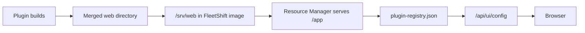
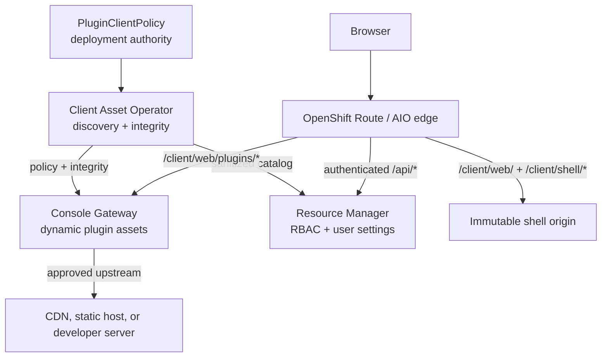
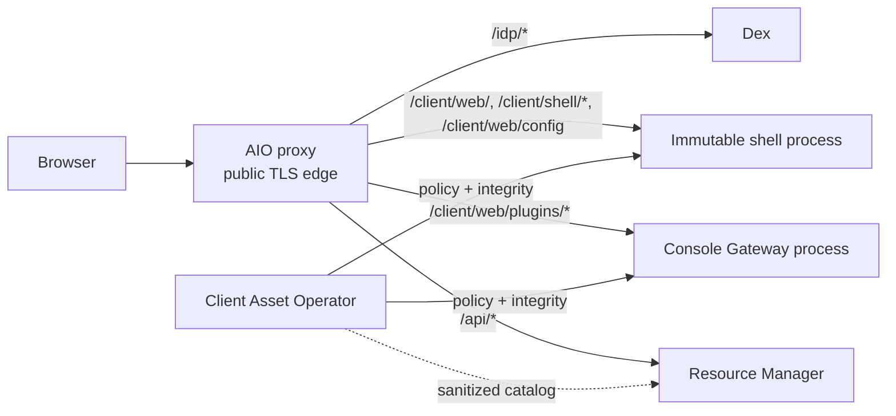
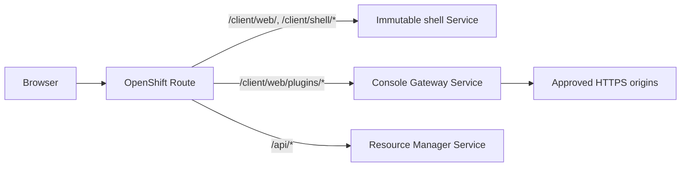

# Client Asset Separation

**Status:** Draft

**Related issue:** [OME-313](https://redhat.atlassian.net/browse/OME-313)

## Summary

Resource Manager currently serves shell, manifests, and plugin JavaScript from one merged local directory. This makes Resource Manager an authority over client code; a compromise can alter browser code and defeat client trust assumptions.

This design moves browser asset delivery out of Resource Manager while keeping one public browser origin. An immutable shell origin supplies bootstrap code. Console Gateway proxies dynamic plugin assets from approved origins. Client Asset Operator owns plugin discovery, approval, and integrity metadata. Resource Manager retains plugin metadata needed for RBAC and user settings, but cannot choose an asset origin or serve executable browser assets.

## Goals

- Keep executable browser assets outside Resource Manager.
- Keep one public browser origin across sandbox and cluster deployments.
- Support CDN, internal HTTPS hosts, air-gapped static hosts, and scoped local development origins.
- Discover plugin metadata at runtime and preserve last-known-good state during transient failure.
- Support independent plugin development without rebuilding all shell and plugin assets.
- Define trust, integrity, caching, upgrades, and failure behavior.

## Non-goals

- Marketplace, installation, or native CLI distribution design.
- Changing Scalprum or Module Federation plugin contracts.
- Storage-provider implementation details for S3, OCI, or caches.
- OIDC issuer and identity-provider bootstrap design; see [IdP Bootstrap](idp_bootstrap.md).
- Browser sandboxing for untrusted plugins. Same-origin plugins are trusted code.

## Current State



- `plugin-registry.json` is build-generated.
- Resource Manager reads it from `WebDir` and serves API and static assets.
- Assets effectively use `/app` as their only origin.
- AIO already provides a public proxy for Dex and Resource Manager.

## Architecture



The browser uses one public origin and never accesses plugin origins directly. Edge routes immutable shell assets, dynamic plugin assets, and APIs by path. Resource Manager is not on the asset path and cannot create or change trusted plugin routes.

### Path ownership

| Path | Owner | Authentication | Purpose |
| --- | --- | --- | --- |
| `/client/web/` | Immutable shell origin | Public | Shell HTML and entry assets |
| `/client/shell/*` | Immutable shell origin | Public | Content-hashed shell assets |
| `/client/web/config` | Shell/edge | Public | Global plugin and OIDC bootstrap configuration |
| `/client/web/plugins/*` | Console Gateway | Public | Approved manifests, JavaScript, CSS, chunks |
| `/api/*` | Resource Manager | Required | Platform APIs, user settings, plugin data |
| `/idp/*` | IdP proxy or IdP | Public as required by OIDC | OIDC discovery and login exchange |

`/client/*` is reserved for client discovery and bootstrap. `/api/*` remains Resource Manager's authenticated domain API namespace. `/client/cli/config` is reserved for future CLI configuration; it does not imply CLI asset delivery through browser routes.

### Ownership

| Component | Owns | Must not own |
| --- | --- | --- |
| Deployment authority | Plugin policy and shell trust anchor | Resource Manager-managed route policy |
| Client Asset Operator | Manifest discovery, validation, integrity catalog | Browser asset serving or user authorization |
| Immutable shell origin | Bootstrap HTML, shell assets, global config assembly | Dynamic upstream route selection |
| Console Gateway | Plugin route enforcement, fetch, byte validation, optional cache | Initial plugin trust policy or API authorization |
| Resource Manager | Sanitized catalog persistence, RBAC, user settings | Plugin origins, gateway routes, browser bundle serving |

## Policy and Discovery

Deployment defines one `PluginClientPolicy` per plugin identity. YAML is suitable for AIO. A namespace-scoped CRD is preferred for cluster deployment. The resource shares plugin identity across clients while each client declares its own artifact details.

```yaml
apiVersion: ui.fleetshift.io/v1alpha1
kind: PluginClientPolicy
metadata:
  name: gcphcp
spec:
  plugin:
    name: gcphcp-plugin
    key: gcphcp
    version: 1.2.0
  policyRevision: 1
  clients:
    web:
      origin: https://assets.example.com/gcphcp/1.2.0/web
      manifestPath: plugin-manifest.json
      routePrefix: /client/web/plugins/gcphcp/1.2.0
      enabled: true
      required: true
      onFailure: block-client
    cli:
      artifact: oci://registry.example.com/gcphcp-cli:1.2.0
      manifestPath: cli-manifest.json
      enabled: true
      required: false
      onFailure: disable-client
```

Required policy fields:

- Stable plugin key, name, and version.
- Client artifact locations and route prefix for each supported client type.
- Enabled, required, and failure behavior per client artifact.
- Optional dependencies, compatibility, signature, or provenance constraints.

Operator loads policy, fetches manifests only from approved origins, validates identity/version/path/client type, and verifies integrity metadata generated by Rspack/CI and published in `plugin-manifest.json`. It may compute hashes as a fallback or discovery aid, but build-time hashes provide the preferred provenance chain before CAO fetches the asset. Operator atomically publishes active state, supplies full policy and integrity metadata read-only to Gateway, and supplies a sanitized logical catalog to Resource Manager.

The sanitized catalog can include identity, version, availability, capabilities, dependencies, extension types, logical module identifiers, and opaque policy references. It must not include mutable route authority, storage credentials, or browser URLs that bypass Gateway.

Community publishers need not manage signing keys. Deployment admission establishes approval. Publisher signatures or provenance are optional additional evidence. An observed hash on first fetch is trust-on-first-use: it detects later change but does not prove first bytes were clean. Strong deployments pin expected digests or require signed integrity metadata.

## Configuration and Authorization

The shell/edge produces public `/client/web/config` from deployment OIDC configuration plus active operator catalog data. It contains global, approved plugin metadata and same-origin plugin URLs. It must not expose unvalidated upstream origins.

Resource Manager serves authenticated `/api/user/settings`. It holds user preferences, navigation order, workspace-dependent presentation, and authorized plugin visibility as logical plugin identifiers. Browser renders a plugin only when it appears in both global configuration and user settings. This improves UX; Resource Manager still enforces authorization on every API request.

Plugin capabilities and dependencies describe availability only. They cannot grant access to organization, tenant, workspace, role, or user data.

`/client/web/config` is public because browser code needs it before login. All `/api/*` paths require authentication and authorization. Do not create unauthenticated API exceptions for plugin bootstrap. If a future pre-login proof is required, design a separate public path and trust anchor.

## Trust and Integrity

Same-origin plugins are part of browser trusted computing base. They can inspect page state, make authenticated same-origin API requests, and may access non-HttpOnly browser storage. RBAC protects API responses, not against malicious approved plugin code. Only artifacts with a positive deployment trust decision can receive same-origin routes.

Gateway must:

- Match requests to operator-approved plugin, version, path prefix, and origin.
- Normalize paths and reject overlap, traversal, unexpected schemes, and credential-bearing URLs.
- Use verified HTTPS upstreams; allow HTTP only for explicit sandbox developer policy.
- Reject redirects by default to prevent SSRF and origin escapes.
- Block outbound requests to loopback, RFC1918/private address ranges, link-local addresses including `169.254.169.254`, and other deployment-defined metadata or internal service endpoints.
- Strip `Cookie`, `Authorization`, forwarding, client-certificate, and identity headers from asset requests.
- Validate fetched bytes against operator-provided digests before serving them.
- Record route and policy audit events; bound timeout, retry, and cache behavior.

Gateway does not proxy platform APIs. Edge routes authenticated `/api/*` directly to Resource Manager, preserving only required authentication and removing client-spoofable forwarding headers.

### Shell trust and out-of-band proof

Gateway byte validation protects against an altered upstream. It cannot protect against a compromised Gateway that can replace the verifier. The initial shell must therefore be independently trusted.

| Layer | Protects against | Trust anchor |
| --- | --- | --- |
| Immutable shell | Gateway replacing bootstrap/verifier | Deployment-owned immutable shell origin or edge-pinned artifact |
| Direct API proof | Gateway changing dynamic plugin bytes | Operator-signed integrity metadata fetched from authenticated `/api/*` |

Trusted shell code fetches an operator-signed integrity proof directly from Resource Manager, verifies it with a shell-anchored public key, and supplies expected SRI values before Module Federation creates dynamic scripts. Resource Manager distributes this proof but does not own signing keys. Shell and plugin Rspack/Webpack configurations must set `output.crossOriginLoading = "anonymous"` so standard dynamic chunks use the same CORS/SRI contract as remote entries. If plugins must load before login, that integrity flow needs a separate explicitly designed public bootstrap path.

Module Federation remote entries require runtime support because URL and version are discovered dynamically. Shell runtime must attach SRI to remote scripts and plugin chunks, for example through an equivalent runtime hook:

```js
export const sriRuntimePlugin = () => ({
  name: "sri-runtime-plugin",
  createScript({ url }) {
    const script = document.createElement("script");
    script.src = url;
    script.crossOrigin = "anonymous";
    const integrity =
      globalThis.__GLOBAL_PLUGIN_CONFIG__?.getIntegrityForUrl(url);
    if (integrity) script.integrity = integrity;
    return script;
  },
});
```

This is runtime integration guidance, not another policy contract. Existing Scalprum/Module Federation integration must gain equivalent support before browser SRI protects runtime remote entries.

CSP is defense in depth, not plugin isolation. Deployment should restrict browser sinks to self where plugin behavior permits, including `connect-src 'self'`, `img-src 'self'`, `object-src 'none'`, `base-uri 'self'`, `form-action 'self'`, and `frame-src 'none'`. Proxy OIDC discovery and token exchange through console origin where practical; never use wildcard IdP origins. Prefer short-lived access tokens held in memory or a dedicated Web Worker, not `localStorage` or `sessionStorage`; this reduces exposure but does not isolate malicious same-origin code.

Operator, Gateway, and Resource Manager catalog paths require encrypted, mutually authenticated service transport. Prefer platform/service-mesh mTLS. Otherwise use cert-manager or equivalent deployment PKI with distinct workload identities. Resource Manager must not control the trust bundle. AIO may use equivalent short-lived certificates or protected Unix sockets.

## Reconciliation and Failure Behavior

Discovery is asynchronous reconciliation, not a startup gate.

1. Operator loads deployment policy and validates manifests and integrity.
2. Operator publishes active policy/integrity state to Gateway and sanitized catalog to Resource Manager.
3. Shell/edge publishes global configuration from active state.
4. Resource Manager persists catalog and creates authenticated user settings.
5. Each component refreshes failed dependencies asynchronously.

| Condition | Result |
| --- | --- |
| Valid policy and manifest update | Atomically activate replacement state |
| Temporary origin or manifest failure | Keep policy-bound last-known-good state and report stale |
| Invalid manifest | Keep prior valid state, if any; report validation error |
| No valid cached state | Plugin unavailable; console starts |
| Policy origin/revision change | Revoke old route before activating new route |
| Policy removed, disabled, expired, or explicitly revoked | Remove route and global catalog entry immediately |

Last-known-good state is a temporary availability fallback, not independent authorization. It remains usable only while its originating policy is current and unexpired. Status must expose last success, last failure, next retry, consecutive failures, and stale state.

## Caching and Upgrades

- Manifests and `/client/web/config`: revalidate, no-cache, or explicit versioning.
- `/api/user/settings`: `Cache-Control: no-store`; never shared across users or workspaces.
- Shell and plugin JS/CSS: content-hashed names plus long-lived immutable cache headers.
- Gateway route state: persistent and recoverable.

Version directories alone are insufficient: immutable cache headers require content-hashed filenames. Build must validate hashed shell and plugin outputs. Asset hosts retain old entrypoints and lazy chunks through active-session, cache propagation, and rollback windows.

Upgrade sequence: publish assets, validate through Operator, atomically publish route/catalog state, then retain prior content-hashed assets. Rollback changes policy to a previously validated version; it does not rebuild Resource Manager.

## Deployment

### Sandbox AIO



AIO retains public TLS, host validation, WebSocket handling, and supervision. Operator watches configured YAML. Gateway is separate from Resource Manager and accepts only operator-owned policy.

### Cluster



Operator, Gateway, and Resource Manager run with independent identities. Operator watches `PluginClientPolicy` resources and publishes read-only state. OpenShift Route owns public path routing; Gateway owns dynamic plugin origin enforcement.

Connected deployments use approved external CDNs. Air-gapped deployments mirror artifacts to internal static hosts. Both preserve browser same-origin routing. A developer override may use a scoped `http://host.docker.internal:3001` origin only when explicit sandbox policy enables it.

## Alternatives

| Alternative | Decision | Reason |
| --- | --- | --- |
| Resource Manager serves all assets | Rejected | Resource Manager compromise controls browser code |
| Browser directly loads third-party origins | Rejected | Bypasses route, integrity, credential, CSP, and audit policy |
| Arbitrary Resource Manager proxy plugins | Rejected | Makes Resource Manager trusted Gateway code |
| Asset distribution addon controlled by Resource Manager | Rejected | Recreates privileged asset authority with more lifecycle complexity |

An independently provisioned asset distribution component could replace Gateway only if Resource Manager cannot configure, replace, or activate it. That is equivalent to this design's independent Gateway boundary and is not proposed separately.

## Open Questions

1. Are deployment allowlists sufficient for OME-313, or are signed route/catalog updates required?
2. Is `PluginClientPolicy` correct resource name and scope?
3. Which operator policy source is preferred: mounted file, CRD, or administrator service?
4. Which artifact provenance or manifest-signature format is required?
5. What availability behavior applies to required client artifacts?
6. Which metrics, alerts, and UI expose stale or never-valid plugins?
7. Which authenticated protocol distributes catalog and integrity proof?
8. Which deployment mechanism anchors immutable shell trust?

## Expected Implementation Outcomes

- Client Asset Operator policy loading, YAML/CRD watch, manifest validation, integrity catalog, and reconciliation status.
- Persistent sanitized catalog and authenticated `/api/user/settings` generation.
- Immutable shell origin, global `/client/web/config`, and Module Federation SRI runtime support.
- Console Gateway route enforcement, safe upstream fetch, byte validation, cache policy, and audit logging.
- AIO routing/process integration and cluster Deployment, Service, and Route resources.
- Content-hash build validation, atomic configuration publication, developer override, and observability.
