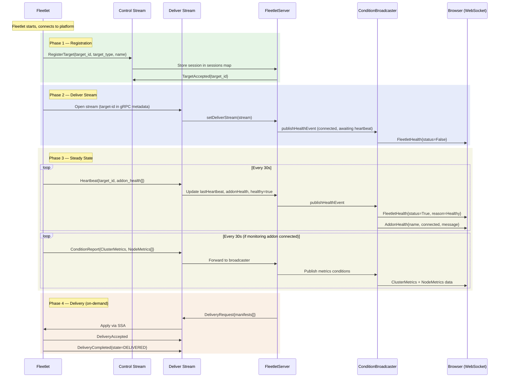
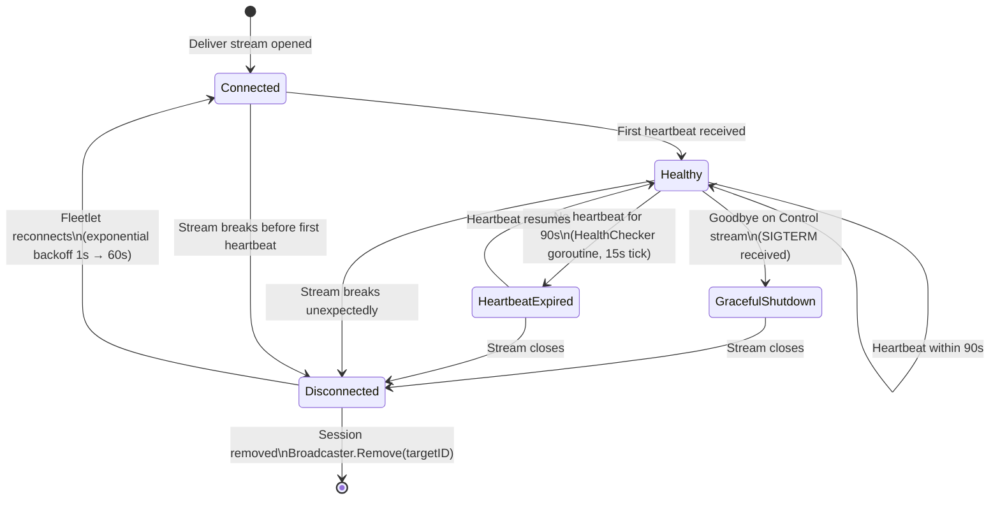
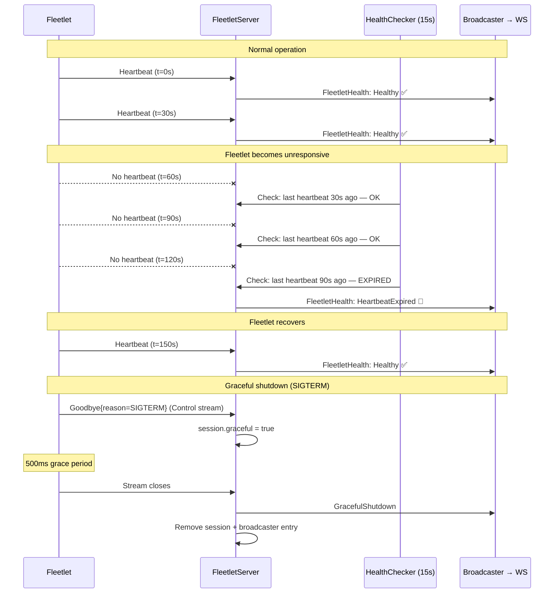
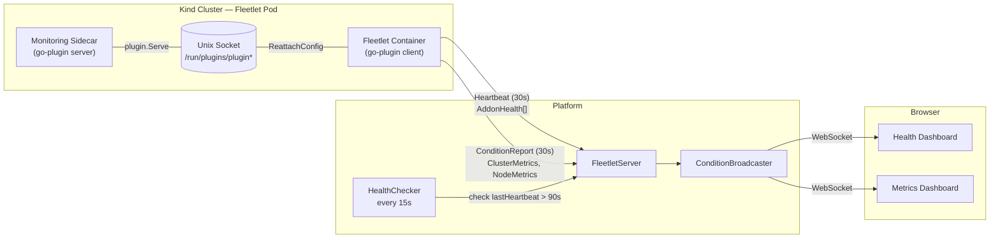
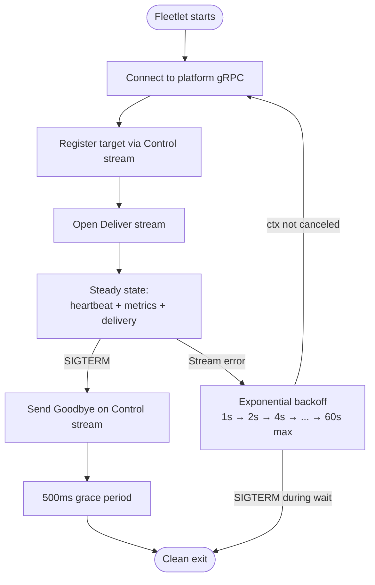

# Fleetlet Health & Liveness Detection

How the platform knows whether each fleetlet and its addons are alive.

## Full Lifecycle: Fleetlet ↔ Platform ↔ Browser

The complete flow from fleetlet boot through connection, steady-state operation, delivery, and disconnection.



## Health State Machine

Each fleetlet session transitions through these states based on heartbeat presence and shutdown signals.



## Health Detection Timeline

Concrete example showing normal operation, heartbeat expiry, recovery, and graceful shutdown.



## Addon Health Tracking

Each fleetlet can have sidecar addons connected via go-plugin over Unix sockets. Addon health status is embedded in every heartbeat message and broadcast to the UI alongside the fleetlet's own health.



### Addon health data flow

The `addonStatus` struct in the fleetlet tracks each addon with thread-safe accessors, shared between the metrics collection goroutine and the heartbeat goroutine.

| Field | Updated by | Read by |
|---|---|---|
| `connected` | `connectMonitoringPlugin()` | `heartbeatLoop()` via `toProto()` |
| `lastCollectionAt` | `metricsLoop()` on success | `heartbeatLoop()` via `toProto()` |
| `lastError` | `metricsLoop()` on failure | `heartbeatLoop()` via `toProto()` |

Each heartbeat message includes `AddonHealth[]` with the current snapshot. The platform stores this on the session and broadcasts it as separate `AddonHealth` conditions alongside `FleetletHealth`.

## Reconnection & Backoff

The fleetlet wraps its entire `run()` function in a retry loop with exponential backoff. Each `run()` is a fresh gRPC connection: register → deliver stream → steady state.



The fleetlet uses two contexts to make graceful shutdown work:

- **Signal context** — canceled on SIGTERM. Triggers the Goodbye flow.
- **Run context** — controls the gRPC streams. Canceled 500ms after Goodbye is sent, giving the platform time to receive it before the streams close.

## Condition Types

All health data flows through the existing `ConditionBroadcaster` → WebSocket pipeline. The UI filters by condition type.

| Condition Type | Status | Reason | Message (JSON) |
|---|---|---|---|
| `FleetletHealth` | `True` | `Healthy` | `{"healthy":true,"graceful":false,"lastHeartbeat":"RFC3339"}` |
| `FleetletHealth` | `False` | `HeartbeatExpired` | `{"healthy":false,"graceful":false,"lastHeartbeat":"RFC3339"}` |
| `FleetletHealth` | `False` | `GracefulShutdown` | `{"healthy":false,"graceful":true,"lastHeartbeat":"RFC3339"}` |
| `FleetletHealth` | `False` | `Disconnected` | `{"healthy":false,"graceful":false}` |
| `AddonHealth` | `True`/`False` | addon name | error message (empty if healthy) |
| `ClusterMetrics` | `True` | `Collected` | `{"nodes":N,"pods":N,"cluster":"id"}` |
| `NodeMetrics` | `True` | node name | `{"cpuCapacity":N,"cpuUsage":N,"memCapacity":N,...}` |

## Timing Parameters

| Parameter | Value | Rationale |
|---|---|---|
| Heartbeat interval | 30s | Matches metrics collection interval |
| Health check tick | 15s | Half the heartbeat interval for responsive detection |
| Heartbeat expiry | 90s | 3× heartbeat interval — tolerates 2 missed heartbeats |
| Reconnect backoff | 1s → 60s | Exponential with 60s cap |
| Goodbye grace | 500ms | Enough for one gRPC round trip |

## Proto Messages

```protobuf
// On Deliver stream (DeliverEvent oneof field 6)
message Heartbeat {
  string target_id = 1;
  google.protobuf.Timestamp timestamp = 2;
  repeated AddonHealth addon_health = 3;
}

message AddonHealth {
  string name = 1;
  bool connected = 2;
  google.protobuf.Timestamp last_collection_time = 3;
  string message = 4;  // error message if unhealthy
}

// On Control stream (ControlEvent oneof field 2)
message Goodbye {
  string target_id = 1;
  string reason = 2;
  google.protobuf.Timestamp timestamp = 3;
}
```
