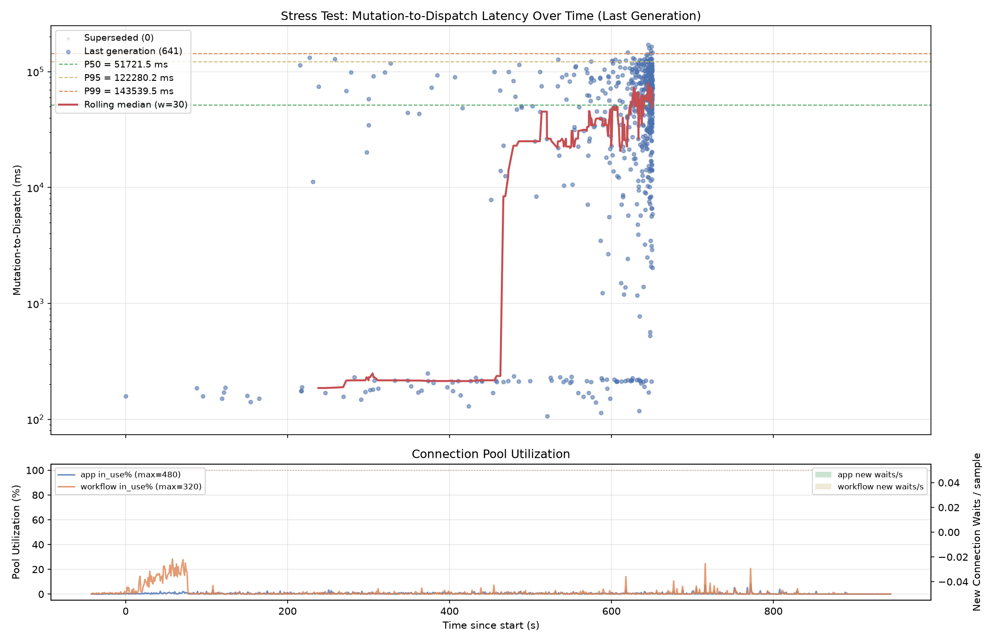
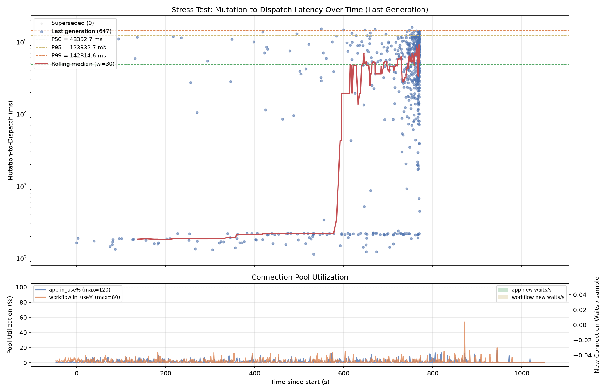

# Stress Test Results and Tuning Baselines

Empirical results and host-specific tuning values from orchestration
stress-test runs. For design decisions and rationale see
[orchestration_stress_test.md](orchestration_stress_test.md).

## Connection pool tuning baselines

Tested on a 16-core / 64 GB dev machine:

- **200** connections is a reasonable default. Larger pools (e.g. 800)
  benefit only if the poller count is also scaled.
- **3000+** connections caused OOM -- each Postgres backend consumes
  ~10 MB.
- **Default 100** caused `context deadline exceeded` as DB operations
  queued behind connection waits.

Different hardware profiles may have different optimal points.

## Mutation-to-dispatch latency comparison

Two runs with identical workload but 4x different resources show nearly
identical latency profiles, confirming the bottleneck is structural
(in-flight delivery wait), not resource contention:

| | Run A (high resources) | Run B (baseline) |
|---|---|---|
| Pool budget | 800 | 200 |
| Pollers | 64 | 16 |
| Mutation-to-dispatch P50 | 51.7 s | 48.4 s |
| Mutation-to-dispatch P95 | 122.3 s | 123.3 s |
| Pool utilization | < 5% | < 10% |
| Converged | 640/641 | 647/647 |

**Run A** (800 connections, 64 pollers):



**Run B** (200 connections, 16 pollers):



Both runs used:
```
STRESS_DURATION=10m STRESS_RATE=100 STRESS_DEPLOYMENTS=1000
STRESS_ACK_DELAY_MIN=100ms STRESS_ACK_DELAY_MAX=500ms
STRESS_COMPLETION_DELAY_MIN=1m STRESS_COMPLETION_DELAY_MAX=3m
STRESS_FAILURE_RATE=0
```
