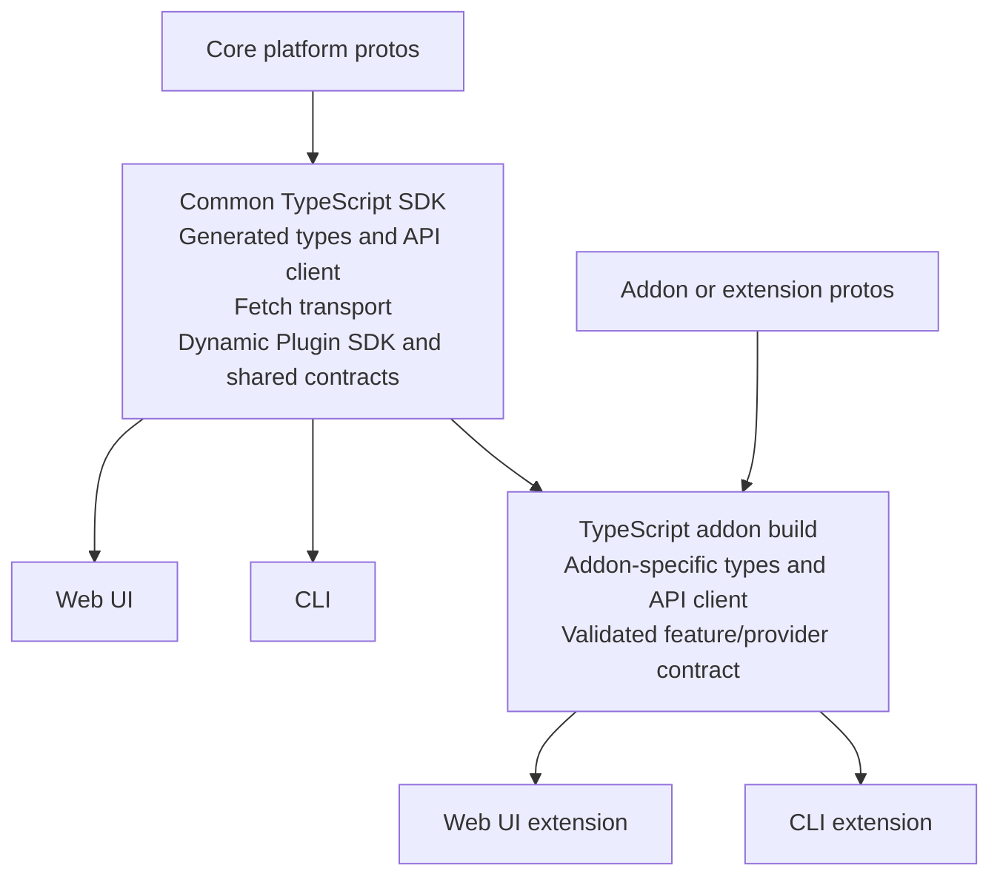
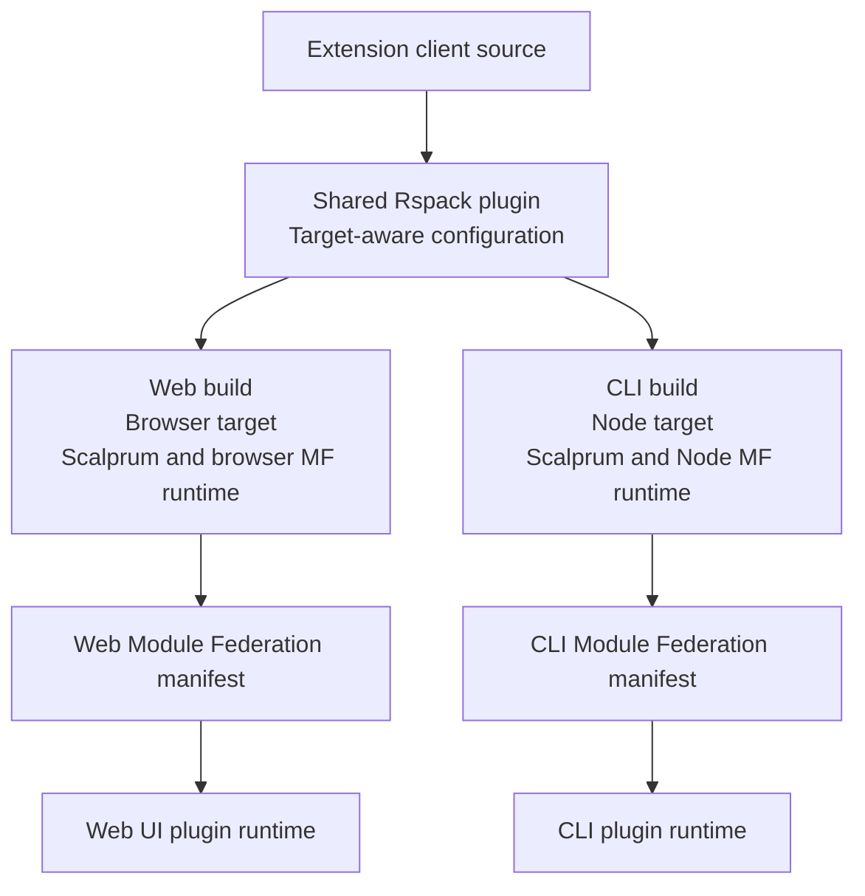
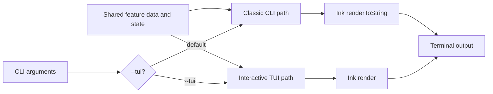

# CLI Feature Inventory

**Related Jira:** OME-305
**Status:** Current implementation baseline
**Scope:** `cli/`

This document inventories what the current `fleetctl` CLI can do. It is input
for the shared CLI/Web UI client architecture. It describes feature behavior,
not terminal presentation. The same feature may later have a CLI and Web UI
representation.

Sections describing a target model are proposals for OME-305, not claims about
current implementation. Current behavior is identified explicitly and grounded
in the source paths listed below.

## Important Baseline

The current CLI in `cli/` is a Go application built with Cobra. It is not the
older TypeScript/Ink proof of concept described by these documents:

- `docs/ui/spikes/009-cli-framework.md`
- `docs/ui/spikes/010-cli-plugin-system.md`
- `docs/ui/spikes/011-cli-authentication.md`
- `docs/ui/spikes/012-cli-realtime-data.md`

Those documents describe useful prior exploration, but some paths and claims
are stale. Current source code is authoritative.

The current CLI has no JavaScript Module Federation plugin loader. Its dynamic
behavior comes from gRPC reflection and dynamically constructed protobuf
messages for addon-provided resource services. OME-306 proposes moving this
client to TypeScript so it can share client and plugin infrastructure with the
Web UI.

## Command Tree

```text
fleetctl
├── auth
│   ├── setup
│   ├── login
│   ├── logout
│   ├── inspect-token
│   └── enroll-signing
├── deployment | dep | deployments
│   ├── create
│   ├── get <name>
│   ├── list
│   ├── resume <name>
│   └── delete <name>
└── resource | res
    ├── types
    ├── describe <type>
    ├── create <type>
    ├── get <type> <id>
    ├── list <type>
    ├── query | search
    └── delete <type> <id>
```

Command registration is in `cli/internal/cli/root.go`,
`cli/internal/cli/auth.go`, `cli/internal/cli/deployment.go`, and
`cli/internal/cli/resource.go`.

## Client Configuration

Every server-backed invocation creates one gRPC connection and closes it when
the command finishes. Authentication is attached as per-RPC metadata.

Global flags:

| Flag | Default | Purpose |
| --- | --- | --- |
| `--server`, `-s` | `localhost:50051` | gRPC server address |
| `--output`, `-o` | `table` | `table` or `json` output |
| `--server-tls` | disabled | Enable TLS for gRPC |
| `--server-ca-file` | empty | Add PEM CA bundle for server certificate |
| `--server-insecure` | disabled | Skip TLS certificate verification; debugging only |
| `--config-dir` | `~/.config/fleetshift` | Directory containing `auth.json` |
| `--insecure-storage` | disabled | Use plaintext files instead of OS keyring |

`--server-ca-file` and `--server-insecure` require `--server-tls`.
`--config-dir` must be absolute. `--insecure-storage` requires
`--config-dir`.

Relevant source: `cli/internal/cli/root.go` and
`cli/internal/cli/connect.go`.

## Authentication Features

### Configure OIDC client

`fleetctl auth setup`:

- Accepts issuer URL and OAuth client ID.
- Accepts comma-separated scopes.
- Optionally accepts separate signing-enrollment client ID.
- Optionally accepts a CA file for the OIDC issuer.
- Performs OIDC discovery.
- Validates discovered issuer, authorization endpoint, and token endpoint.
- Writes local `auth.json`.
- Does not configure server-side authentication.

Source: `cli/internal/cli/auth_setup.go` and
`cli/internal/auth/discovery.go`.

### Log in

`fleetctl auth login`:

- Runs browser-based OIDC authorization-code flow.
- Uses PKCE with S256 code challenge.
- Uses a loopback HTTP callback.
- Validates OAuth state.
- Supports `--no-browser` to print the authorization URL.
- Stores OAuth tokens through the configured token store.

Source: `cli/internal/cli/auth_login.go` and
`cli/internal/cli/oidc_loopback.go`.

### Log out

`fleetctl auth logout` clears stored OAuth tokens. It intentionally leaves the
signing private key in storage.

### Inspect tokens

`fleetctl auth inspect-token` displays:

- Token type
- Expiration and current status
- Whether a refresh token exists
- Decoded access-token claims
- Decoded ID-token claims

JSON output is available for this command. JWT claims are decoded for
inspection; this command is not a signature-verification command.

### Enroll signing key

`fleetctl auth enroll-signing`:

- Generates or reuses an ECDSA P-256 key pair.
- Runs a dedicated OIDC enrollment flow.
- Calls `SignerEnrollmentService.CreateSignerEnrollment`.
- Stores the private key through the configured token store.
- Prints enrollment details and OpenSSH public signing key.
- Supports `--reuse-key`.

The default store is the operating-system keyring. With
`--insecure-storage`, tokens and the private key are stored as files under
`--config-dir` with restrictive permissions.

Source: `cli/internal/cli/auth_enroll_signing.go`,
`cli/internal/auth/keyring.go`, and `cli/internal/auth/file.go`.

### Automatic credentials on API calls

Server-backed commands load stored tokens for each RPC. Tokens close to expiry
are refreshed when a refresh token exists. A usable access token is sent as:

```text
Authorization: Bearer <access-token>
```

The current default transport is plaintext gRPC unless `--server-tls` is set.

## Deployment Features

Deployment commands use the static
`fleetshift.v1.DeploymentService` protobuf service.

### Create deployment

`fleetctl deployment create` creates a deployment from a manifest file or
stdin.

Required flags:

- `--id`
- `--manifest-file`
- `--resource-type`

Optional flags:

- `--placement-type all|static|selector`
- `--target-ids` for static placement
- `--target-selector` for selector placement
- `--rollout-type immediate`
- `--sign` to sign deployment intent with the enrolled signing key

The current CLI supports inline manifests and immediate rollout only.

### Get deployment

`fleetctl deployment get <name>` retrieves one deployment. Names may be given
as a short ID or as `deployments/<id>`.

### List deployments

`fleetctl deployment list` lists deployments and supports `--page-size`.
Displayed table columns are:

- Name
- State
- Reconciling
- Resolved target IDs
- Age

### Resume deployment

`fleetctl deployment resume <name>` resumes a deployment paused for
authentication. It sends the current authenticated credential. `--sign`
re-signs the deployment intent with the enrolled signing key.

### Delete deployment

`fleetctl deployment delete <name>` deletes a deployment.

Sources: `cli/internal/cli/deployment_*.go` and
`cli/internal/cli/deployment.go`.

## Dynamic Resource Features

Resource commands use a reflection-driven client rather than generated stubs
for addon-provided resource services.

### Discover resource types

`fleetctl resource types` discovers resource services through gRPC server
reflection. It filters known static services and identifies resource services
by descriptor shape.

The current discovery contract requires:

- A service name ending in `Service`.
- A `Get<Kind>` method.
- A `List<Kind>s` method.
- A resource message.

`Create` and `Delete` methods are optional, allowing inventory-only resource
types.

The output includes qualified type, singular name, and gRPC service name.

Canonical qualified type form:

```text
{proto-package}/{collection-id}
```

Example:

```text
kind.fleetshift.v1/clusters
```

### Resolve resource type

Resource commands accept:

- Qualified type: `kind.fleetshift.v1/clusters`
- Collection ID: `clusters`
- Plural name: `Clusters`

Ambiguous short names require `--service`. The flag is inherited by all
`resource` commands.

### Describe resource type

`fleetctl resource describe <type>` displays:

- Qualified type
- Singular name
- gRPC service name
- Available RPC methods
- Recursive protobuf `spec` field tree

### Create resource

`fleetctl resource create <type>` creates a managed resource from JSON.

Required flags:

- `--id`
- `--spec-file`; `-` reads stdin

The CLI dynamically resolves the resource and request descriptors, parses JSON
into the protobuf `spec`, and invokes the dynamic `Create<Kind>` RPC.

### Get resource

`fleetctl resource get <type> <id>` invokes the dynamic `Get<Kind>` RPC.

### List resources

`fleetctl resource list <type>` invokes the dynamic `List<Kind>` RPC and
supports `--page-size`.

### Query resources across types

`fleetctl resource query`, also available as `resource search`, queries managed
resources across the platform using the static
`fleetshift.v1.ResourceQueryService`.

Flags:

- `--scope`; v0 accepts only `-` for whole-platform scope
- `--filter`; CEL expression, empty means all resources in scope
- `--page-size`
- `--page-token`
- `--order-by`; currently documented value is `resource_type,name`

JSON output preserves the complete response, including `nextPageToken`. Table
output prints a copyable continuation command to stderr.

### Delete resource

`fleetctl resource delete <type> <id>` invokes the dynamic `Delete<Kind>` RPC.

Sources: `cli/internal/cli/resource_*.go` and
`cli/internal/dynamic/client.go`.

## Output and Automation

Supported output formats:

- `table`: human-readable tables or command-specific text
- `json`: protobuf JSON for most resource and deployment responses

Table output is defined separately for deployments, resources, and query
results. JSON output is intended for scripting, but not every command honors
the global format flag. Type discovery, schema description, and several auth
commands use custom text output.

The CLI accepts manifests and resource specs from stdin, which supports shell
pipelines and automation. Query pagination exposes an opaque page token.

## Backend Surface Used

The current CLI directly uses gRPC. It does not currently use the backend's
HTTP gateway or dynamic HTTP resource routes.

The current Web UI uses browser `fetch` against HTTP endpoints. The backend
provides HTTP/JSON access in two ways:

- Generated gRPC-Gateway handlers for static protobuf services.
- Dynamic HTTP handlers for addon and platform resource services.

Therefore, CLI and Web UI use different transports today:

| Client | Current transport | Typical representation |
| --- | --- | --- |
| CLI | Direct gRPC with generated and reflection-based clients | Commands, flags, stdin/stdout, table/JSON |
| Web UI | HTTP requests through browser `fetch` | Pages, forms, navigation, client state |

This is a transport difference, not necessarily a feature difference. Shared
client architecture should define feature-level operations and data contracts
above transport adapters. A fetch-based HTTP adapter can serve both CLI and Web
UI. A gRPC adapter can remain available for backend or native-client use, but
should not define feature semantics.

## Target API Client Generation Model

The emerging shared SDK should provide coordinated Go and TypeScript packages.
Both packages are generated or built from the same protobuf definitions and
are used by core platform components and addon/plugin developers.

The TypeScript SDK provides API types, clients, fetch transport, shared errors,
context, and extension contracts for the Web UI, CLI, and TypeScript addons.
The Go SDK provides the corresponding generated types, server/client helpers,
and validation contracts for Go platform components and Go addons. The two SDK
packages must expose equivalent feature and contract semantics even where
language-specific APIs differ.

The expected layering is:



Core TypeScript generation should be an Nx build target owned by the common
TypeScript SDK. Addon and plugin developers should use the same TypeScript SDK,
generation tooling, transport, and validation contracts for their own protobuf
definitions. This is required for CLI/Web UI parity: addons should not
implement a separate client runtime or transport integration.

Generated addon types should remain owned by the addon package whose API they
describe. The common TypeScript SDK provides shared generation and runtime
foundation; it should not absorb every addon schema.

## Target Dynamic Plugin Build and Runtime Model

The shared Dynamic Plugin SDK should provide the common high-level plugin
abstraction for Web UI and CLI. Scalprum should be the shared runtime in both
browser and Node environments, with Module Federation and Rspack providing the
underlying loading and build mechanisms.

The current blocker is that the Dynamic Plugin SDK only supports the Web target.
Direct Module Federation and Rspack integration can work around this blocker
for the CLI, but it creates a second plugin path. The target is to extend or
align the SDK so it supports both targets and produces and consumes manifests
through one unified model.

Runtime differences should be hidden behind Scalprum/SDK adapters, while
extension contracts, API clients, capabilities, context, and validation remain
shared. If Scalprum lacks required Node features, FleetShift can extend or own
those additions rather than replacing the shared runtime with a separate CLI
implementation.

An extension can keep Web UI and CLI code under one client package, but it must
produce separate builds because the runtimes differ:



A possible higher-level Rspack integration would accept one extension
definition and produce two target-specific compilations or configurations: one
for Web UI and one for Node-based CLI. This would avoid duplicated plugin build
logic while preserving correct runtime bundles and manifests. Whether this is
implemented as one wrapper with two entries, two configurations, or another
Rspack abstraction remains an OME-305 design decision.

The extension `client/` area can contain shared contracts and API integration
plus target-specific entrypoints and renderers. Separate compilation does not
imply separate feature definitions:

- Shared feature contract: capability, inputs, outputs, permissions, context,
  and backend operations.
- Web UI representation: routes, pages, components, navigation, and browser
  lifecycle.
- CLI representation: commands, terminal rendering, flags, stdin/stdout, and
  Node lifecycle.

## CLI and TUI Rendering Model

The CLI/TUI design uses Ink only. OpenTUI remains an evaluation/reference
package and is not part of the production client or extension contract.

Both classic CLI output and fullscreen TUI use the same feature data, API
client, state, formatters, and theme tokens:



Classic commands load data, render an Ink element with `renderToString()`, and
exit. TUI commands use Ink `render()` and keep a live renderer for interaction,
scrolling, and updates. The CLI should avoid TUI escape sequences when output
is piped or redirected.

The SDK and plugin contracts should remain renderer-aware only at the runtime
edge:

- Shared layer: API clients, data types, state machines, feature contracts,
  context, capabilities, formatters, theme tokens, plugin discovery and
  loading, manifest parsing and validation, extension lifecycle, command
  metadata detection, command indexing, and lazy implementation resolution.
- Ink layer: `Box`, `Text`, `useInput`, `renderToString()`, `render()`, and
  terminal lifecycle.
- Runtime adapter layer: browser or Node Module Federation loading and
  environment-specific module execution.
- Command extension: renderer-agnostic pre-load metadata plus a lazy-loaded
  implementation for classic and/or TUI representation.

One command feature may support classic output, TUI output, or both. The
contract must declare supported representations; missing TUI support must not
prevent classic command use. Ink extensions can share components between modes
when their output and lifecycle requirements permit it.

For example, a shared `create resource` feature can require a resource type,
resource ID, and validated resource specification. Each runtime represents
that feature differently:

- Classic CLI: accepts `--id`, `--spec-file`, or JSON from stdin, then exits
  after the operation completes.
- Ink TUI: guides the user through resource type, ID, and specification inputs
  with interactive validation. It can support pasted JSON or a file path when
  the terminal permits it.
- Web UI: renders a form or supports browser file drag-and-drop for JSON input.

All representations use the same feature contract, validation, context, and API
operation. Input collection and rendering remain runtime-specific.

The existing Node Module Federation loading prototype demonstrates that the CLI
runtime is feasible. Remaining work is enabling the shared Dynamic Plugin SDK
and Scalprum path for Node, aligning manifest generation and loading across
targets, and extending Scalprum where needed rather than maintaining an
independent CLI plugin system.

For performance, the Node client may later cache verified plugin manifests and
assets locally and load them from cache instead of fetching them remotely on
every use. This is desirable but not required for the initial implementation.
Caching must remain subordinate to manifest versioning, expiration, integrity
verification, and invalidation rules; cached code must not bypass trust checks.

## Target Plugin Discovery and Extension Model

Plugin availability should be server-driven for both clients. The server
provides client-specific plugin metadata and manifests; clients do not locally
install or independently enable plugins.

The discovery flow is shared:

1. The server determines which plugins are available for the deployment and
   client target.
2. The server returns the relevant Web UI and CLI manifests or configuration.
3. Each client registers extension metadata declared for its runtime without
   loading executable extension code.
4. The client loads an extension implementation only when the user invokes or
   otherwise needs it.
5. Later, RBAC and user context can further filter which plugins and extensions
   a specific user may use.

Web UI and CLI may have different plugin sets. A plugin can provide a Web UI
binding, a CLI binding, both, or neither. This is represented in client-specific
manifest metadata rather than treated as a separate installation model.

Plugin contributions should use typed extension contracts. Possible extension
categories include:

- Visual extensions: pages, widgets, navigation, and renderers.
- API extensions: typed backend API clients and data providers.
- Resource extensions: resource types, schemas, and resource operations.
- Command extensions: CLI commands and context-aware actions.
- Global/provider extensions: cross-cutting services without a user-facing
  page.

CLI command registration is therefore one extension type in the shared model,
not a separate plugin mechanism. Each command must declare its structural
contract, capabilities, context requirements, runtime target, and backend
operations. The same plugin model can support different extension types and
different bindings for Web UI and CLI.

### Pre-load command contract

Before command code is loaded, every CLI command must be represented by a
validated metadata declaration. The server can provide this command catalog in
the CLI plugin manifest, allowing the client to offer completion, help, search,
availability hints, and permission filtering without loading every plugin.

The declaration should include at least:

- Stable command identity and command path.
- Display name, summary, description, and usage examples.
- Positional argument and option schemas.
- Completion providers and hint metadata.
- Required capabilities, permissions, and context.
- Supported resource types and scopes.
- Runtime target and compatibility range.
- Owning plugin, module, version, and exposed implementation reference.
- Dependencies and initialization requirements.
- Loading, verification, and failure behavior.

The command metadata is separate from executable implementation:

1. Build tooling validates that command implementation satisfies its declared
   contract.
2. The plugin build publishes command metadata with its manifest.
3. CLI loads manifests and builds command discovery/completion structures.
4. CLI lazy-loads and verifies the referenced implementation only when needed.
5. CLI executes the command through the shared client context and API client.

This preserves a fast, low-memory CLI while keeping command discovery
contract-driven. It also gives Web UI and CLI a common declaration model even
when their command and visual implementations differ.

Build tooling should validate that generated clients and extension metadata
match the declared protobuf and client contracts. Runtime manifests should
carry the metadata needed for clients to discover available operations and
capabilities, but clients should not generate code at runtime.

This model separates three cases:

- **Core APIs:** statically generated into the common SDK.
- **Known addon APIs:** generated by the addon/plugin build and shipped with
  the extension.
- **Runtime-discovered resource types:** accessed through the generic client
  using server-provided type, schema, route, and capability metadata.

The third case preserves dynamic resources without requiring the CLI or Web UI
to compile every possible addon schema into the core client.

### Current generation gap

The repository currently generates Go protobuf, gRPC-Go, gRPC-Gateway, and
OpenAPI output from `buf.gen.yaml`. It has no TypeScript generation target yet.
The current Buf configuration also excludes `proto/addons` from generated Go
output because addon schemas are compiled dynamically by the server at runtime.

OME-305 should add a separate TypeScript SDK generation target for core APIs.
Addon and plugin builds should invoke the same TypeScript SDK generation and
validation tooling for addon-owned protos. Excluding addon protos from the
server's generated Go output should not prevent client-side TypeScript
generation when an addon publishes a supported client API.

Static services:

| Feature | Service |
| --- | --- |
| Deployment lifecycle | `fleetshift.v1.DeploymentService` |
| Cross-resource query | `fleetshift.v1.ResourceQueryService` |
| Signing enrollment | `fleetshift.v1.SignerEnrollmentService` |
| Resource discovery and descriptors | `grpc.reflection.v1.ServerReflection` |

Addon-provided resources are currently invoked by the CLI through dynamically
constructed gRPC methods and protobuf messages.

The backend also exposes dynamic addon resource routes at canonical
`/apis/{service}/{version}/{collection}` prefixes. Current dynamic HTTP
handlers support capability-dependent create, get, list, delete, and resume
operations, using protobuf JSON and forwarding to the registered gRPC service.
The CLI does not consume these routes yet.

## Current Capabilities Versus Current Surface

The backend may expose more capability than the CLI currently surfaces. The
dynamic client can discover method descriptors, but CLI commands currently
implement only this resource operation set:

| Feature | Current CLI surface | Shared feature candidate |
| --- | --- | --- |
| Authentication | OIDC setup/login/logout/token inspection | Client authentication and session |
| Signing identity | Signer enrollment and deployment signing | Delegated authorization |
| Type discovery | gRPC reflection | Capability/resource discovery |
| Schema inspection | Recursive protobuf spec description | Resource type metadata |
| Resource read | Get, list, cross-type CEL query | Resource observation and search |
| Resource mutation | Create and delete | Resource lifecycle management |
| Deployment lifecycle | Create, get, list, resume, delete | Deployment orchestration |
| Output | Table, JSON, stdin/stdout | Input/output adapter |
| Extensions | Reflection-based resource services only | Runtime module and extension system |

The shared architecture should model these as features independent of command
names or page routes. CLI flags, stdin, stdout, exit codes, and JSON are CLI
representations. Web UI routes, forms, tables, navigation, and interactive
state are Web UI representations.

## Current Gaps and Planned Coverage

These gaps describe the current Go CLI surface. Some already have planned
coverage in OME Jira; planned coverage does not mean implementation is done.

### Covered by planned architecture or existing tickets

| Current gap | Planned coverage |
| --- | --- |
| JavaScript/TypeScript client runtime | `OME-306` Rewrite CLI client in TypeScript |
| Shared Dynamic Plugin SDK with Web UI | `OME-305`, `OME-306`, and target SDK model in this document |
| Module Federation loading for CLI | `OME-306`; Node loading prototype already exists |
| Server-driven plugin metadata and client-specific enablement | `OME-309`, `OME-313`, `OME-316` |
| Typed plugin-provided CLI commands | `OME-319` and `OME-320`; implementation follows spike outcome |
| Named profiles and shared client configuration | `OME-310` defines the model; implementation not yet created |
| Live updates and shared extension subscriptions | `OME-322` defines protocol; `OME-325` implements shared client subscription path |
| Interactive command discovery and command palette | `OME-320` defines behavior; implementation follows spike outcome |

### Partially addressed

- **Resource watch/live updates:** protocol and shared client architecture are
  planned in `OME-322` and `OME-325`, but server implementation and CLI-specific
  rendering behavior remain open.
- **Dynamic resource HTTP parity:** backend has dynamic HTTP routes, but the
  current CLI still uses gRPC reflection and dynamic gRPC invocation.
- **Schema metadata:** CLI can inspect recursive protobuf `spec` fields, while
  richer resource metadata and server-backed hints are covered by `OME-321`.
- **TypeScript plugin loading:** Node Module Federation is proven by prototype,
  but shared SDK/Scalprum integration and production builds remain open.

### Not yet addressed

- Resource update or patch.
- Dynamic resource resume command.
- Deployment watch or wait command and its CLI representation.
- Full pagination controls for deployment and dynamic resource list commands.
- Managed-resource create signing. This is distinct from deployment signing and
  client artifact verification in `OME-317`.
- Full resource metadata output beyond the protobuf `spec` tree.
- Persistent interactive CLI session and its target behavior. The old Ink POC
  explored this, but current Go CLI is command-per-process.
- Server-side WebSocket implementation tickets, pending `OME-322` outcome.

### Intentional non-goal

Client-side local plugin installation or enablement is not the target model.
The server provides client-specific manifests and configuration; later RBAC
and user context can filter available extensions further.

These gaps are not necessarily missing backend capabilities. The backend
already has HTTP support for current static and dynamic unary resource surfaces;
full client parity still requires checking each operation and adding contracts
for uncovered or streaming APIs.

## Shared Architecture Implications

The CLI inventory suggests these shared layers:

1. **Client core:** configuration, endpoint selection, authentication context,
   capability discovery, request execution, errors, and lifecycle.
2. **Resource model:** resource identity, type metadata, schemas, capabilities,
   scopes, permissions, and lifecycle operations.
3. **Extension model:** module identity, runtime compatibility, provided and
   required capabilities, commands/actions, and resource contributions.
4. **Feature operations:** authenticate, discover, inspect, observe, query,
   create, update, delete, deploy, resume, and sign.
5. **Runtime adapters:** CLI argument parsing and output versus Web UI routes,
   forms, state, navigation, and rendering.

Shared feature contracts must not force identical representations. A feature
may have a CLI command, a Web UI page, both, or a client-specific action. The
contract should state capability and input/output semantics; each runtime
should declare which representation it supports.

## Source Map

- CLI entrypoint: `cli/cmd/fleetctl/main.go`
- Command root and global flags: `cli/internal/cli/root.go`
- Authentication commands: `cli/internal/cli/auth_*.go`
- Authentication storage and OIDC: `cli/internal/auth/`
- Deployment commands: `cli/internal/cli/deployment_*.go`
- Resource commands: `cli/internal/cli/resource_*.go`
- Dynamic resource client: `cli/internal/dynamic/client.go`
- Output rendering: `cli/internal/output/`
- Nx project configuration: `cli/project.json`
- CLI tests: `cli/internal/cli/*_test.go`, `cli/internal/auth/*_test.go`, and
  `cli/internal/dynamic/*_test.go`
